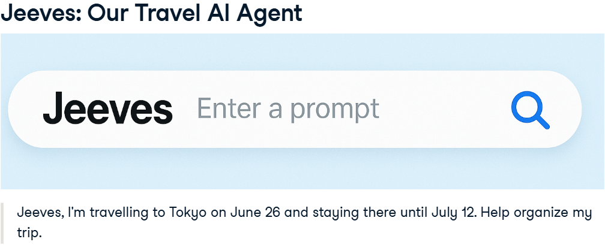
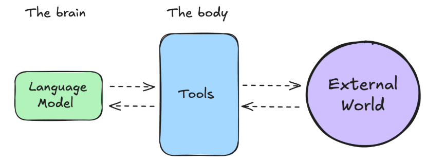
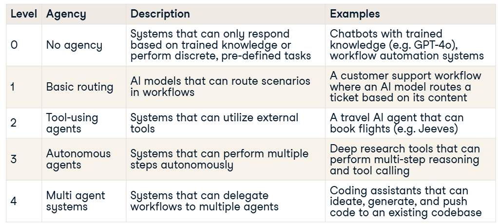
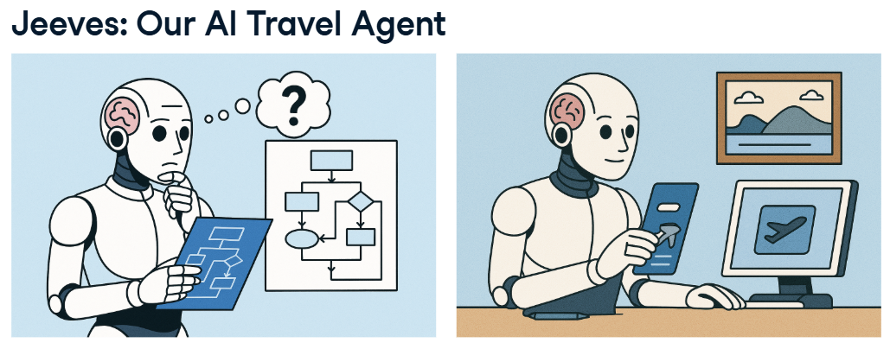
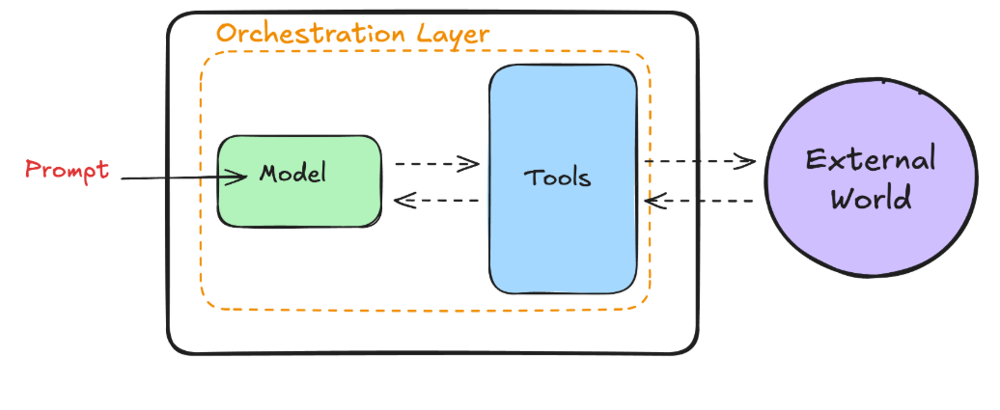
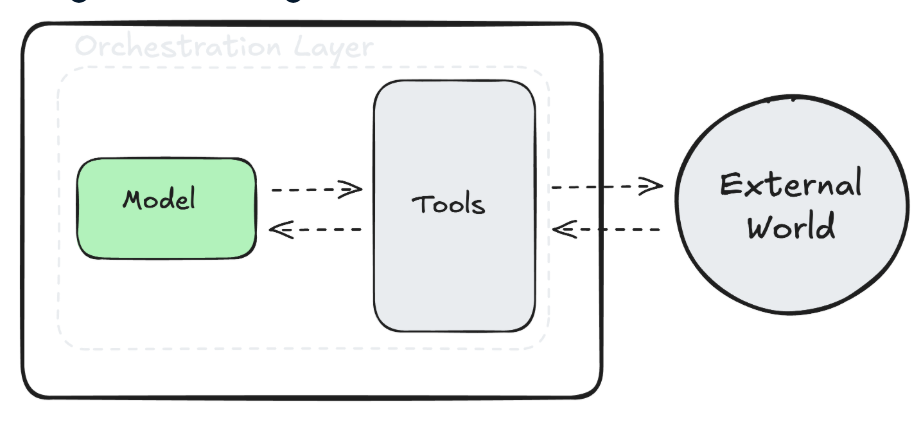
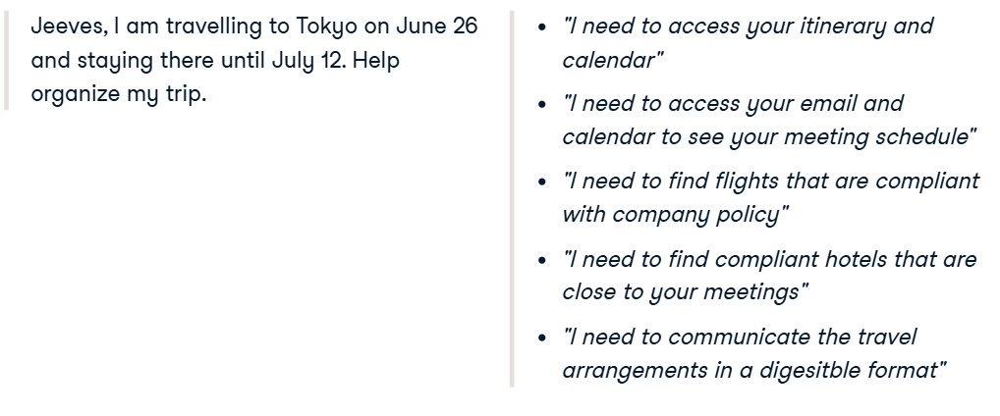
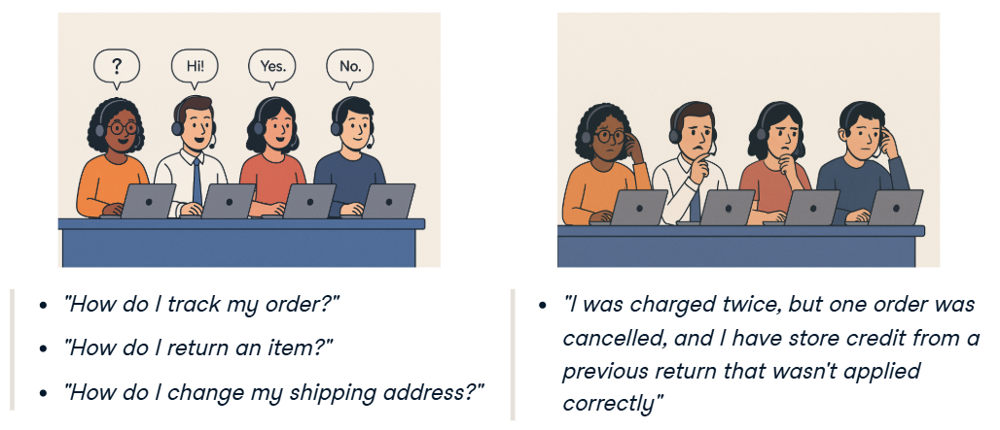
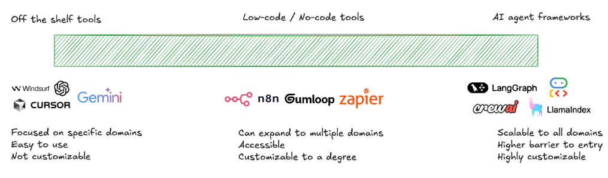
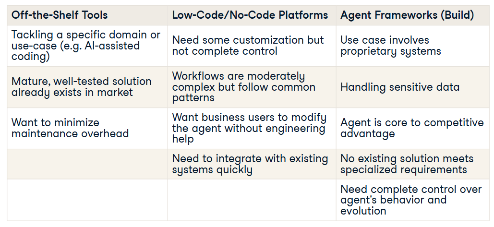

# Introduction to AI Agent

# 1. Foundations of AI Agents

Get introduced to what AI agents are, how they differ from traditional automation and AI systems, and why they matter. You'll explore real-world examples—like customer support bots and travel agents—to understand key components such as memory, tools, and orchestration.

## What is AI Agent?

To understand AI Agents, let’s start with an analogy. Imagine you're planning a business trip to Tokyo. You’re busy, but luckily, your company is subscribed to an AI travel agent service that can help with your journey. Let’s call this agent Jeeves.

You type into Jeeves the following: “Jeeves, I’m travelling to Tokyo on June 26 and staying there until July 12. Help organize my trip.”

Because Jeeves understands natural language, he quickly grasps our request. Before booking travels, Jeeves engages in reasoning and planning, figuring out the necessary steps and tools needed to fulfill the request correctly. 

### Reasoning and Planning

In this context, Jeeves identifies the following steps: 
1. Access your itinerary and calendar
2. identify where you’ll need to stay based on your meeting schedule
3. identify relevant flights and hotels
4. communicate the plan back to you
5. And finally, organize your travels.

### Taking Action 

Having identified his plan, Jeeves now needs to act. To execute his plan, he can use the tools provided to him. 

So, he accesses: 
1. Your calendar and email to understand your schedule and meetings
2. Documentation related to your company’s travel policy, 
3. and finally, Expedia or Booking.com to determine the best flights and hotels. 
4. He shares a proposal for the plan with you, and once agreed, books the travel arrangements.

## AI Agents: Reasoning, Planning, and Acting

In a nutshell, this is what an AI Agent is: 

**An AI model capable of reasoning, planning, and acting on a set of actions by interacting with its environment.**

You can think of an Agent as having two main parts:
 1. The brain: 
    - The AI model that handles reasoning and planning.
    - It decides which actions to take based on the situation. 
    
2. The body: 
    - Representing everything the agent is able to do, through tools. 
    
These systems are agentic, because they have agency, which means they can interact with the real world, using these capabilities and tools.

## AI Agents: A Formal Definition

Formal definition: 

An agent is a system that leverages an AI model to interact with its environment to achieve a user-defined objective. It combines reasoning, planning, and the execution of actions (often via external tools) to fulfill tasks.

## The Spectrum of "Agency"

You might wonder how this differs from prompting a language model or using a workflow automation tool. 

To understand these distinctions, let’s look at the spectrum of agency when it comes to AI systems. 

1. Level 0: There are systems with no levels of agency.
- For example, chatbots that can only answer questions based on trained knowledge, or workflow automation systems that can do discrete, pre-defined tasks. 

2. Level 1: when an AI model can route scenarios in a workflow, 
- for example, if an AI identifies whether a customer support ticket should go to billing or technical support. 

3. Level 2: tool-using agents, similar to Jeeves. 
- These systems can interact with tools, to achieve a user-defined objective.

4. Level 3 and 4: Here, we have systems that can perform multiple steps
- like Deep Research tools. Or multi-agent systems, that call on multiple agents to work on different tasks simultaneously. 
- The best example of multi-agent systems is coding tools that can autonomously create, ideate, and push code. 

The more agency these systems acquire, the more "agentic" they become.

## What Makes an Agent Agentic?

What exactly gives Agents these capabilities? What makes an agent... agentic? Let's peek under the hood and discover the core components of AI agents.

Previously, we were introduced to Jeeves. An AI travel agent that, based on our request, looked at our itinerary, booked appropriate flights and hotels, and presented us with a detailed travel plan. Let's trace through what happens when you prompt a system like Jeeves.

## The Agentic Trinity: Model, Tools, and Orchestration

When you typed your prompt to book travel plans, three essential components worked together: 
1. model 
2. tools
3. orchestration layer

### The Agentic Trinity: Model

First, there's the Model. Think of this as Jeeves' brain. This is a large language model that understood your request and figured out what steps to take. It reasons through the presented problem and breaks it down into smaller steps.

In this example, it takes a travel request, and breaks it down in the different steps the agent needs to take. Without this, Jeeves would not be able to develop the necessary steps to help him achieve his objective.

### The Agentic Trinity: Tools

That said, even the smartest brain needs a way to interact with the world. That's where Tools come in.

To help build your travel plans, 
- Jeeves accessed your calendar
- checked company travel policies
- and searched Expedia and Booking.com for the best flights and hotels. 

Each of these is a tool. Tools extend the model’s ability to get up-to-date information, perform actions, and interact with digital interfaces. Tools are essential for bridging the gap between the model and the real world.

### The Agentic Trinity: Orchestration

The orchestration layer is a continuous loop that controls how an agent processes information, remembers information, and makes decisions. 

Think of it as managing the agent's decision-making cycle: 
1. it takes in data, 
2. thinks about what it means, 
3. and decides what to do next.
4. It also keeps track of everything the agent has done so far. 

This cycle spins until the agent achieves its goal or hits a predetermined stopping point.

This orchestration layer can be simple, like following basic if-then rules, or more sophisticated, involving complex reasoning chains and even other AI models. 

We'll spend more time on orchestration in the next chapter. For this lesson, what you need to know is that it keeps the agent going until the goal is achieved or a stopping point is reached.

## To Agent or Not to Agent? 

While agents can be really powerful, they're not always the right tool for the job. So when should you adopt agentic systems? And when should you not?

### A Tale of Two Customer Support Teams

To put this into context, imagine two different customer support teams. They both work at a retailer and want to augment their operations with AI.

For customer support team A : 
- 80% of the support tickets are variations of: 
    - "How do I track my order?" 
    - "How do I return an item?" 
    - "How do I change my shipping address?" 
    
For customer support team B : 
- 80% of tickets are complex issues like: 
    - "I was charged twice, but one order was cancelled, and I have store credit from a previous return that wasn't applied correctly."

Taking a step back, 80% of the tickets the customer support team A faces have the following qualities in common: 
- They require simple decision-making, 
- they do not require accessing customer information and history, 
- they all have discrete, predictable answers.

On the other hand, the majority of customer support team B’s tickets have the following qualities in common:
- They require complex decision-making, 
- they require accessing customer information and history, 
- they require adaptive solutions.

In this context, while both could benefit from AI augmentation, 
- Customer support team A does not need an AI agent and can opt for a simple chatbot that answers questions based on pre-trained knowledge—no tool use or action is required. 
- Customer support team B, on the other hand, would benefit from an agentic solution that can access customer data, generate remediation strategies, implement them, and update customer support systems with them.

### When to Use AI Agents

**Criteria for using AI Agents**
1. require complex decision-making
2. rely heavily on unstructured data
3. have difficult to maintain rules
4. require adaptive problem solving. 

**Examples of agentic use cases** 
1. Autonomous customer support systems like the ones customer support team B needed
2. Coding assistants that can read code bases, provide updates, and implement them automatically
3. deep research assistants that can take break down a research tasks into different steps, perform web search, access research sites and publicly available data, and synthesize results.

### The AI Agents Tooling Ecosystem

The next step after adopting AI agents is understanding the tooling ecosystem.

The AI Agents tooling space is dynamic and quickly changing. That said, you can see it operating on a spectrum that goes from 
1. Off-the-shelf tools
- allows you to use an agentic system to tackle a specific problem—such as AI assisted coding, or deep research
2. low-code/no-code tools
- enable you to build low agency maturity level workflows. Think of these as the next generation of workflow automation tools.
3. AI Agent framworkds
- let you build agentic systems from scratch—which are most widely used by developers to build truly robust systems.

Each set of tools provides advantages and disadvantages, including ease of use, the type of use cases enabled, and customizability.

### Build vs Buy: A Framework

Like with most software, the choice between building and buying comes down to a few different factors. 

You should consider buying off-the-shelf tools if you're 
- tackling a specific domain or use-case
- there is already a mature, well-tested solution in the market
- you want to minimize maintenance overhead

You should consider buying low-code/no-code platforms if you 
- need some customization but not complete control
- your workflows are moderately complex but follow common patterns
- you want business users to modify the agent without engineering help
- you need to integrate with existing systems quickly

And finally, you should build with agent frameworks from scratch if 
- your use case involves proprietary systems
- you're handling sensitive data
- the agent is core to your competitive advantage
- no existing solution meeting your specialized requirements
- need complete control over the agent's behavior and evolution

# 2. Agentic Design Patterns & Architectures

Dive deeper into how AI agents think and act through frameworks like the Thought-Action-Observation (TAO) loop and ReAct prompting. You'll explore how agents interact with tools, environments, and each other, building toward more advanced multi-agent systems.

