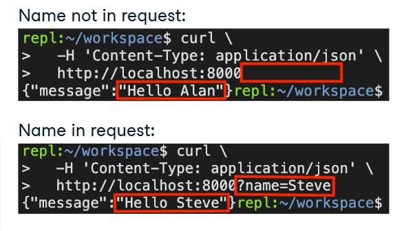

# Introduction to FastAPI 

We’ll start by learning FastAPI’s key features and core use cases. Then we will run our first application and test it out! Finally, we will learn the details of supporting GET and POST operations that include request parameters and build and test those endpoints.

## Why FastAPI? 


## GET Operations

### GET operation review

HTTP protocol - several types of operations
- GET is most common 

eg: When we type a URL into the address bar of our web browser and hit enter, we are sending a GET request.

Example:`https://www.google.com:80/search?q=fastapi`

The key parts of a GET reqeust are:
- Host,e.g.`www.google.com`,This identifies the specific server or load balancer on the Internet where we will send the request.
- Port,e.g.`80` (Default),in this case 80 which is the default for web serving.
- Path,e.g.`/search`,This tells the server what request handler it should use.
- Query String,e.g.`?q=fastapi`,This tells the handler that we are sending a query parameter named "q" with a value of "fastapi."
- All this put together tells our browser to search Google for the term "fastapi" which will show us the FastAPI project documentation.

 ### FastAPI GT operation

 The simplest FastAPI application:

 ```python
 from fastapi import FasstAPI

 # Instantiate app
 app = FastAPI()

 # Handle get requests to root
 @app.get("/")
 def root(): # we provide a function called "root() that returns a response
    return {"message":"Hello World"} # the application responds to requests to root by sending back a static dictionary with the key "message" and the value "Hello World."
    # When it is returned, FastAPI encodes this dictionary as JSON 
```

### Using the cURL web client

cURL is a convenient script we can use to test our code without a browser. 
- cURL stands for "client URL." 
- The only required argument to cURL is the URL. 

```bash
$ curl -h
Usage: curl [options...] <url>
-v, --verbose                   Make the operation more talkative
-H, --header <header/@file>     Pass custom header(s) to server
-d, --data <data>               HTTP POST data
```
- Some key optional arguments are 
    - "verbose" to make the client more talkative,
    - "header" to specify the encoding of POST data, and
    - "data" for the data itself. 
- If we call cURL on the endpoint from the previous slide, it prints the response, a message of "Hello world."

Example usage:
```bash
$ curl http://localhost:8000
{"message":"Hello World"}
```

### Query Parameters

New endpoints:
- Path: "/hello"
- Query parameter:"name"
    - Default value: "Alan"

```python
@app.get("/hello")
def hello(name: str = "Alan"):
    return {"message":f"Hello {name}"}
```



#### 1. Hello world
Let's build your first GET endpoint! You can't run the FastAPI server directly with "Run this file" - see the instructions for how to run and stop the server from the terminal.

- Import FastAPI and instantiate the app server.
- Run the live server in the terminal: fastapi dev main.py.
- Open a new terminal (top-right of terminal)
- Terminal with arrow pointing to the "new terminal" button on top right.
- Test your code with the following command:
```bash 
curl http://localhost:8000
```

#### 2. Hello world

Let's build your first GET endpoint that accepts an input! You can't run the FastAPI server directly with "Run this file" - see the instructions for how to run and stop the server from the terminal.
- Add a query parameter name with a default value "Alan".
- Return a dictionary with the key message and the value "Hello {name}".
- Run the live server in the terminal: fastapi dev main.py.
- Open a new terminal (top-right of terminal) and test your code with the following command:
```bash
curl \
  -H 'Content-Type: application/json' \
  http://localhost:8000?name=Steve
```

## POST operations

### GET vs POST Operations

**GET Operations**
- Traditional use of: request information about an object. 
- Request parameters sent via query string
- Can be sent from a web browser

```python
api = "http://moviereviews.co/reviews/1"
response = requests.get(api)
```

**POST Operations**
- Traditional use: create a new object. 
- Parameters sent via query string as well as request body.(The important thing to remember for now is that POST requests can send much more information to the server than GET requests can)
- Requires an application or framework
    - eg. `cURL`,`requests`

```python 
api = "http://moviereview.co/reviews/"
body = {"text":"A great movie!"}
response= requests.post(api,json = body)
```

### HTTP Request Body
- Both HTTP requests and response can include a message body, which is the data sent after the HTTP request header
- Header specifies body encoding, which tells the application how to decode this data correctly
- Supports nested data structures
- JSON amd XML are the most common encodings for APIs
- JSON is FastAPI default encoding

JSON Example
```python
#Create a record for a movie review
{"movie":"The Neverending Story",
"review":{"num_starts":4,
        "text":"Great movie!",
        "public":true}}
```
- The body can include various data types like strings, objects, numbers, and booleans that are supported by JSON.

### Using pydantic's BaseModel

Since HTTP request bodies support nested data structures, we need more than just type hints to define a message body for a POST request. 

Python's `pydatic` library is designed to generate and manage nested model schemas.

`pydantic`: interface to define request and response body schemas

```python 
from pydantic import BaseModel

class Review(BaseModel):
    num_stars: int
    text: str
    public: bool = False

class MovieReview(BaseModel):
    movie: str
    # Nest Review in Movie Review
    review: Review
```

- We are nesting `Review` inside `MovieReview`

### Handling a POST Operation

POST endpoint to create a new movie review:

- Endpoint:`/review`
- Input: `MovieReview`(from previous slide)
- Output: `db_review` (defined elsewhere)

```python
@app.post("/reviews",response_model = DbReview)
def create_review(review:MovieReview):
    # Persist the movie review to the database
    db_review = crud.create_review(review)
    # Return the review including database ID
    return db_view
```

Explanation:
- The endpoint is called "reviews."
- We use the @app.post annotation to tell FastAPI that this is a POST operation. 
- We follow it with a function create_review that defines the input and output. 
- The input is the pydantic model for MovieReview objects that we defined in the previous slide. 
- The output schema is called DbReview.
- Typically we would define a file call crud.py with custom functions to create, read, update, and delete objects in the database. 
- You can see an example of this in the FastAPI docs below. We can then import and use these within our `create_review` function as we are here.
- https://fastapi.tiangolo.com/tutorial/sql-databases/#crud-utils

#### 1. Pydantic model
You've been asked to create an API endpoint that manages items in inventory. To get started, create a Pydantic model for Items that has attributes name, quantity, and expiration.

- Import date from datetime and BaseModel from pydantic.
- Create a Pydantic model for Item.
- Fill in the following fields correctly: name (string), quantity (integer, optional, default 0), and expiration (date, optional, default None).

```python
# Import date
from datetime import date

# Import BaseModel
from pydantic import BaseModel

# Define model Item
class Item(BaseModel):
    name: str
    quantity: int = 0
    expiration: date = None
```

#### 2. POST operation in action
You've been asked to create an API endpoint that accepts a name parameter and returns a message saying "We have name". To accomplish this, create a Pydantic model for Item and root endpoint (/) that serves HTTP POST operations. The endpoint should accept the Item model as input and respond with a message including Item.name.

You can't run the FastAPI server directly with "Run this file" - see the instructions for how to run the server and test your code from the terminal.

- Define pydantic model Item so that parameter name can be passed into the POST body.
- Run the live server in the terminal: fastapi dev main.py
- Open a new terminal (top-right of terminal) and test your code with the following command:

```bash
curl -X POST \
  -H 'Content-Type: application/json' \
  -d '{"name": "bananas"}' \
  http://localhost:8000
```