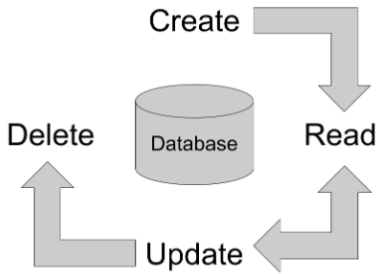
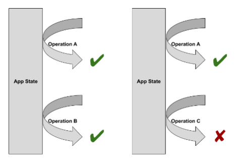

# Introduction to FastAPI 

We’ll start by learning FastAPI’s key features and core use cases. Then we will run our first application and test it out! Finally, we will learn the details of supporting GET and POST operations that include request parameters and build and test those endpoints.

## Why FastAPI? 

Let's start with some terminology

1. **Application Programming Interface**(API), meaning any software with a defined purpose : refers to web applications using the HTTP protocol to transmit structured data. 
2. **Web application** : application that serves traffic over the web.
3. **Web framework** : a software framework that helps build web applications. 

FastAPI is a fast way to build high-performance APIs using Python.

### **FastAPI key features**

- Fast: It has very high performance and is one of the fastest Python frameworks available. 
- "Low code" and easy to learn: Python annotations and type hints to make coding APIs almost identical to coding Python functions. 
- Robust : It builds production-ready code with automatic interactive documentation. 
- Standards-based : based on (and fully compatible with) the open standards for APIs: OpenAPI and JSON Schema. 

The FastAPI website, shown on the slide, provides more information about the framework's features.
- https://fastapi.tiangolo.com/

### FastAPI vs other python web frameworks

1. Flask 
- Build web based (Graphical Users Interface) apps
- ORM optional

2. Django
- Build web-based (GUI) apps
- ORM built in 

3. FaskAPI 
- Build APIs
- ORM optional

**Key difference**
 The big difference between Flask and Django is that Django has a built-in Object-Relational Mapping or ORM for short. An ORM is software that represents database models as Python objects. FastAPI and Flask do not have a built-in ORM. FastAPI's key difference is that it's designed for APIs without database operations, which can hurt API performance. This makes FastAPI a great framework for high-throughput data and machine learning transactions.

### Building our first web application with FastAPI 

1. Install FastAPI
```cmd
pip install fastapi
```

2. Create your app in main.py
```python 
from fastpi import FastAPI

app = FastAPI()

@app.get("/")
def read_root():
    return {"message":"Hello World"}
```

3. Run the server
```cmd 
fastapi dev main.py
```


&nbsp;

**Before we practice with FastAPI**
**Some notes**

1. Can't run the FastAPI sercer with the "Run this code" button
2. Instead, we define the server code in the python editor as `main.py` instead
3. Run it from the  terminal using the command `fastapi dev main.py`
4. Verify that the logs in the terminal show `Application startup complete`
5. Stop the live server by pressing `Control + c` in the same terminal
6. You should install FastAPI in your own python environment to get used to practicing there as well


## GET Operations

### GET operation review

HTTP protocol - several types of operations
- GET is most common 

eg: When we type a URL into the address bar of our web browser and hit enter, we are sending a GET request.

Example:`https://www.google.com:80/search?q=fastapi`

The key parts of a GET reqeust are:
- Host,e.g.`www.google.com`,This identifies the specific server or load balancer on the Internet where we will send the request.
- Port,e.g.`80` (Default),in this case 80 which is the default for web serving.
- Path,e.g.`/search`,This tells the server what request handler it should use.
- Query String,e.g.`?q=fastapi`,This tells the handler that we are sending a query parameter named "q" with a value of "fastapi."
- All this put together tells our browser to search Google for the term "fastapi" which will show us the FastAPI project documentation.

 ### FastAPI GET operation

 The simplest FastAPI application:

 ```python
 from fastapi import FasstAPI

 # Instantiate app
 app = FastAPI()

 # Handle get requests to root
 @app.get("/")
 def root(): # we provide a function called "root() that returns a response
    return {"message":"Hello World"} # the application responds to requests to root by sending back a static dictionary with the key "message" and the value "Hello World."
    # When it is returned, FastAPI encodes this dictionary as JSON 
```

### Using the cURL web client

cURL is a convenient script we can use to test our code without a browser. 
- cURL stands for "client URL." 
- The only required argument to cURL is the URL. 

```bash
$ curl -h
Usage: curl [options...] <url>
-v, --verbose                   Make the operation more talkative
-H, --header <header/@file>     Pass custom header(s) to server
-d, --data <data>               HTTP POST data
```
- Some key optional arguments are 
    - "verbose" to make the client more talkative,
    - "header" to specify the encoding of POST data, and
    - "data" for the data itself. 
- If we call cURL on the endpoint from the previous slide, it prints the response, a message of "Hello world."

Example usage:
```bash
$ curl http://localhost:8000
{"message":"Hello World"}
```

### Query Parameters

New endpoints:
- Path: "/hello"
- Query parameter:"name"
    - Default value: "Alan"

```python
@app.get("/hello")
def hello(name: str = "Alan"):
    return {"message":f"Hello {name}"}
```


#### 1. Hello world
Let's build your first GET endpoint! You can't run the FastAPI server directly with "Run this file" - see the instructions for how to run and stop the server from the terminal.

- Import FastAPI and instantiate the app server.
- Run the live server in the terminal: fastapi dev main.py.
- Open a new terminal (top-right of terminal)
- Terminal with arrow pointing to the "new terminal" button on top right.
- Test your code with the following command:
```bash 
curl http://localhost:8000
```

#### 2. Hello world

Let's build your first GET endpoint that accepts an input! You can't run the FastAPI server directly with "Run this file" - see the instructions for how to run and stop the server from the terminal.
- Add a query parameter name with a default value "Alan".
- Return a dictionary with the key message and the value "Hello {name}".
- Run the live server in the terminal: fastapi dev main.py.
- Open a new terminal (top-right of terminal) and test your code with the following command:
```bash
curl \
  -H 'Content-Type: application/json' \
  http://localhost:8000?name=Steve
```

## POST operations

### GET vs POST Operations

**GET Operations**
- Traditional use of: request information about an object. 
- Request parameters sent via query string
- Can be sent from a web browser ( means you can trigger it with no extra code/ tools, just use the browser UI(address bar, a link, or a plain HTML form))

```python
api = "http://moviereviews.co/reviews/1"
response = requests.get(api)
```

**POST Operations**
- Traditional use: create a new object. 
- Parameters sent via query string as well as request body.(The important thing to remember for now is that POST requests can send much more information to the server than GET requests can)
- Requires an application or framework
    - You need code (JS, curl, Postman, Python, etc.) because the request needs things a “bare” browser submit can’t do conveniently:
        - Custom headers / tokens (e.g., Authorization: Bearer …, X-API-KEY)
        - JSON body (not a simple form)
        - Non-standard methods (PUT/PATCH/DELETE)
        - Complex content types (e.g., application/json, application/xml)
        - CORS/CSRF constraints (server refuses generic browser origins or needs a CSRF header)
    - eg. `cURL`,`requests`

Example of an application/client script
```python 
api = "http://moviereview.co/reviews/"
body = {"text":"A great movie!"}
response= requests.post(api,json = body)
```

Same call in other "requires code"cilents: 
```bash
# curl
curl -X POST http://moviereview.co/reviews/ \
  -H "Content-Type: application/json" \
  -d '{"text":"A great movie!"}'
```

Examples : 
```bash
// Browser JS (or axios/fetch); can’t do this with a raw HTML form
fetch('/api/orders', {
  method: 'POST',
  headers: {'Content-Type':'application/json','Authorization':'Bearer <token>'},
  body: JSON.stringify({sku:'ABC123', qty:2})
})
```

### HTTP Request Body
- Both HTTP requests and response can include a message body, which is the data sent after the HTTP request header
- Header specifies body encoding, which tells the application how to decode this data correctly
- Supports nested data structures
- JSON amd XML are the most common encodings for APIs
- JSON is FastAPI default encoding

JSON Example
```python
#Create a record for a movie review
{"movie":"The Neverending Story",
"review":{"num_starts":4,
        "text":"Great movie!",
        "public":true}}
```
- The body can include various data types like strings, objects, numbers, and booleans that are supported by JSON.

### Using pydantic's BaseModel

Since HTTP request bodies support nested data structures, we need more than just type hints to define a message body for a POST request. 

Python's `pydatic` library is designed to generate and manage nested model schemas.

`pydantic`: interface to define request and response body schemas

```python 
from pydantic import BaseModel

class Review(BaseModel):
    num_stars: int
    text: str
    public: bool = False

class MovieReview(BaseModel):
    movie: str
    # Nest Review in Movie Review
    review: Review
```

- We are nesting `Review` inside `MovieReview`

### Handling a POST Operation

POST endpoint to create a new movie review:

- Endpoint:`/review`
- Input: `MovieReview`(from previous slide)
- Output: `db_review` (defined elsewhere)

```python
@app.post("/reviews",response_model = DbReview)
def create_review(review:MovieReview):
    # Persist the movie review to the database
    db_review = crud.create_review(review)
    # Return the review including database ID
    return db_view
```

Explanation:
- The endpoint is called "reviews."
- We use the @app.post annotation to tell FastAPI that this is a POST operation. 
- We follow it with a function create_review that defines the input and output. 
- The input is the pydantic model for MovieReview objects that we defined in the previous slide. 
- The output schema is called DbReview.
- Typically we would define a file call crud.py with custom functions to create, read, update, and delete objects in the database. 
- You can see an example of this in the FastAPI docs below. We can then import and use these within our `create_review` function as we are here.
- https://fastapi.tiangolo.com/tutorial/sql-databases/#crud-utils

#### 1. Pydantic model
You've been asked to create an API endpoint that manages items in inventory. To get started, create a Pydantic model for Items that has attributes name, quantity, and expiration.

- Import date from datetime and BaseModel from pydantic.
- Create a Pydantic model for Item.
- Fill in the following fields correctly: name (string), quantity (integer, optional, default 0), and expiration (date, optional, default None).

```python
# Import date
from datetime import date

# Import BaseModel
from pydantic import BaseModel

# Define model Item
class Item(BaseModel):
    name: str
    quantity: int = 0
    expiration: date = None
```

#### 2. POST operation in action
You've been asked to create an API endpoint that accepts a name parameter and returns a message saying "We have name". To accomplish this, create a Pydantic model for Item and root endpoint (/) that serves HTTP POST operations. The endpoint should accept the Item model as input and respond with a message including Item.name.

You can't run the FastAPI server directly with "Run this file" - see the instructions for how to run the server and test your code from the terminal.

- Define pydantic model Item so that parameter name can be passed into the POST body.
- Run the live server in the terminal: fastapi dev main.py
- Open a new terminal (top-right of terminal) and test your code with the following command:

```bash
curl -X POST \
  -H 'Content-Type: application/json' \
  -d '{"name": "bananas"}' \
  http://localhost:8000
```
Answer:
```python
from fastapi import FastAPI
from pydantic import BaseModel

# Define model Item
class Item(BaseModel):
    name: str

app = FastAPI()


@app.post("/")
def root(item: Item):
    name = item.name
    return {"message": f"We have {name}"}
```

# FastAPI Advanced topics

We’ll start by learning how to support PUT and DELETE operations using FastAPI. Then we will learn how to handle different kinds of errors and always return an appropriate status code in the response. Lastly we'll learn how to use async to enable concurrent requests that can handle higher workloads.

## PUT and DELETE operation

**PUT Operations**
- Traditional use: update an existing object
- Paramters sent via query string as well as request body
- Requires an application or framework to send and receive requests
    - eg. `cURL`,`requests`
```python
api = "http://moviereviews.co/reviews/1"
body = {"text":"A fantastuc movie!"}
response = requests.put(api.json=body)
```

**DELETE Operations**
- Traditional use: delete an existing object
- Parameters sent via query string as well as request body
- requires an application or framework to send and receive requests
    - eg.`cURL`, `requests`

```
api = "http://moviereviews.co/reviews/1"
response = requests.delete(api)
```

### Referencing Existing Objects
- Frameworks with a built-in ORM handle this mapping for you automatically, but as we have learned, FastAPI does not have a built-in ORM. 
- It is the application's responsibility to map API requests to objects it manages. This typically means mapping a parameter to the ID or other unique column of a database table(Database ID - unique identifier)
- _id convention for database IDs (It's a common practice to include the name of the column in the parameter name.)
    - review_id: Table reviews, column id
    - Same convention in frameworks with ORM

```python    
from pydantic import BaseModel

class DbReview(BaseModel):
        movie: str
        num_stars: int    
        text: str
        # Reference database ID of Reviews   
        review_id: int
```

### Handling a PUT Operation

PUT endpoint to update an existing movie review:
- Endpoint:`/reviews`
- Input:`DbReview`(from previous slide)
- Output: `DbReview`

```python
@app.put("/reviews",response_model=DbReview)
def update_review(review:DbReview):
    #update the movie review in the database
    db_review = crud.update_review(review)
    # return the updated review
    return db_review
```

### Handling a DELETE Operation

DELETE endpoint to remove an existing movie review:
- Endpoint: `/reviews`
- Input: `DbReview`

```python
@app.delete("/reviews")
def update_delete(review:DbReview):
    # Delete the  movie review from the database
    crud.delete_review(review)
    # Return nothing since the data is gone
    return {}
```

#### 1. PUT operation in action
You've been asked to create a PUT endpoint /items that accepts parameters name and description and updates the description based on the name in a key-value store called items.

You can't run the FastAPI server directly with "Run this file" - see the instructions for how to run the server and test your code from the terminal.

- Define pydantic model Item so that parameters name and description can be passed into the PUT body.
- Update description in items based on the key name.
- Run the live server from the terminal: fastapi dev main.py.
- Open a new terminal (top-right of terminal) and test your code with the following command:

```bash
curl -X PUT \
  -H 'Content-Type: application/json' \
  -d '{"name": "bananas", "description": "Delicious!"}' \
  http://localhost:8000/items
```

answer:
```python
from fastapi import FastAPI
from pydantic import BaseModel

# Define model Item
class Item(BaseModel):
    name: str
    description: str

# Define items at application startup
items = {"bananas": "Yellow fruit."}

app = FastAPI()

@app.put("/items")
def update_item(item: Item):
    name = item.name
    # Update the description
    items[name] = item.description
    return item
```

#### 2. DELETE operation in action
You've been asked to create a DELETE endpoint that accepts parameter name and deletes the item called name from a key store called items.

You can't run the FastAPI server directly with "Run this file" - see the instructions for how to run the server and test your code from the terminal.

- Define pydantic model Item with parameter name.
- Delete from items based on the key name.
- Run the live server from the terminal: fastapi dev main.py.
- Open a new terminal (top-right of terminal) and test your code with the following command:

```bash 
curl -X DELETE \
  -H 'Content-Type: application/json' \
  -d '{"name": "bananas"}' \
  http://localhost:8000/items
```

Answer: 
```python 
from fastapi import FastAPI
from pydantic import BaseModel

# Define model Item
class Item(BaseModel):
    name: str

# Define items at application start
items = {"apples", "oranges", "bananas"}

app = FastAPI()


@app.delete("/items")
def delete_item(item: Item):
    name = item.name
    # Delete the item
    items.remove(name)
    return {}
```

## Handling Errors

### Two Main Reasons To Handle Errors
**User error**
- invalid or outdated URI
- missing or incorrect input

For example, an API user could request to delete an object that doesn't exist.
```python
@app.delete("/items")
def delete_item(item:Item):
    if item.id not in item_ids:
        # Return an error
    else:
        crud.delete_item(item)
        return{}
```

**Server Error**
- Something else happened

For example, the app could get an exception when trying to delete an object. In this case we wrap our code in a try block and respond with an error when there is an Exception.

```python 
@app.delete("/items")
def delete_item(item:Item):
    try: 
        crud.delete_item(item)
    except Exception:
        # Return an error
    return {}
```

### HTTP Status Codes: "Levels of Yelling" 

- Enables API to provide status in response 
    - Success, failure, error, etc. 
- Specific codes defined in HTTP protocol 
- Range: `100` - `599`
- Categorize by first number (`1` -`5`) 

1. Informational responses (`100` - `199`)
2. Successful responses (`200`-`299`)
3. Redirection messages (`300`-`399`)
4. Client error responses (`400`-`499`)
5. Server error responses (`500`-`599`)

### Common HTTP Status Codes

**Success (200-299)**
- `200 ok`
    - Default success response
- `201 Created`
    - Specific to POST operation
- `202 Accepted`
    - Non committal. "Working on it"
- `204 No Content`
    - Success! Nothing more to say

**Other Response**
- 301 Moved Permantently
    - URI changed permanently
- 400 Bad Request
    - Client error
- 404 Not Found
    - Server cannot find the requested resource
- 500 Internal Server Error
    - Server has encountered a situation it does not know how to handle

### Handling Errors With Status Codes
```python 
from fastapi import FastAPI, HTTPException

app = FastAPI()

@app.delete("/items")
def delete_item(item: Item):
    if item.id not in item_ids:
        # Send response with status 404 and specific error message 
        raise HTTPException(status_code=404, detail="Item not found.")
    else:       
        delete_item_in_database(item)
        return {}

```

#### 1. Handling a client error
You've been asked to create a DELETE endpoint that accepts parameter name and deletes the item called name from a key store called items. If the item is not found, the endpoint should return an appropriate status code and detailed message.

You can't run the FastAPI server directly with "Run this file" - see the instructions for how to run the server and test your code from the terminal.

- Import HTTPException from FastAPI.
- Raise HTTPException if an item is not in items.
- Specify the appropriate status code for "not found."
- Run the live server from the terminal: fastapi dev main.py.
- Open a new terminal (top-right of terminal) and test your code with the following command:
```bash
curl -X DELETE \
  -H 'Content-Type: application/json' \
  -d '{"name": "bananas"}' \
  http://localhost:8000/items
```
Answer : 
```python
from fastapi import FastAPI, HTTPException
from pydantic import BaseModel

# Define model Item
class Item(BaseModel):
    name: str

# Define items at application startup
items = {"apples", "oranges"}

app = FastAPI()


@app.delete("/items")
def delete_item(item: Item):
    name = item.name
    if name in items:
        items.remove(name)
    else:
        # Raise HTTPException with status code for "not found"
        raise HTTPException(status_code=404, detail="Item not found.")
    return {}
```

## Using async for concurrent work 

### Why use async?


Let's use the example from the FastAPI website: Concurrent burgers. On the left we see two people waiting at a restaurant, where every cashier prepares every order they take. We can call this sequential burgers, since each worker does every step to make their burgers themselves. With sequential burgers, we have to wait at the counter a long time, since each worker completes all the steps! On the right we see two people in line for concurrent burgers. With concurrent burgers, most of the workers are in the kitchen doing different jobs to make the burgers, so we don't have to wait as long for our food. The lesson of this analogy is that if we use async our API can serve requests concurrently and spend less time waiting for work to be done. The FastAPI website referenced here covers this with a lot more detail, in case this concept is confusing!

### async in practice

**Sequential Burgers**
Defining a function to get burgers
```python 
# This is not asynchronous 
def get_sequential_burgers(number:int):
    # Do some sequential stuff
    return burgers 
```

Calling the function sequentially
```python
burgers = get_burgers(2)
```


**Concurrent Burgers**
Defining a fucntion to get burgers 
```python
async def get_burgers(number:int):
    # Do some asynchronous stuff
    return burgers
```

Calling the function asynchronously
```python 
burgers = await get_burgers(2) 
```
- This tells Python that the code is safe to run ins the background

### FastAPI with async

If we can:
```python
results = await some_library()
```

then use `async def`: 
```python 
@app.get('/')
async def read_results():
    results = await some_library()
    return results
```
*Note: Only use `await` inside of functions crated with `async def`*

### When to use async
**Use aysnc**

if our application needs to wait for other systems to respond
- External API 
- Database

This is common in I/O-bound tasks, and helps FastAPI stay responsive during those waits.

Examples: 
- HTTP requests
- Querying databases
- Reading files

**Don't use async**

We should not use asunc for CPU-heavy tasks

Examples:
- Audio or image processing
- Computer vision
- Machine Learning
- Deep Learning


#### 1. Asynchronous DELETE operation
You've been asked to create an API endpoint that deletes items managed by your API. To accomplish this, create an endpoint /items that serves HTTP DELETE operations. Make the endpoint asynchronous, so that your application can continue to serve requests while maintaining any long-running deletion tasks.

We can't run the FastAPI server directly with "Run this file" - see the instructions for how to run the server and test your code from the terminal.

- Make the delete operation asynchronous.
- Validate the existence of item.name in list items.
- Return the appropriate status code for "not found."
- Run the live server from the terminal: fastapi dev main.py.
- Open a new terminal (top-right of terminal) and test your code with the following command:
```bash
curl -X DELETE \
  -H 'Content-Type: application/json' \
  -d '{"name": "rock"}' \
  http://localhost:8000/items

curl -X DELETE \
  -H 'Content-Type: application/json' \
  -d '{"name": "roll"}' \
  http://localhost:8000/items
```

Answer: 
```python 
from fastapi import FastAPI, HTTPException
from pydantic import BaseModel

# Define model Item
class Item(BaseModel):
    name: str

app = FastAPI()

items = {"rock", "paper", "scissors"}


@app.delete("/items")
# Make asynchronous
async def root(item: Item):
    name = item.name
    # Check if name is in items
    if name not in items:
        # Return the status code for not found
        raise HTTPException(status_code=404, detail="Item not found.")
    items.remove(name)
    return {"message": "Item deleted"}
```
output : 
```cmd 
INFO:     127.0.0.1:34250 - "DELETE /items HTTP/1.1" 200 OK
INFO:     127.0.0.1:34260 - "DELETE /items HTTP/1.1" 404 Not Found
```

# Building and testing a JSON CRUD API

We'll start by learning how to write system tests to validate individual FastAPI endpoints. Next we'll build a full JSON CRUD API to manage object lifecycles over HTTP. Finally, we'll learn how to test different application endpoints working together with manual functional tests.

## FastAPI automated testing

### What are automated Tests?

**Unit Tests**
- Focus: Isolated code
- Purpose: Validate code function
- Scope: Function or method
- Environment: Isolated Python env

```python 
def test_main():
    response = main()
    assert response == {"msg":"Hello"}
```

**System Tests**
- Focus: Isolated system operations
- Purpose: Validate system function 
- Scope: Endpoint
- Environment: Python env with app running

```python 
def test_read_main():
    response = client.get("/")
    assert response.status_code ==200
    assert response.json() == {"msg":"Hello"}
```

### Using TestClient

`TestClient`: HTTP client for `pytest`

```python 
# Import TestClient and app
from fastapi.testclient import TestClient
from .main import app

# Create test client with application context
client = TestClient(app)

def test_main():
    response = client.get("/")
    assert response.status_code ==200
    assert response.json() == {"msg":"Hello"}
```

### Testing Error or Failure Responses

**App**
```python 
app = FastAPI()

@app.delete("/items")
def delete_item(item:Item):
    if item.id not in item_ids:
        raise HTTPEXception(
            status_)code = 404,
            detail="Item not found.")
    else:
        delete_item_in_database(item)
        return {}
```

**Test**
```python 
def test_delete_nonexistent_item():
        response = client.delete(
            "/items",
            json={"id": -999})
        assert response.status_code == 404    
        json = response.json()
        assert json == {"detail":"Item not found."}
```

## Building a JSON CRUD API

### Four Steps in Object Management Lifecycle (CRUD)



**API Operations**

**Create**
- POST operation

**Read**
- GET operation

**Update**
- PUT operation

**Delete**
- DELETE operation

### JSON CRUD API Motivation

**Fundamentals**
- Manage the entire object lifecycle
- Understand best practices for HTTP API operations
- Design our own data management APIs

**Opportunities**
- Business logic for more complex data operations
- High throughput data pipelines
- Machine Learning inference pipelines

### Building a CRUD Module

```python 
from pydantic import BaseModel

class Review(BaseModel):    
    movie: str    
    num_stars: int    
    text: str
    
class DbReview(BaseModel):
    movie: str
    num_stars: int
    text: str
    # Reference database ID of Reviews   
    review_id: int

# crud.py
def create_review(review: Review):
    # Create review in database
    
def read_review(review_id: int):
    # Read review from database
    
def update_review(review: DbReview):
    # Update review in database
    
def delete_review(review_id: int):
    # Delete review from database
```

### POST Endpoint to Create
- Endpoint:`/reviews`
- Input:`Review`
- Output: `DbReview`

```python
@app.post("/reviews",response_model = DbReview)
def create_review(review:Review):
    # Create the movie review in the database
    db_review = crud.create_review(review)
    # Return the created review with database ID
    return db_review
```

### GET Endpoint to Read
- Endpoint:`/reviews`
- Input `?review_id = 1234`
- Output : `DbReview`

```python
@app.get("/reviews",response_model = DbReview)
def read_review(review_id: int):
    # Read the movie review from the database
    db_review = crud.read_review(review_id)
    # Return the review 
    return db_review
```

### PUT Endpoint to Update
- Endpoint: `/reviews`
- Input: `DbReview`
- Output: `DbReview`

```python
@app.put("/reviews",response_model = DbReview)
def update_review(review:DbReview):
    # Update the movie review in the database
    db_review = crud.update_review(review)
    # Return the updated review
    return db_review
```

### DELETE Endpoint to Delete
- Endpoint: `/reviews`
- Input: `DbReview`
- Output: `{}`
```python 
@app.delete("/reviews")
def delete_review(review: DbReview):
    # Delete the movie review from the database
    crud.delete_review(review.review_id)
    # Return nothing since the data is gone
    return {}
```

## Writing a manual functional test

### What Are Functional Tests? 

**System Tests**
- Focus: Isolated system operations
- Purpose: Validate system function
- Scope: Endpoint
- Environment: Python env with app running

```python 
def test_read():
    response = client.get("/items/1")
    assert response.status_code == 200
```    

**Functional Tests**
- Focus: Integrated system
- Purpose: Validate system overall
- Scope: Application
- Environment: Python env with app running

```python
def test_delete_then_read():
    response = client.delete("/items/1")
    assert response.status_code == 200
    response = client.get("/items/1")
    assert response.status_code == 404
```

### Test Workflows



### Functional Test Workflow Examples

**Successful workflows**
- Create, then read
- Create, then update
- Create, then delete
- ...

**Failing workflows**
- Read without create
- Update after delete
- Delete without create
- ...

### Functional Test Scripts
- Outside test framework - "Manual test"
- Use `requests`

```python 
import requests
ENDPOINT = "http://localhost:8000/items"

# Create item "rock"
r = requests.post(ENDPOINT, json={"name": "rock"})
assert r.status_code == 200

# Get item rock
r = requests.get(ENDPOINT, json={"name": "rock"})
assert r.status_code == 200
```
- Workflows built against known application state

### FastAPI Review

- FastAPI key features and use cases
- Four types of HTTP operations
- Building a JSON CRUD API
- Using status codes to communicate success and failure
- Using async
- System tests
- Manual functional tests
 