# AdaBoost
Let's start by using **Decision Trees** and **Random Forests** to explain the three main concepts behind **AdaBoost**

---

In Random Forest, 

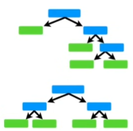

- each time you make a tree, you make a full sized tree. Some trees might be bigger than others, but there is no predetermined maximum depth. 
- each tree has an equal vote on the final classification 
- each decision tree is made independently of the others, in other word, it doesn't matter which three was made first

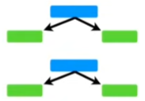

In contrast, in a **Forest of Trees** made with **AdaBoost**, 
- the trees are usually just a **node** and two **leaves**
- in a **Forest of Stumps** made with **AdaBoost**, some stumps get more say in the final classification than others
    - 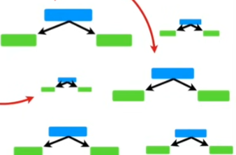
    - in this illustration, the larger stumps get more say in the final classification than the smaller stumps
- **Forest of Stumps** made with **AdaBoost**, the order is important
    - The erroes that the first stump makes influence how the second stump is made
---

Terminology:
- **Stump**: A tree with just one node and two leaves
    - Stumps are not great at making accurate classifications 

---

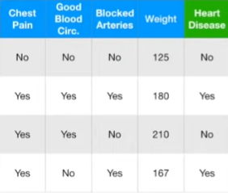

For examples, if we were using this data to determine if someone had heart disease or no, then a full sized Dicision Tree would take advantage of all 4 variables that we measured (Chest Pain, Blood Circulation, Blocked Arteries and Weight) to make decision ...

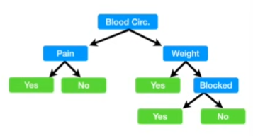

but a Stump can only use one variable to make a decision
- Thus, **Stumps** are technically "weak learners"
- However, that's the way **AdaBoost** likes it, and it's one of the reasons why they are so commonly combined

## The three ideas behind Adaboost 

1. AdaBoost combines alot of "weak learners" to make classifications. The weak learners are almost always **stumps**

2. Some stumps get more say in the classification than the others

3. Each stump is made by taking the previous stump's mistakes into account.

## How to create a Forest of Stumps using AdaBoost

Context:

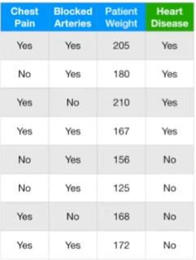

We create a **Foreast of Stumps** with AdaBoost to predict of a patient has heart disease 
- we will make these predictions based on a patient's **Chest Pain** and **Blocked Artery** status and their **Weight**

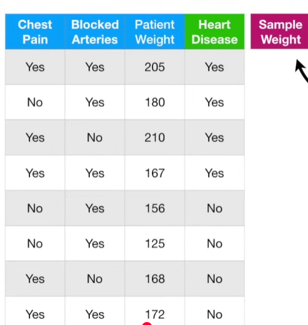
- the first thing we do is give each sample a weight that indicates how important it is to be correctly classified
- **Note:** The **Sample Weight** is different from the **Patient Weight**

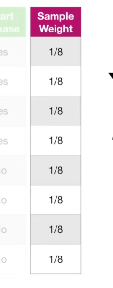

1. At the start, all samples get the same weight , 1 / total number of samples = 1/8, and that makes the samples all equally important. However, after we make the first stump, these wright will change in order to guide how the next stump created.

2. Now we need to make the first stump in the forest,this is done by finding the variable, **Chest Pain**, **Blocked Arteries** or **Patient Weight**, that does the best job classifying the samples.
    - >Note: Because all of the weights are the same, we can ignore them right now.

3. We start by seeing how well chest pain classifies the samples.

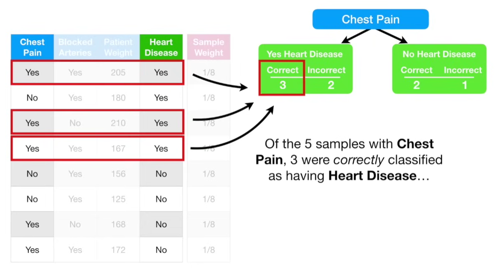
- Of the 5 samples with Chest Pain, 3 were correctly classified as having **Heart Disease**

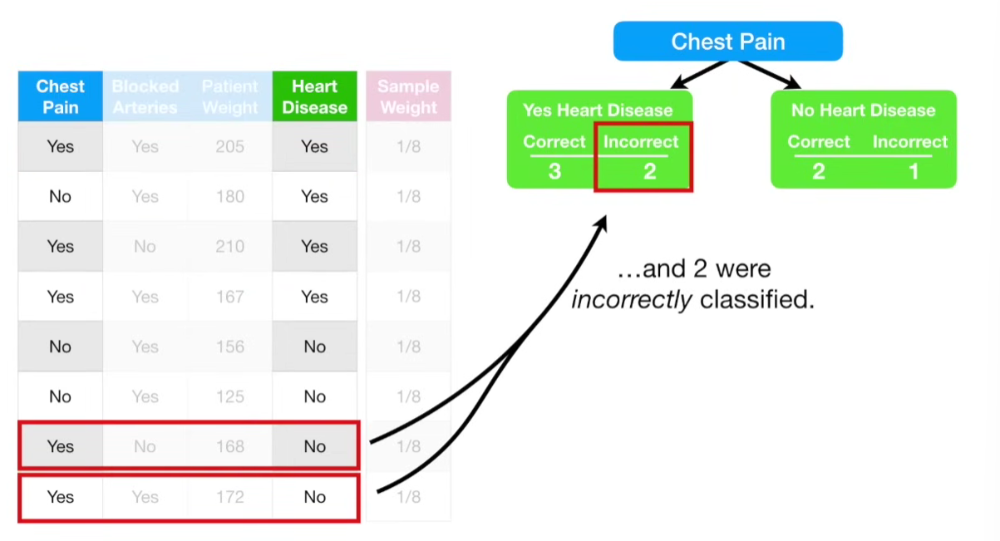
- and 2 were incorrectly classified

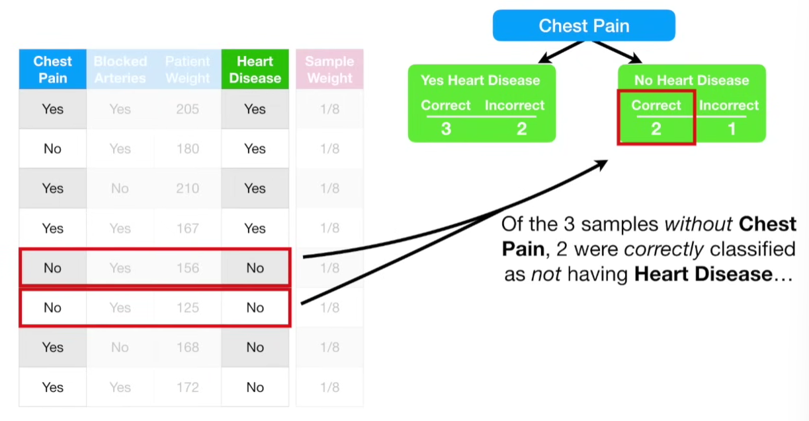
- Of the 3 samples without Chest Pain, 2 were correctly classified as not having Heart Disease

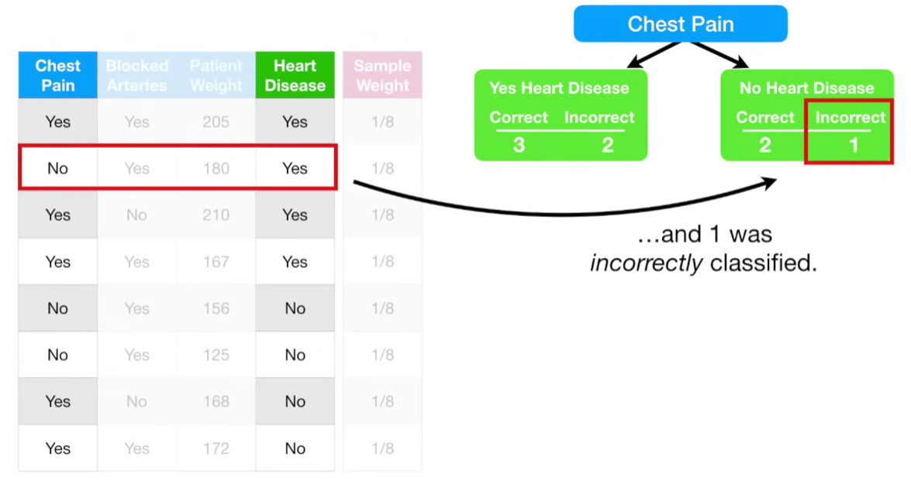
- and 1 was incorrectly classified

4. Now we do the same for **Blocked Arteries**
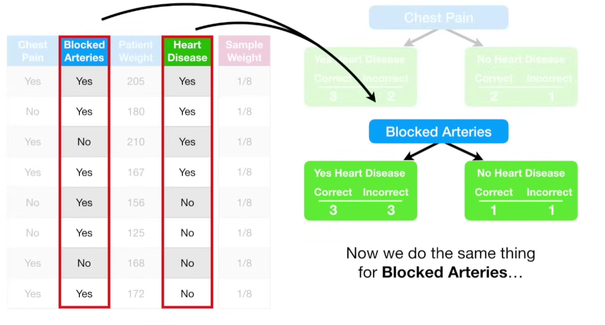

5. And for **Patient Weight**

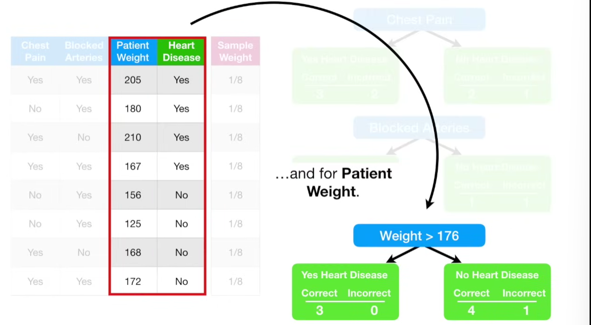

>Note: We used the techniques described in the Decision Tree StatQuest to determine that 176 was the best weight to separate the patients

6. Now we calculate the Gini index for the three stumps. 

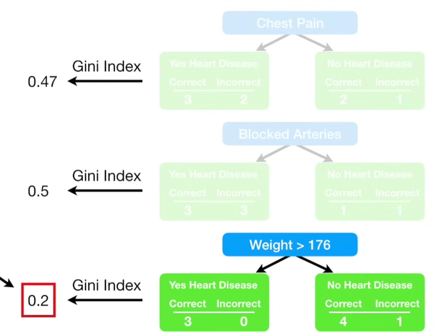

- the Gini index for the **Patient Weight** is the lowest, so this will be the first stump in the forest.
- Now we need to determine how much say this stump will have in the final classification 

7. We determine how much say a stump has in the final classification based on how well it classified the samples.

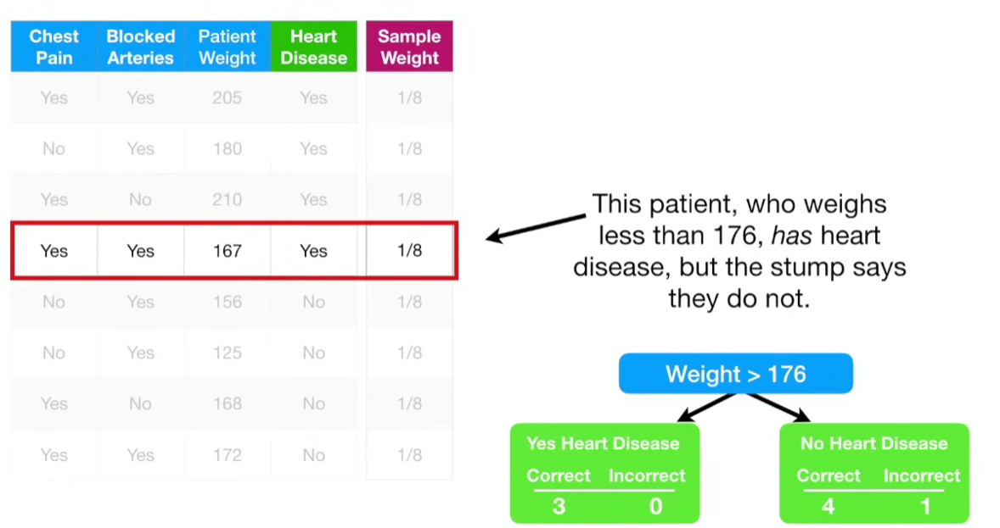
- this stump made one error
- This patient, who weight less than 176, has heart disease, but the stump says they do not.
- The **Total Error** for a stump is the sum of weight associated with the incorrectly classified samples, Thus the **Total Error** here is 1/8

>**Note:** Because all of the **Sample Weights** add up to 1, **Total Error** will always be between 0, for a perfect stump, and 1, for a horrible stump.

- We use the **Total Error** to determine **Amount of Say** this stump has in the final classification with the following formula:

$$ \text{Amount of say} = \frac{1}{2} log(\frac{1 - \text{Total Error}}{\text{Total Error}}) $$

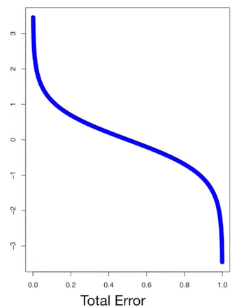

We can draw graph of **Amount of say** by plugging in a bunchof numbers between 0 and 1 for total error.
- The blue line tells us the **Amount of Say** for total Error values between 0 and 1
- When a stump does a good job, and the **Total Error** is small then the **Amount of Say** is relatively large positive value
- When a stump is no better at classification than flipping a coin (i.e. half of the samples are correctly classified and half are incorrectly classified) and **Total Error** = 0.5 then the **Amount of Say** is 0
- When a stump does a terrible job and the **Total Error** is close to 1, ie: if the stump consistently gives you the opposite classification then the **Amount of SAY** will be a large negative value
- So if a stump votes for "HEart Disease", the negative Amount of say will turn that vote into "Not Heart Disease".

>Note: If **Total Error** is 1 or 0, then this equation will freak out, in practice, a small error term is added to prevent this from hapenning 

8. With **Patient Weight**> 176, the **Total Error** is 1/8, so we just plug and calculate the **Amount of say**

$$ \text{Amount of say} = \frac{1}{2} log(7) = 0.97 $$

9. After we work out the **Amount of say** of **Weight**, we work it out for **Chest Pain** and **Blocked Arteries**, which are 0.42 and 0.
This is how we determine the amount of say 

---

Now we need to learn how to modify the weights so that the current stump made into account.

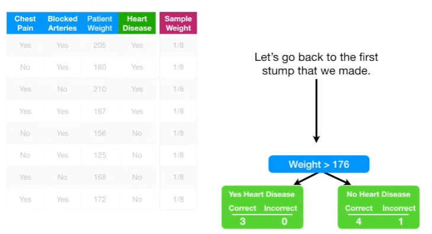

This is the first stump that we made. When we created this stump, all of the **Sample Weights** were the same and that meant we did not emphasize the importance of correctly classifying any particular sample

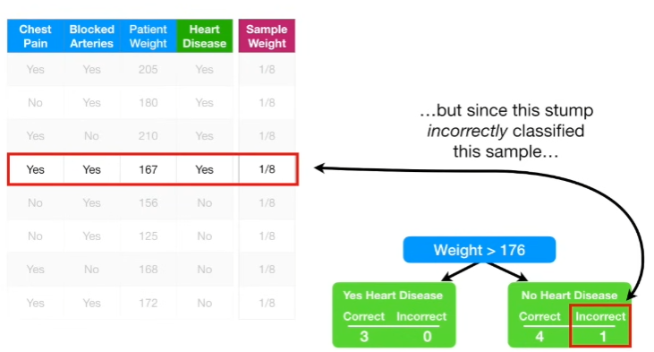

But this stump incorrectly classified this sample, we will emphasize the need for the next stump to correctly classify it by increasing its **Sample Weight** 

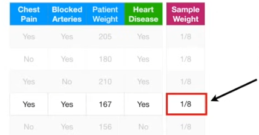 

and decrease all other sample weight. 

Let's start by increasing the **Sample Weight** for incorrectly classified sample

$$ \text{New Sample Weight} = \text{sample weight} \times e^{\text{amount of say}} $$

This is the formula we will use to increase the **Sample Weight** for the sample that was incorrectly classified.

$$ \text{New Sample Weight} = \frac{1}{8} \times e^{\text{amount of say}} $$

>For better understand of how this part will scale the previous **Sample Weight**, let's draw a graph
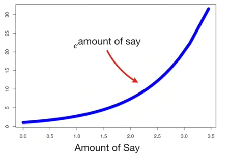
> When the **Amount of Say** is relatively large, (ie. the last stump did a good job classifying samples) then we will scale the previous **Sample Weight** with a large number and the **New Sample Weight** will be much larger than the old one. And when the **Amount of Say** is relatively low (ie. the last stump did not do a very good job classifying samples) then the previous **Sample Weight** is scaled by a relatively small number and the **New Sample Weight** will only be a little larger than the old one.

In this example, the **Amount of Say** was 0.97, and $e^{0.97} = 2.64$

$$ \text{New Sample Weight} = \frac{1}{8} \times 2.64 = 0.33 $$

That means the new **Sample Weight** is 0.33, which is more than the old one (1/8 = 0.125)

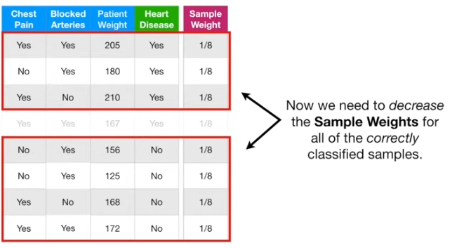

Now we need to decrease the **sample weight** of the correctly classified samples

$$ \text{New Sample Weight} = \text{sample weight} \times e^{-\text{amount of say}} $$

This is the formula we will use to decrease the **Sample Weight** for the sample that was correctly classified.

Just like before, we plug in the sample weight and calculate the **Amount of say**

> For better understanding of how this will scale the **Sample Weight**,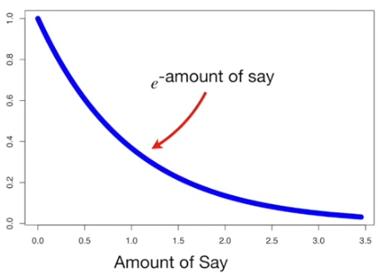
> When the **Amount of Say** is relatively large then we will scale the previous **Sample Weight** with a number that close to 0 and the **New Sample Weight** will very small. When the **Amount of Say** is relatively low then we will scale the **Sample Weight** by a value close to 1 and the **New Sample Weight** will just be a little smaller than the old one.

In this example, the **Amount of Say** was 0.97, and $e^{-0.97} = 0.38$

$$ \text{New Sample Weight} = \frac{1}{8} \times 0.38 = 0.05$$

The new **Sample Weight** is 0.05 which is less than the old one (1/8 = 0.125)

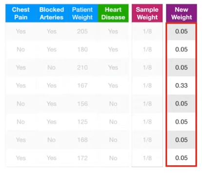

This will be the **New Sample Weight** of each samples, then we will need to normalize the **New Sample Weight** so that they will add up to 1.
- if we add up all the new sample weight, it will be 0.68
- So we divide each New Sample Weight by 0.68 to get the normalized values

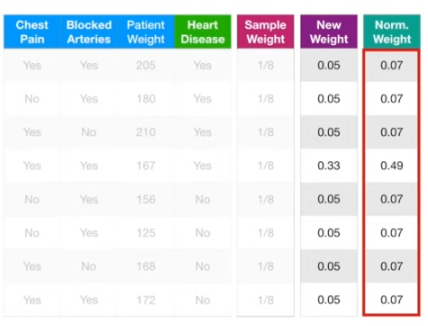

Now, when we add up the **New Sample Weights**, we get 1. Then we transfer the **Normalized Sample Weights** to the **Sample Weight** column, since those are what we will use for the next stump.

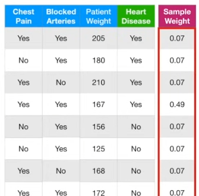

Now we can use the modified **Sample Weights** to make the second stump in the forest.

---

In theory, we cound use the **Sample Weights** to calculate **Weighted Gini Indexes** to determine which variable should split the next stump.

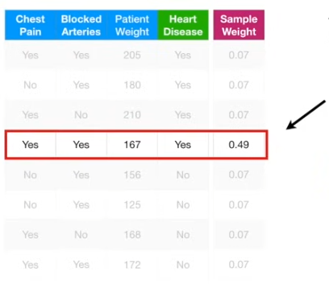

The **Weighted Gini Index** would put more emphasis on correctly classifying this sample (the one that was misclassified by the last stump), since this sample has the largest **Sample Weight**

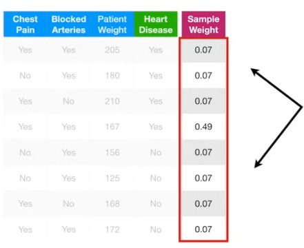

Alternatively, instead of using a **Weighted Gini index**, we can make a new collection of samples that contains duplicate copies of the samples with the largest **Sample Weights**.