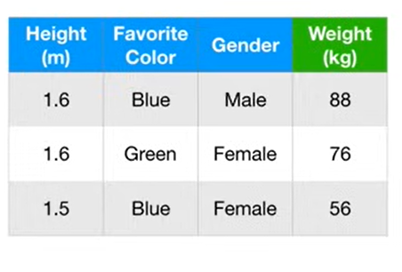

# Gradient Boost (Part 2)

We are going to walk through the original **Gradient Boost** step-by-step. In order to keep the example from getting out of hand, we are going to use Gradient Boost to fit a model to super simple **Training Dataset**

