# Random Forest

Random Forests are made out of desicion trees...
- Trees have one aspect that prevents the, from being the ideal tool for predictive learning, namely inaccuracy
- in other words, they work great with the data used to create them, but they are not flexible when it comes to classifying nre samples.
- Random forests combine the simplicity of decision trees with flexibility resulting in a vast improvement in accuracy

- this is the dataset we are going to build the tree from

**Step 1:**
- To create a bootstrapped dataset that is the same size as the original, we jsut randomly select samples from the original dataset.(we are allow to pick the same sample more than once.)
- Bootstrapping a dataset means creating multiple new datasets by resampling, woth replacement, from original dataset. This technique is used to estimate the uncertainty and variability of ststistical estimates, especially when dealing with limited original data.

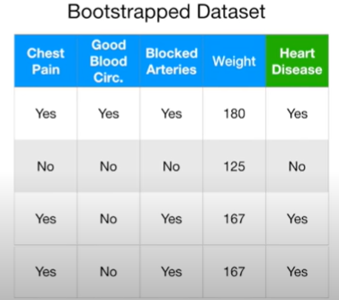
- this is the bootstrapped dataset that we randomly select from the original dataset

**Step 2:**
- Create a decision tree using the bootstrapped dataset, but only use a random subset of variables (or columns) at each step.
- In this example, we will only consider 2 variables (columns) at each step.
- Note: we will talk more about how to determine the optimal number of variables to consider later...
- Thus, instead of considering all 4 variables to figure out how to split the root node, we randomly select 2. In this case, we randomly select **Good Blood Circulation** and **Blocked Arteries** as candidates for the root node

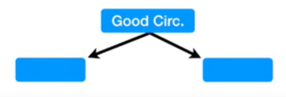
- Just for the sake of the example, assume that **Good Blood Circulation** did the best job separating the samples

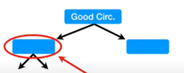
- Now we need to figure out how to split samples at this node. 
- just like for the root, we randomly select 2 variables as candidates, instead of all 3 remaining columns.

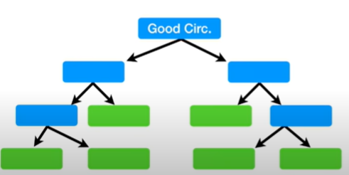
- And we just build the tree as usual, but only considering a random subset of variables at each step. 

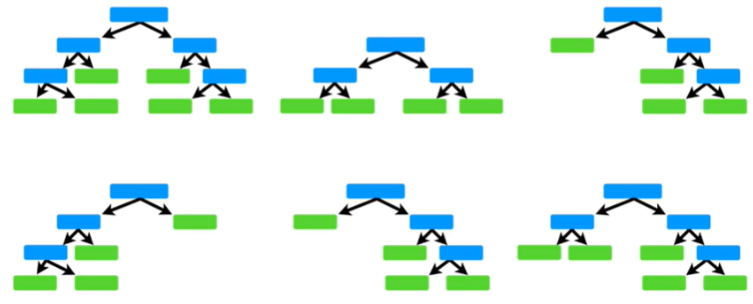

After building the first tree, **go back to Step 1 and repeat**: Make a new boot strapped dataset and build a tree considering a subset of variables at each step.
- Ideally, you do this 100's of times
- Using a bootstrapped sample and considering only a subset of variables at each step results in a wide variety of trees.
- The variety is what makes random forests more effective than individual decision trees.

#### How do we use random forest? 

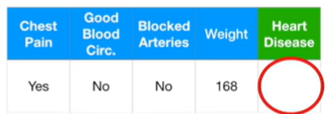
- First we got a new patients, we got all the measurements(variables), we want to know whether this patient has heart disease or not.

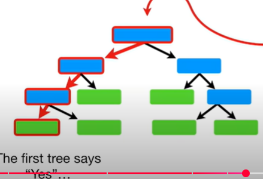
- so we takke the data, and run it down the first tree that we made, and the first tree says "Yes"

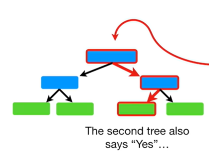
- Now we run the data down the second tree taht we made, and the second tree says "Yes"
- And then we repreat for all the trees taht we made.

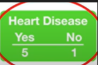
- After running the data down all of the trees in ranfom forest, we see which option received more votes
- In this case, "Yes" received teh most votes, so we will conclude that this patient has heart disease.

**Terminology**
- **Bagging**: bootstrapping the data plus using the aggregate to make a decision

## How do we know which random forest/tree is better? 

**we estimate the accuracy of the random forest**

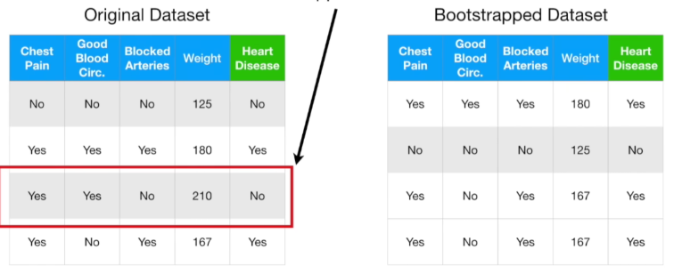
- When we create a bootstrap dataset, we allowed duplicate entries in the bootstrapped datase. 
- As a result, there are some entries were not included in the bootstrapped dataset.
- Typically, about 1/3 of the original data does not end up in the bootstrapped dataset.
- The entries that are not in the bootstrapped dataset called the **"Out-Of-Bag Dataset"**

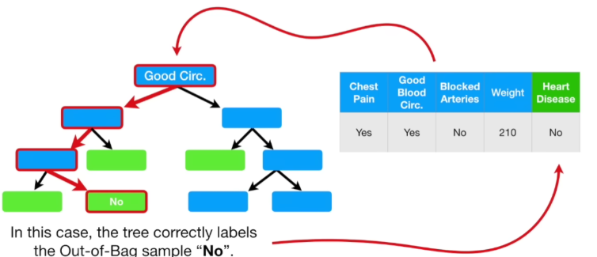
- Since the Out-Of-Bag data was not used to create this tree, we can run it through and see if it correctly calssifies the sample as "No Heart Disease"
- in this case, the tree correctly labels the Out-Of-Bag sampple, "No"
- The we run this Out-Of-Bag sample through all of the other trees that were built without it. For examples, there three trees, one correctly label the Out-Of-Bag sample, and two trees labelled it wrongly.

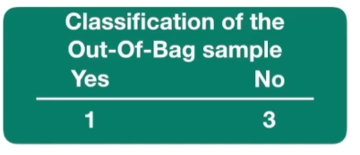
- Since the label with the mose votes wins, it is the label that we assign this Out-of-Bag sample.
- In this case, the out-of-bag sample is correctly labeled by the Random Forest.

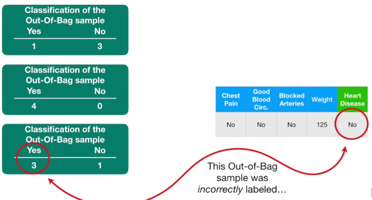
- We then do the same thig for all the other out-of-bag samples for all of the trees
- some out-of-bag samples is correctly labeled, some are incorrectly labeled ... etc etc etc
- Ultimately, we can measure how accurate our random forest is by the proportion of out-of-bag samples that were correctly classified by the Random Forest
- The proportion of out-of-bag samples that were incorrectly classified is the **"out-of-bag error"**

&nbsp;

**Go back to how we built the random forest**

Remember when we built our first tree and we only used 2 variables (columns of data) to make a decision at each step?

Now we can compare the **Out-Of-Bag error** for a random forest built using only 2 variables per step to a random forest built using 3 variables per step and we test a bunch of different settings and choose the most accurate random forest

**To summarize**
1. Build a random Forest
2. Estimate the accuracy of the Random Forest. (change the number if variables used per step, do this for a bunch of times and then choose the one that is most accurate)

Note: Typically, we start by using the square of the number of variables and then try a few settings above and below that value.

## Missing data and sample clustering

Context:

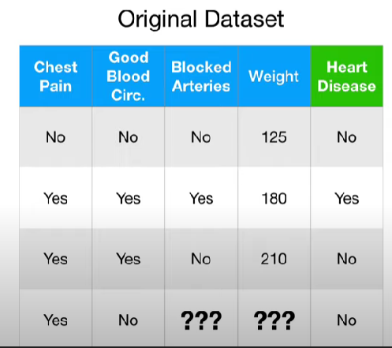
- Here is our dataset, our dataset has 4 patients
- our forth patient have some missing data

**Random Forests consider 2 types of missing data**

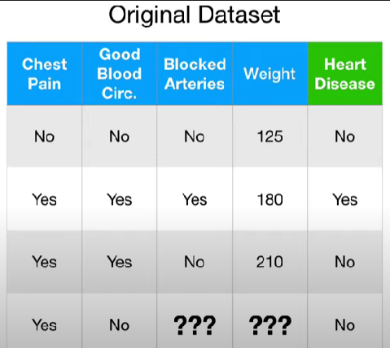

1. Missing data in the original dataset used to create the random forest

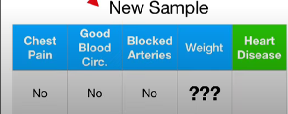

2. Missing data in the new sample that you want to categorize

&nbsp;

**Missing data in the original dataset used to create the random forest**

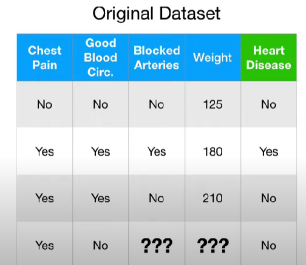

- we want to create a random forest with this data
- however, we don't know if this patient has blocked arteries or their weight 
- the general idea for dealing with missing data in this context is to make n initial guess that could be bad, then gradually refine the guess until it is (hopefully) a good guess.

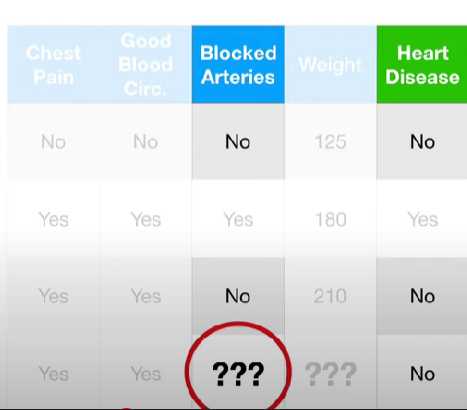

- Normally, the initial(and possibly bad) guess for the blocked arteries value is just the most common value for "Blocked Arteries" found in the other samples that do not have Heart Disease.
- Among the people that do not have Heart Disease "No" is the most common value for Blocked arteries - it occurs in 2 out of 2 samples.
- So "No" is our initial guess.

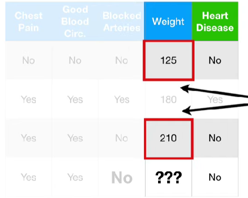
- since **weight** is numeric, our initial guess will be the medial value of the patients that **did not** have heart disease.
- in this case, the median value is 167.5

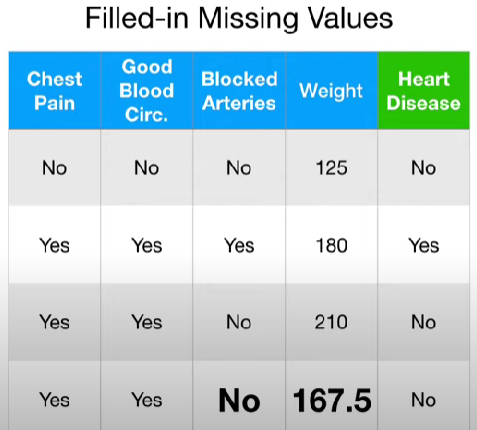
- this is the new dataset with Filled-in Missing Values, now we want to refine these guesses
- we do this by first determining which samples are similar to the one with missing data.

&nbsp;

**How to determine similarity?**
- step 1: Build a random forest
- step 2: Run all fo the data down all of the trees.

1. We will start by running the data down the first tree. 

sample data 1:
- 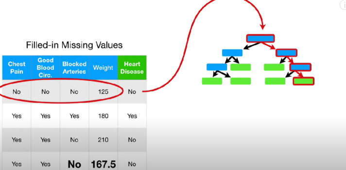

sample data 2:
- 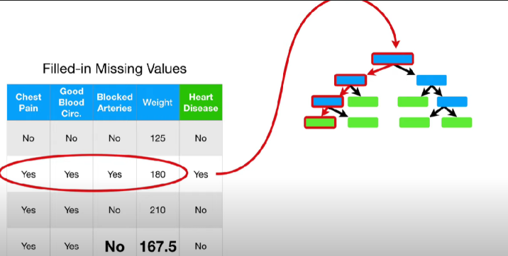

sample data 3:
- 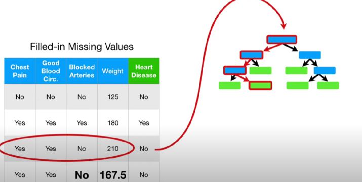

sample data 4:
- 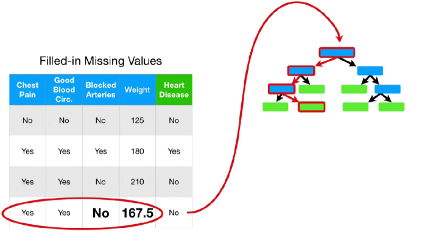

Notice that sample 3 and sample 4 both ended up at the same leaf node. That means they are **similar**
- we keep track of similar samples using a "Proximity Matrix"
    - 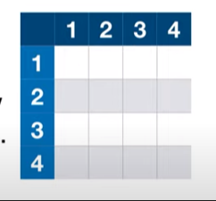
- The proximity matrix has a row for each sample and it has a column for each sample.
- Because sample 3 and sample 4 ended up in the same leaf node, so we put a 1 here
    - 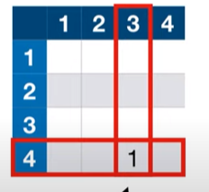
- We also put a 1 here, since this position also represents samples 3 and 4.
    - 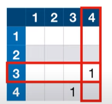
- because no other pair of sampels ended in the same leaf node, our proximity matrix look like this after running the samples down the first tree.

2. Now we run all fo the data down the second tree.

sample data 1: 
- 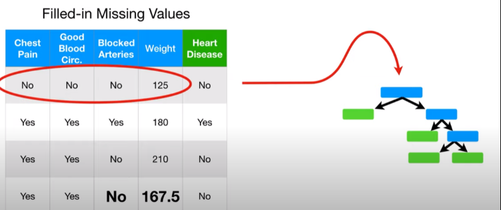

sample data 2:
- 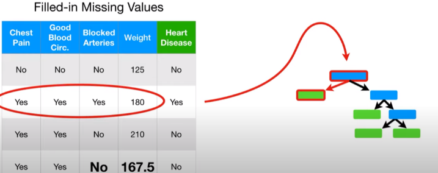

sample data 3: 
- 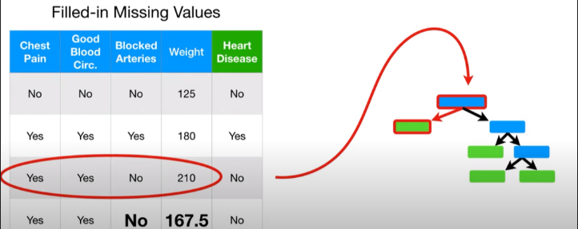

sample data 4:
- 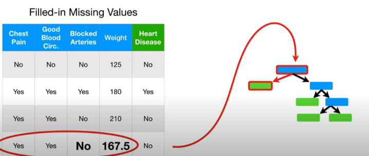

Notice that samples 2,3 and 4 all ended up in the same leaf note.
- This is what the proimity matrix looked like after running the data down the first tree.
    - 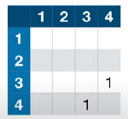
- and after the second tree, we add 1 to any pair of samples that ended up in the same leaf node.
    - 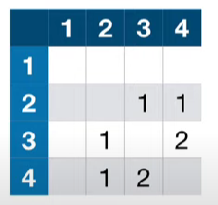
- Samples 3 and 4 ended up in the same node together again, and sample to ended up in the same node with them

3. Now we run all of the data down the third tree
- and here is the updated proximity matrix.
    - 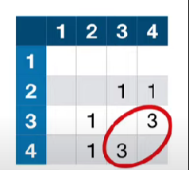
    - only samples 3 and 4 ended up in the same leaf node.

Ultimately, we run the data doen all the trees and the proximity matrix fills in
- 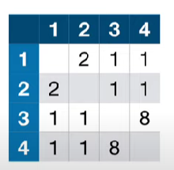
- the we divide each proximity value by the total number of trees. In this example, assume we had 10 trees.
    - 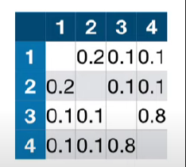
- Now we use the proximity values for sample 4 to make better guesses about the missing data

For Blocked Arteries, we calculated the weighted frequency of "Yes" and "No", using proximity values as the weights.

