# Gradient Boost 

## (Part1) Gradient Boost for Regression

Context: 

We will use this dataset

> Note: When **Gradient Boost** is used to Predict a continuous value, like **Weight**, we say that we are using **Gradient Boost** for regression

This StatQuest focuses on showing you the most common way Gradient Boost is used to predict a continuous value like **Weight**

### Compare and contrast **AdaBoost** and **Gradient Boost**

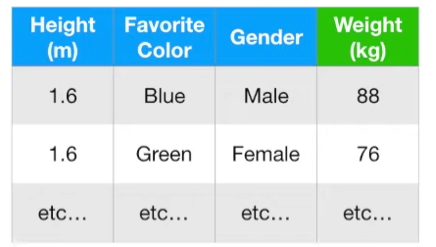

If we want to use these measurement to predict **Weight** ,

**AdaBoost** 
- starts by building a very short tree, called a **Stump**, from the training data 
- and the amount of say that the stump has on the final output is based on how well it cmopensate for those previous errors.
- Then build the next stump based on errors that the previous stump made until a specify amount of stump or until it perfectly fit.

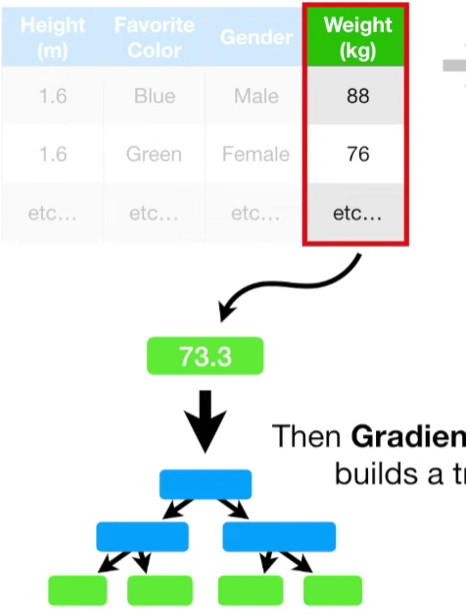

**Gradient Boost**
- starts by making a single leaf, instead of a tree or stump
- This leaf represents an initial guess for the **Weights** of all of the samples.
- When trying to **Predict** a continuous value like **Weight**, the first guess is the average value.
- then **Gradient Boost** builds a tree, like AdaBoost, this tree is based on the error made by the previous tree but unlike Adaboost, this tree is usually larger than a stump
- That's said, gradient boost still restrict the size of the tree 

>In the simple example that we will go through in this StatQuest, we will build trees with up to four leaves but no larger. However, in practice, people often set the maximum number of leaves to between 8 and 32

Thus, like **AdaBoost**, **Gradient Boost** Builds fixed sized trees based on the previous tree's error, but unlike **AdaBoost**, each tree can be larger than a stump

Also like **AdaBoost**, **Gradient Boost** scales the trees. However, **Gradient Boost** scales all trees by the same amount. 

Then **Gradient Boost** builds another tree based on the errors made by the previous tree and then it scales the tree. And **Gradient Boost** continues to build trees in this fashion until it has made the number of trees you asked for, or additional trees fail to improve the fit

### The most common **Gradient Boost** configuration

let's see how the most common Gradient Boost configuration would use this Training Data to Predict Weight

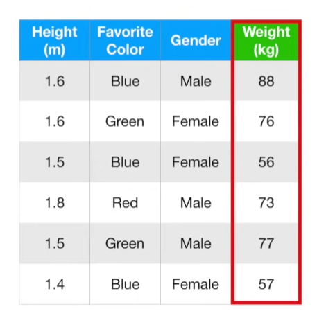

The first thing we do is to calculate the average weight, this is the first attempt at predicting everyone's weight. $\text{Average Weight} = 71.2$ In other words, if we stopped right now, we would predict that everyone weighed 71.2 kg. However, Gradient boost doesn't stop here

The next thing we do is build a tree based on the errors from the first tree. The **error** that the previous tree made are the differences between the **Observed Weights** and the **Predicted Weight**(71.2). so lets start by plugging in the predicted weight and observed weight and do the maths

$$
\begin{align*}
(\text{Observed Weight} - \text{Predicted Weight}) 
&= (88 - 71.2) \\
&= 16.8 \\
\end{align*}
$$

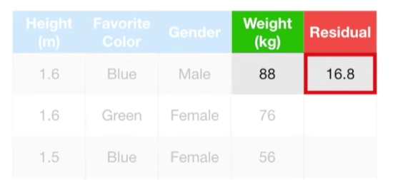

and save the difference which is called the **Pseudo Residual**, in a new column.

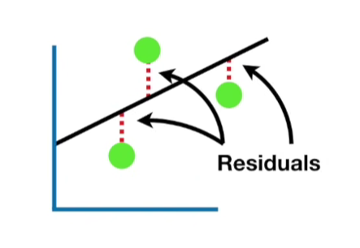

> Note: The term **Pseudo Residual** is based on **Linear Regression**, where the difference between the **Observed** vales and the **Predicted** values results in **Residuals**

> The "Pseudo: part of Pseudo Residual is a reminder that we are doing Gradient Boost, not Linear Regression

Now we do the same thign for the remaining weight

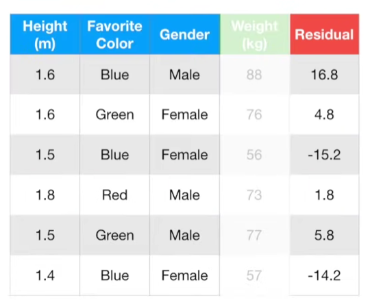

Now we will build a Tree using **Height**, **Favourite Color** and **Gender** to predict the residuals.

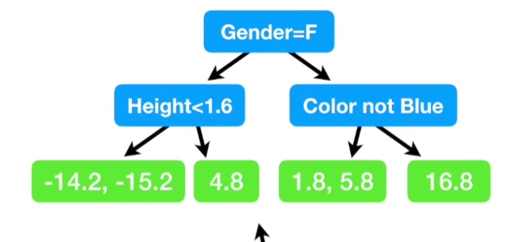

Setting aside the reason why we are building a tree to predict the residuals for the time being, here's the tree. In the example, we are only allowing up to four leaves but when using a larger dataset, it is common to allow anywhere from 8 to 32 

By restricting the total number of leaves, we get fewer leaves than residuals.

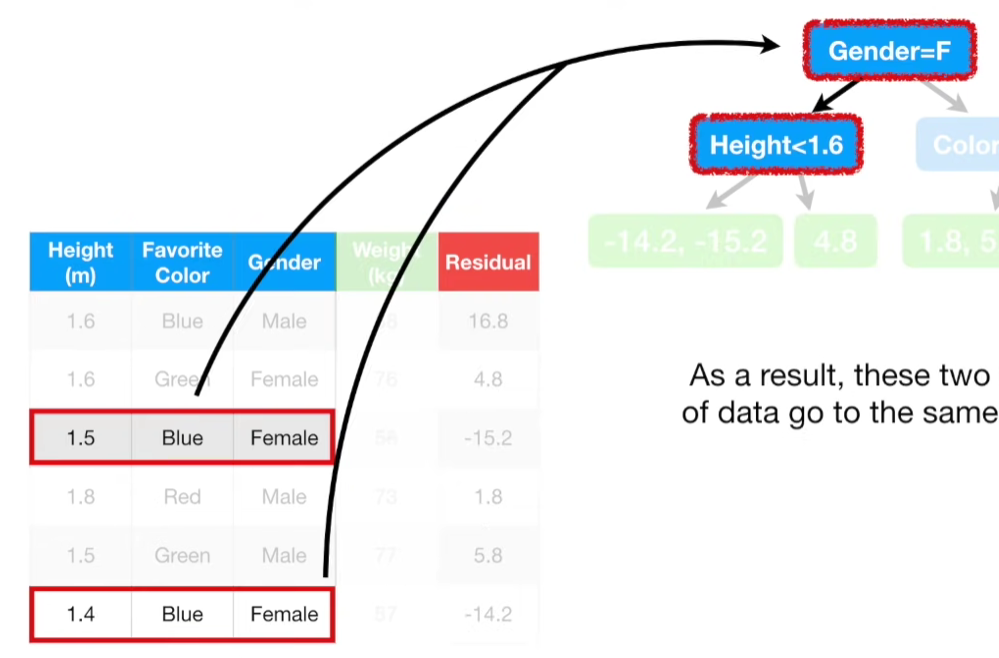

As a result, these two rows of data go to the same leaf.

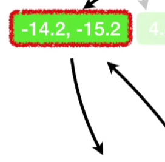

so we replace these residuals with their average.

$$ \frac{(-14.2-15.2)}{2} = -14.7 $$

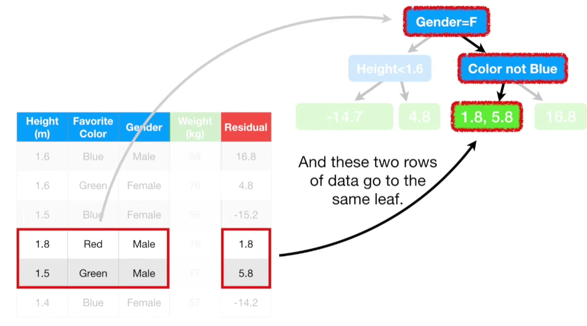

And these two rows of data go to the same leaf, so we replace the residuals with the average (1.8+5.8)/2 = 3.8

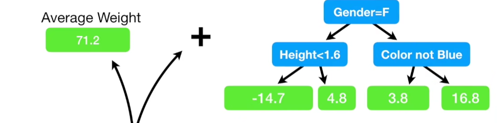

Now we can combine the original leaf with the new tree to make a new prediction of an individual's *Weight** from the **Training Data**

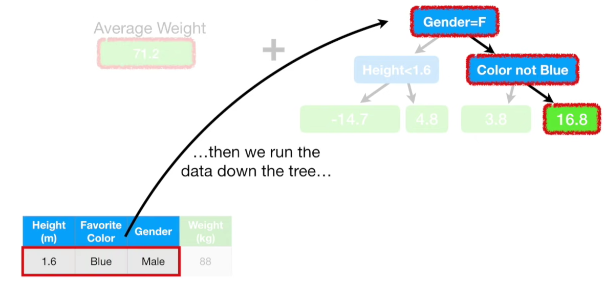

We start with the initial **Prediction**,71.2 then we run the data down the tree and we get 16.8. S0 the **Predicted Weight**= 71.2 + 16.8 = 88, which is the same as the **Obeserved weight** 

But this data fit the model too well. In other words, we have low **Bias**, but probablu very high **Variance**

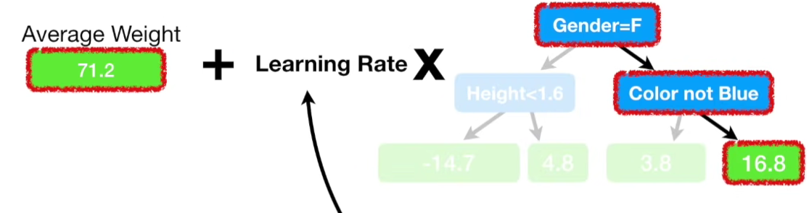

**Gradient Boost** deals with this problem by using a ***Learning Rate** to scale the contribution from the new tree
- **Learning Rate** is a value between 0 and 1

In this case, we set the learning rate to 0.1.

Now, the **Predicted Weight** is 
$$ 71.2 + (0.1 \times 16.8) = 72.9 $$

With the **Learning Rate** set to 0.1, the new **Prediction** isn't as good as it was before, but it's a little bit better than the **Prediction** made with just the original leaf, which predicted that all samples would weigh 71.2

In other words, scaling the tree by **Learning Rate** results in a small step in the right direction. 

According to the dude that invented **Gradient Boost**, Jerome Friedman, empirical evidence shows that taking a lots of small steps in the right direction results in better **Predictions** with a **Testing Dataset**, ie. lower **Variance**

Let's build another tree so we can take another small step in the right direction

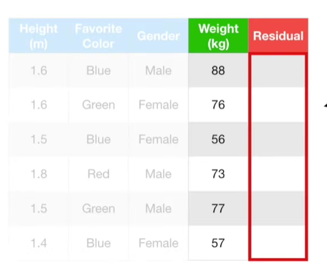

just like before, we calculate the Pseudo Residual, the difference between the **Observed Weights** and our latest **Predictions**

$$\text{Residual} = (\text{Observed} - \text{Predicted}) $$

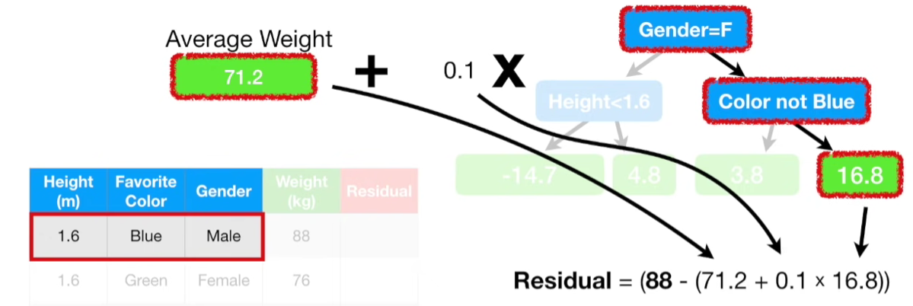

We plug in the observed weight and the new **Predicted Weight**

$$\text{Residual} = (88 - (71.2 + 0.1 \times 16.8)) =15.1 $$

and we save it in the column for **Psuedo Residuals**

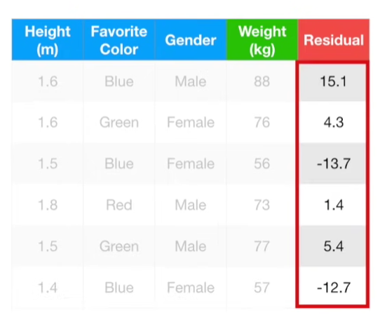

Then we repeat for all the individuals in the training dataset

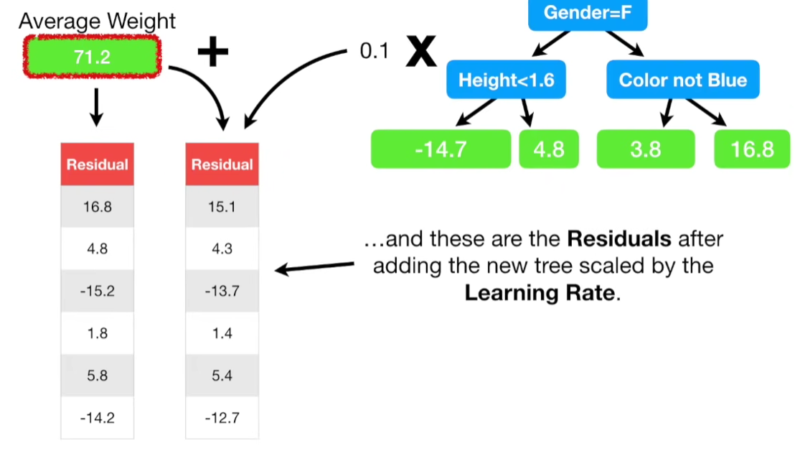

>Note: These are the original **Residuals**, from when our **Prediction** was simply the average overall Weight on the left

>And on the right, these are the **Residuals** after adding the new tree scaled by the **Learning Rate**

The New **Residuals** are all smaller than before, so we have taken a small step in the right direction.

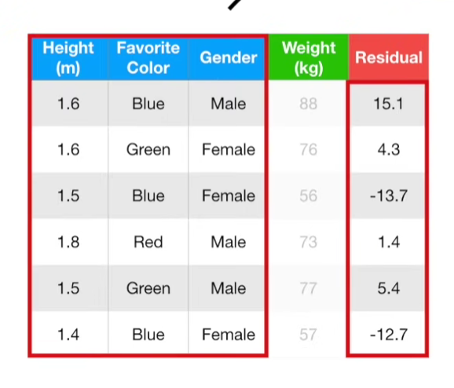

Then we build a new tree for the new residuals.

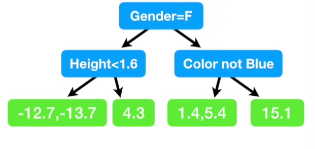

Here is the new tree.
> Note: In this example, the branches are the same as before. However, in practice, the trees can be different each time.
- Just like before, since multiple samples ended up in the first and the third leaves, we just replace the **Residuals** with their averages

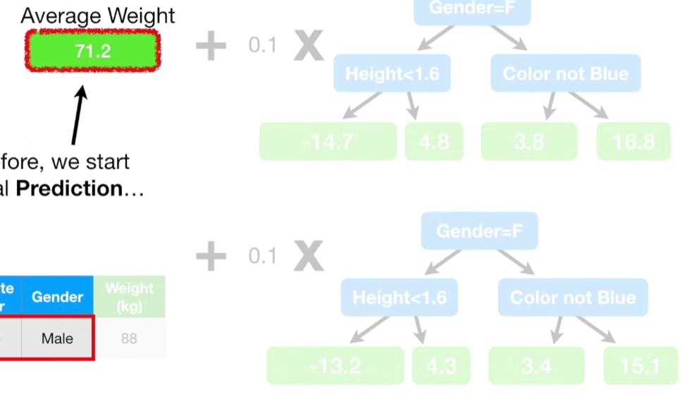

Now we combine the new Tree with the previous Tree and the initial **Leaf**
- We scale all of the **Trees** by the **Learning Rate**, which we set to 0.1 and add everything together.

Now we are ready to make the new predictions for the training data
1. just like before, we start with the initial predictions
2. then add the scaled amount from the first tree and the scaled amount from the second Tree

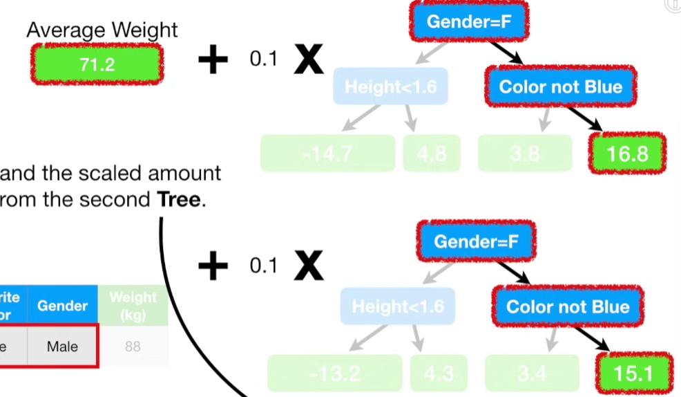

$$ 71.2 + (0.1 \times 16.8) + (0.1 \times 15.1) = 74.4$$

Which is another small step closer to the **Observed Weight**(88). 

Now we use the initial leaf, plus the scaled value from the first tree, plus the scaled value from the second tree to calculate the new **Residuals**

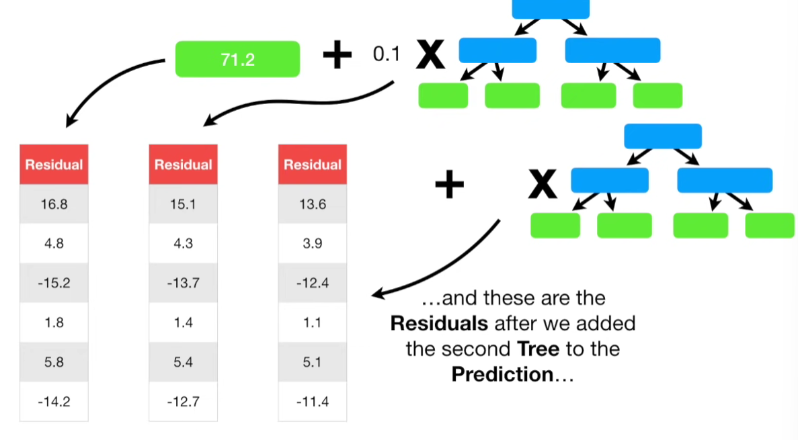
>Remember, the first column is the residuals from the first prediction, second columns are the residuals after we add the first tree to the prediction, third column are the residuals after we added the second tree to the prediction

> Each time we add a tree to the **Prediction**, the **Residuals** get smaller

So we have taken another small step towards making good **Predictions**

Now we build another tree with the new residuals, and add it to the chain of **Trees** that we have already created, and we keep making trees until we reach the maximum specified, or adding additional trees does not significantly reduce the size of the **Residuals**.

Then, we we get some new measurement, we can **Predict Weight** by starting with the initial predictions(71.2), then add the scaled value from the first tree, and the second tree and the third tree, etc.

When the math is all done, we are left with the **Predicted Weight**

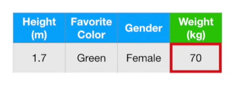

In this case, we predicted that this person **Weighed 70** kg

---

### Summary

When Gradient Boost is used for regression, we start with a leaf that is the average value of the variable we want to **Predict**

In this case, we want to predict **Weight**.Then we add a tree based on the **Residuals** and the difference between the **Observed** values and the **Predicted** values
and we scale the tree's contribution to the final **Prediction** with a **Learning Rate**. Then we add another tree based on the the new **Residuals** and we keep adding trees based on the error made by the previous tree. 
