# Gradient Boost (Part 2)

We are going to walk through the original **Gradient Boost** step-by-step. In order to keep the example from getting out of hand, we are going to use Gradient Boost to fit a model to super simple **Training Dataset**

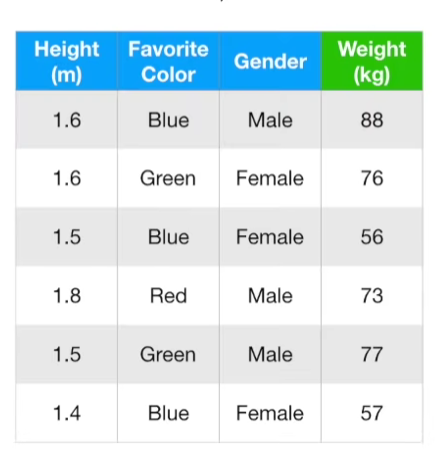

which contains the **Height** measurements, **Favorite colour**,**gender** and **Weight** from three people.

## Gradient Descent algorithm

### Input:

Data ${(x_i , y_i)}^n_{i=1}$, and differentiable **Loss Function** $L(y_i,F(x))$

This line describes the **Training Dataset**, and the method we will use to evaluate how well the model fits the **Training Dataset**

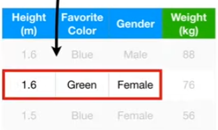

> Data : ${(x_i , y_i)}^n_{i=1}$
- $x_i$ refer to each row of measurements that we will use to predict **Weight**
- $ y_i$ refers to the **Weights** measured for the each person in the dataset
- the $n$ and $i=1$ says that the $X_i$ and $y_i$ go from 1 to $n$, where $n$ is the number of people in our dataset,$n=3$.

> $L(y_i,F(x))$
- **Loss Function** is just something that evaluates how well we can predict **Weight**
- The Lost Function that is most commonly used when doing **Regression** with **Gradient Boost** is 
$$ \frac{1}{2} (\text{Observed} - \text{Predicted})^2 $$

- When we remove the 1/2, we end up with the sa,e **Loss Function** we use for **Linear Regression**
$$ (\text{Observed} - \text{Predicted})^2 $$

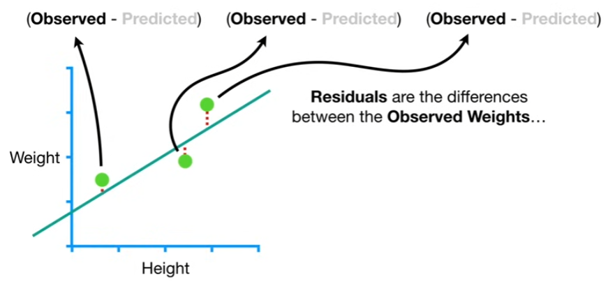

For Example, if we had Height and Weight measurements from three people, then we could fit a line to the data.
- Residuals are the difference between the **Observed** Weights and the Weights that are **Predicted** by the line

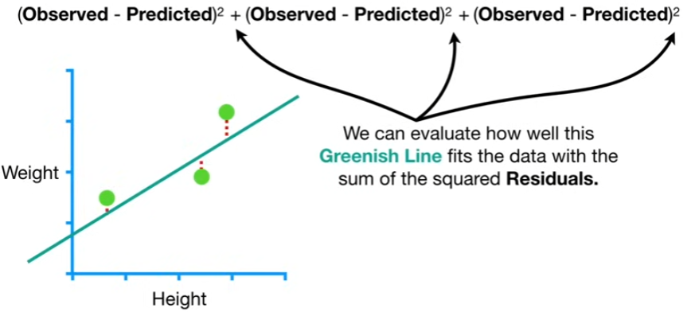

We can evaluate how well this **Greenish Line** fits the data with the sum of squared **Residuals**.

Thus, the **Loss Function** is just a squared **Residual** $ (\text{Observed} - \text{Predicted})^2 $. If want to compare between two lines, we can just compare the **Sum of the Squared Residuals**

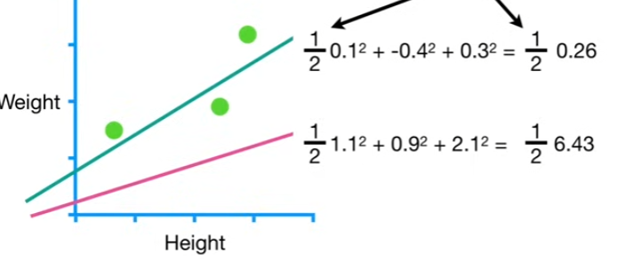

>Note: If i multipled both sides of the formulas by $\frac{1}{2}$ then we would get smaller numbers but we wil still know that the **Greenish Line** fits the data better since its number is still relatively smaller. So it doesn't matter

The reason why people choose this **Loss Function** for **Gradient Boost** is that when we differentiate with respect to "Predicted" and use **The Chain Rule** and bring the square down to the front and multiply by the derivative of **-Predicted**, which is -1, and $\frac{2}{2}$ cancel out, and that leaves you with the $-(\text{Observed} - \text{Predicted})$

$$ 
\begin{align*}
& \frac{d}{d(Predicted)} \frac{1}{2} (\text{Observed} - \text{Predicted})^2 \\
&=\frac{2}{2} (\text{Observed} - \text{Predicted}) \times -1 \\
&= -(\text{Observed} - \text{Predicted})
\end{align*}
$$

In other words, we are left with the negative **Residual**, and this makes the math easier since **Gradient Boost** uses the derivative a lot
- $y_i$ is the observed value
- $F(x)$ is the function that gives us the **Predicted** values

These will be the Input for the **Gradient Boost** algorithm
- Data
- differentiable Loss Function

### Step 1: 

**Initialize model with a constant value: $F_0(x) = \text{argmin}_{\gamma} \sum^n_{i=1} L(y_i , \gamma)$**
- we start by initializing the model with a constant value that is determined by $F_0(x)$
- $L(y_i , \gamma)$ this is the Loss function, $y_i$ refers to the **Observed** values, and $\gamma$ refers to **Predicted** values.
- The summation means that we add up one **Loss Function** for each **Observed** value
- "argmin over gamma" means we need to find a **Predicted** value that minimizes the sum

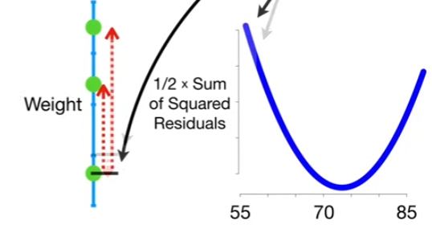

Here is a plot of one half of the sum of the squared residuals for potential **Predicted** values

>Note: We could use the **Gradient Descent** to find the optimal value for **Predicted** but we also can just solve for it, because the math isn't that hard.

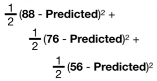

The first thing we do is take the derivative of each term with respect to **Predicted**. Since we already showed how to take the derivaticve of our **Loss Function**, we can just plug it in.

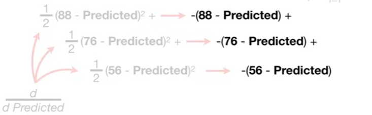

Then we set the sum og the derivative equals to 0, then solve for the **Predicted**

$$
\begin{align*}
-(88 - \text{Predicted}) + -(76 - \text{Predicted}) + -(56 - \text{Predicted}) &= 0 \\
\text{Predicted} &= \frac{88+76+56}{3} 
\end{align*} 
$$

the value of $\gamma$ is the average of the **Observed Weights**. So the value of $ \gamma $ that minimizes the sum Loss function is the average of the **Observed Weights**

$$
F_0(x) = \frac{88+76+56}{3} = 73.3
$$

We have now created the initial predicted value is 73.3. That means that initial predicted value $F_0(x)$, is just a leaf. The leaf predicts that all samples will weigh 73.3.

We finised Step 1! We initialized the model with a constant value,73.3. In other words, we created a leaf that predicts all samples will weigh 73.3

### Step 2

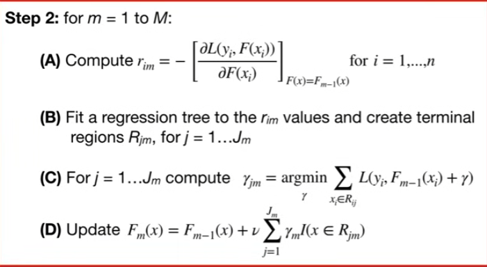

step 2 is a loop where we make all of the trees. In generic terms, we will make *M* trees, but in practice, most people set *M* = 100 and make 100 trees
- *m* refers to individual tree. So when *m* = 1, we are talking about first tree

#### (A) Calculating residuals

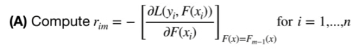

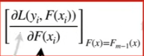

This part is just the derivative of the **Loss Function** with respect to the **Predicted** value

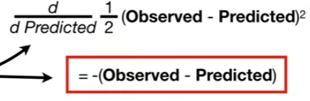

and we already calculated this. and there is a big minus sign, and taht leave us with the Observed value minus the Predicted value

$$(\text{Observed - Predicted})$$

Now we plug $F_{m-1}(x)$ in for **Predicted** and since *m* = 1 that means we plug in $F_0(x)$ for $F_{m-1}(x)$

$$(\text{Observed} - F_0(x))$$

and since $F_0(x)$ is just the leaf set to 73.3, we plug in 73.3

$$(\text{Observed} - 73.3)$$

Now we can compute $r_{i,m}$, where $r$ is short for **Residual**, *i* is the sample number and *m* us tge tree tthat we are trying to build.

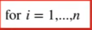

This tells us to calculate **Residuals** for all 3 samples in the dataset.

---

So we will start with $r_{1,1}$ the **Residual** for the first sample (i=1) and the first tree (*m*=1)

we plug in the **Observed Weight** for the first sample

$$ r_{1,1} = (88 - 73.3) = 14.7 $$

Now we calculate $r_{2,1}$

$$ r_{2,1} = (76 - 73.3) = 2.7 $$

Now we calculate $r_{3,1}$

$$ r_{3,1} = (56 - 73.3) = -17.3 $$

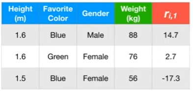

We have finish Part A of Step 2 by calculating residual for each sample

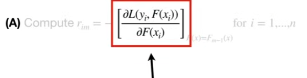
> Note: this derivative is the **Gradient** that **Gradient Boost** is named after

> $r_{i,m}$ values are technically called **Pseudo Residuals**. When we

#### (B) Fit a regression tree

Fit a regression tree to the $r_{im}$ values and create terminal regions $R_{jm}$, for - = 1...$J_m$
- this means we will build a regression tree to predict the **Residuals** instead of **Weights**

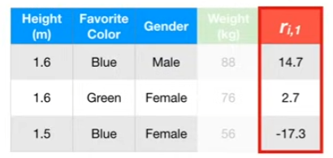

So we will use **Height**, **Favorite Color** and **Gender** to predict the **Residuals**

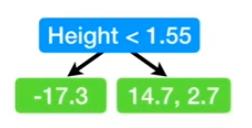

Here, is the new tree. This is just a stump and **Gradient Boost** almost always uses larger trees.

However, in order to demonstrate details of the **Gradient Boost** algorithm, we need at least one leaf with more than 1 sample in it. We only have 3 samples, so we can't have more than 2 leaves. So we are stuck with using stumps, even though they are not typically used with **Gradient Boost**
- The residual for the third sample, $x_3$ goes to the leaf on the left
- and the residuals for sample $x_1$ and $x_2$ go to the leaf on the right
- So we have a regression tree fit to the **Residuals** $r_{im}$

Now we need to "create terminal regions $R_{j,m}$"
- This part is super easy because the **Leaves** are the "terminal regions $R_{j,m}$

> Note: This little $m$ is the index for the tree we just made. Since this is teh first tree, $m$ = 1. And this little $j$ is the index for each leaf in the tree.

- Since this tree has 2 leaves, $J_m =2$

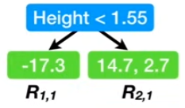

> Note: it doesn't matter which leaf gets which label. However, once we give a leaf a label, we need to keep track of it.

We have finished **Part B** of **Step 2** by fitting a **Regression Tree** to the residuals and labeling the leaves

#### (C) Determine the **Output Values** for each leaf

For $j = 1 ... J_m$ compute $ \gamma_{jm} = argmin_{\gamma} \sum _{x_i \in R_{ij}} L(y_i, F_{m-1}(x_i) + \gamma)$

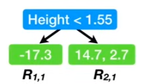

Specifically, since there are two residuals ended up in the right leaf, it's unclear what its **output value** should be.

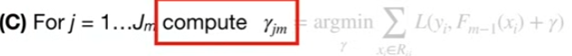

So for each leaf in the new tree, we compute an **Output Value**, $\gamma_{jm}$

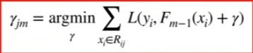
- The output value for each leaf is the value for **Gamma** that minimizes this summation

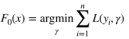
> Note: This minimization is like what we did in **Step 1**.
- one small difference is that now we are taking the previous **Prediction** into account
- while before, since we were just starting out, there was no 
"Previous **prediction** "

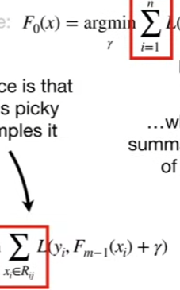
- The other difference is that this summation is picky about which samples it includes. while before, the summation included all of the samples.

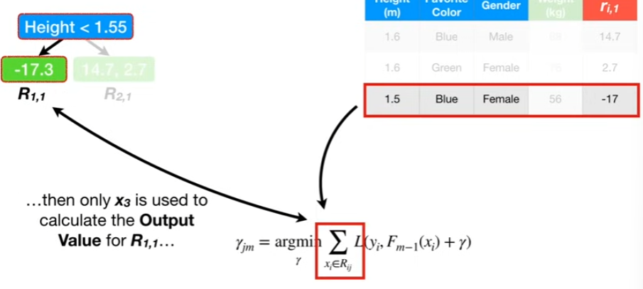
- specifically, the $x_i$ in $R_{i,j}$ means that since only one sample $x_3$, goes to leaf $R_{1,1}$ 
- then only $x_3$ is used to calculate the **Output Value** for $R_{1,1}$

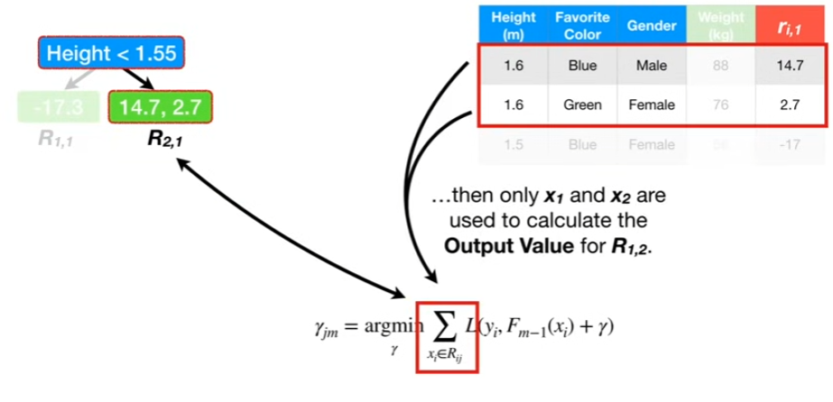
- and since only two samples, $x_1$ and $x_2$, go to leaf $R_1,2$
- then only $x_1$ and $x_2$ are used to calculate the **Output Value** for $R_{1,2}$

Let's start by calculating the Output for the leaf on the left $R_{1,1}$
- That means $j=1$, since this is the first leaf, and $m=1$ since this si the first tree

$$  
\gamma_{1,1} = argmin_{\gamma} \sum _{x_i \in R_{ij}} \frac{1}{2} (y_i - (F_{m-1}(x_i)) + \gamma)^2
$$

Now let's replace the generic **Loss Function** with the actual **Loss Function** that we decided to use $\frac{1}{2} (\text{observed - predicted})$ and let's expand the summation into individual terms.

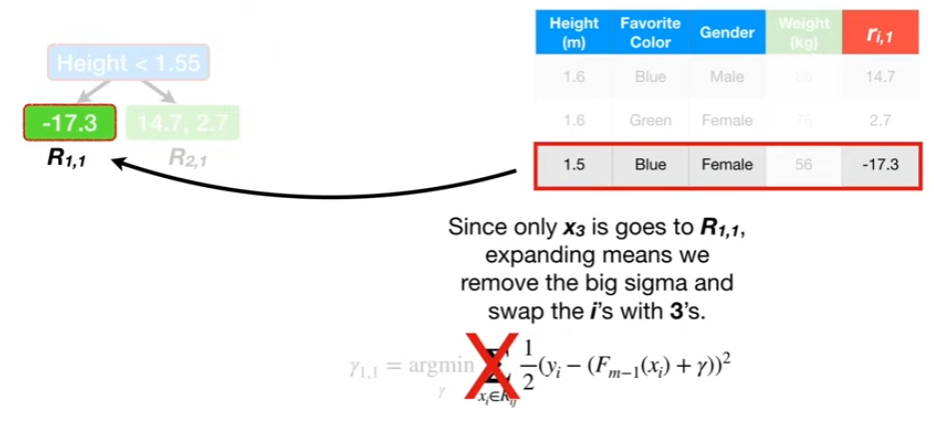

Since only $x_3$ is goes to $R_{1,1}$, expanding means we remove the big sigma and swap the $i$'s withh 3's

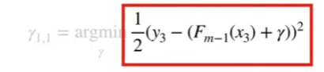

Plug in the value for $y_3$, the observed value and the most recent **Predicted** value for $x_3$ 

$$  
\gamma_{1,1} = argmin_{\gamma} \frac{1}{2} (56 - ((F_{m-1}(x_3)) + \gamma))^2
$$

Since m = 1, the most recent **Predcition** was $F_0(x)$, which Predicted that all samples weighed 73.3. So we plog in 73.3 for $F_{m-1}(x_3)$ and simplify what's inside the parentheses

$$  
\begin{align*}
\gamma_{1,1} 
&= argmin_{\gamma} \frac{1}{2} (56 - (73.3 + \gamma))^2 \\
&= argmin_{\gamma} \frac{1}{2} (-17.3 - \gamma)^2
\end{align*}
$$

Now we need to find the value for $\gamma$ that minimizes this equation, just like Step 1, we can try different values for $\gamma$ or solve it analytically

> Solve: 

> First we take the derivative of the **Loss Function** with respect to $\gamma$, just like we did at the very start.
$$ 
\begin{align*}
\frac{d}{d \gamma} \frac{1}{2}(-17.3 - \gamma)^2 &= 0 \\ 
17.3 + \gamma &= 0 \\
\gamma &= -17.3 
\end{align*}
$$
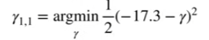
>The value for gamma that minimizes this equation is -17.3. 

And that means $\gamma_{1,1}$ = -17.3

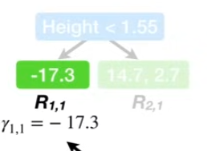

and ultimately, the leaf,$R_{1,1}$ has an **Output Value** of -17.3

Now let's solve for the Output Value for $R_{2,1}$. That means $j=2$, since this is the second leaf, and $m=1$ since this is still the first tree and plug in the loss function

$$  
\gamma_{2,1} = argmin_{\gamma} \frac{1}{2} (y_i - ((F_{m-1}(x_3)) + \gamma))^2
$$

expand the summation, plug in the observe weight and plug in 73.3 for $F_{m-1}(x_1)$ and $F_{m-1}(x_2)$

$$  
\begin{align*}
\gamma_{2,1} &= argmin_{\gamma} [ \frac{1}{2} (y_1 - ((F_{m-1}(x_1)) + \gamma))^2 +  \frac{1}{2} (y_2 - ((F_{m-1}(x_2)) + \gamma))^2] \\
&= argmin_{\gamma} [ \frac{1}{2} (88 - ((F_{m-1}(x_1)) + \gamma))^2 +  \frac{1}{2} (76 - ((F_{m-1}(x_2)) + \gamma))^2] \\
&= argmin_{\gamma} [\frac{1}{2} (88 - ((73.3 + \gamma)))^2 +  \frac{1}{2} (76 - ((73.3 + \gamma)))^2]
\\
&= argmin_{\gamma} [\frac{1}{2} (14.7 - \gamma)^2 + \frac{1}{2} (2.7 - \gamma)^2]
\end{align*}
$$

and take the derivative with respect to $\gamma$ using the chain rule

$$
\begin{align*}
\frac{d}{d \gamma}
\frac{1}{2} (14.7 - \gamma)^2 + \frac{1}{2} (2.7 - \gamma)^2 &= 0 \\
-14.7 +\gamma +-2.7 + \gamma &= 0 \\ 
\gamma &= \frac{14.7 + 2.7}{2} 
\end{align*}
$$

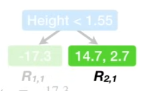

We end up with the average of the **Residuals that ended in the leaf $R_{2,1} $, and that equals 8.7
$$ \gamma = 8.7$$

and ultimately, the leaf, $R_{2,1}$ has an **Output Value** of 8.7
> We just saw that the OUTput value of this leaf $R_2,1$, is the average of the residuals that ended up here

Given our choice of loss Functions, the Output Values are always the average of the **Residials** that end up in the same leaf.

We finished **Part C** of **Step 2** by computing $\gamma$ values, or output values, for each leaf

#### (D) Make new prediction for each sample

We make a new predictions for each sample

Update $
F_m(x) = F_{m-1}(x) + \nu \sum_{j=1}^{J_m} \gamma_{jm} I(x \in R_{jm})
$

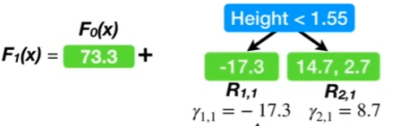

Since this is our first pass through Step 2 and $m=1$, this new prediction will be called $F_1(x)$
- The new prediction, $F_1(x)$ is based on the last predcition we made, $F_0(x)$
- and the tree that we just finisehd making

>Note: The summation is there just in case a single sample ends up in multiple leaves.

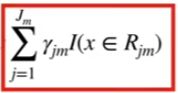

The summation says we should add up the **Output Values**, $\gamma_{j,m}$'s, for all the leaves, $R_{j,m}$, that a sample,x, can be found in.

The last thing in this equation is this Greek character "**nu**"
- **Nu** is the **Learning Rate**, and is a value between 1 and 0.
- a small learning rate reduces the effect each tree has on the final prediction, and this improves accuracy in the long run

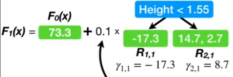

In this example, we will set **nu** to 0.1, and we have created $F_1(x)$

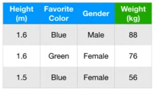

Now we will use $F_1(x)$ to make new **Predictions** for each sample.

The new Predictions for $x_1$ starts with the last **Prediction**, $F_0(x)$, which is 73.3 plus 0.1 times the output value from the new tree, which is 8.7 because $x_1$'s Height is > 1.55

$$F_1(x) = 73.3 + 0.1 \times 8.7 =74.2$$

The new Prediction for the first sample is 74.2, which is slightly closer to **Observed Weight**,88, than the first **Prediction**, 73.3

Now let's make a new **Prediction** for the second sample, $x_2$

$$F_1(x) = 73.3 + 0.1 \times 8.7 =74.2$$

The new Prediction for $x_2$ is also 74.2, which is an improvement over the first **Prediction**, 73.3

Now let's make a new **Prediction** for the third sample, $x_3$

$$F_1(x) = 73.3 + 0.1 \times -17.3=71.6$$

The new Prediction for $x_3$ is also 71.6, which is an improvement over the first **Prediction**, 73.3

We made it through one iteration of **Step 2**!!

---

Now we set $m=2$ and do everything over again

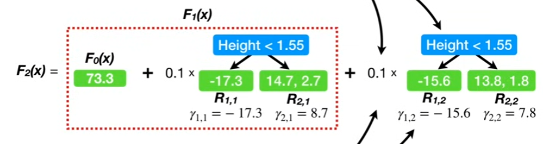

At the end of the second round, m=2, and the new **Predictions**, $F_2(x)$ are based on
- the predictions made by $F_1(x)$ 
- and the learning rate times the **Output Values** from the newest tree.

### Step 3: Output

If $ M =2 $, then $F_2(x)$ is the output from the **Gradient Boost** algorithm.

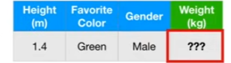

Now if we received some new data, we would use $F_2(x)$ to predict the **Weight** 

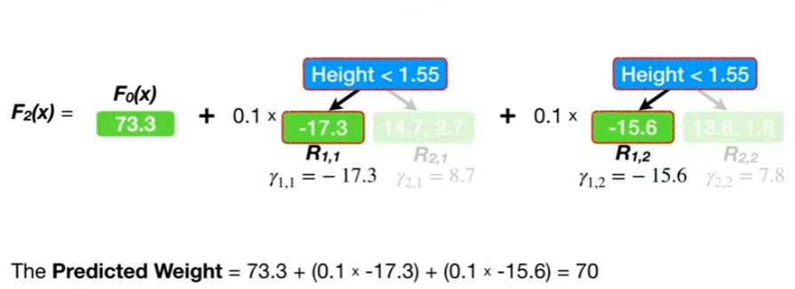

Gradient Boost predicts that this person weights 70 kg