# Gradient Boost for Classification

When **Gradient boost** is use for **classification** it has a lot in common of **logistic regression**.

Context: 

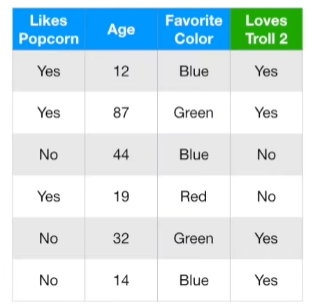

We will use this **Training Data** which include popcorn preference, age, favorite color, and whether or not they love the movie **Troll 2**and walk through the most common way that **Gradient Boost** fits a model to this **Training Data**

## Calculate Log(odds)

Just like in **Part 1**, we start with a leaf that represents an initial **Prediction** for every individual.

When we use **Gradient Boost for Classification**, the initial **Prediction** for every individial is the **log(odds)**
> think of the log(odds) as the **Logistic Regression** equivalent of the average

So let's calculate the overall **log(odds)** that someone **Loves Troll 2**

Since 4 people in the Training Dataset **Loves Troll 2** and 2 people do not, then the **log(odds)** that someone **loves Troll 2** is $log(\frac{4}{2}) = 0.7$ which we will put into our initial leaf.

- This is the initial **Prediction**

### How do we use this for **Classification**? 

Just like with **Logistic Regression**, the easiest way to use the **Log(Odds)** for **Classification** is to convert it to a **Probability** and we do that with a **Logistic Function**

$$\text{ Probability of Loving Troll 2} =\frac{e{log(odds)}}{1+ e^log(odds)}$$

so we plug in the **log(odds)** into the **Logistic Function**

$$\text{ Probability of Loving Troll 2} =\frac{e^{log(\frac{4}{2})}}{1+ e^{log(\frac{4}{2})}} = 0.7$$

> Note: These two numbers, the log(4/2) and the **Probability** are the same only because I am rounding. If I allowed 4 digits passed the decimal place

$$log(\frac{4}{2}) = 0.6931$$

$$ \frac{e^{log(\frac{4}{2})}}{1+ e^{log(\frac{4}{2})}} = 0.6667$$

Since the **Probability** of Loving Troll 2 is greater than 0.5, we can **Classify** everyone in the Training Dataset as someone who **Loves Troll 2**.

> Note: While 0.5 is a very common threshold for making **Classification** decisions based on **Probability**, we could have just as easily used a different value. 

Now, Classifying everyone in the Training Dataset as someone who **Loves Troll 2** is pretty lame, because two of the people do not love the movie.

We can measure how bad the initial **Prediction** is by calculating **Pseudo Residuals**, the difference between the **Observed** and the **Predicted** values.

$$\text{Residual = Observed - Predicted}$$

Although the math is easy, i think it's easier to grasp what's going on if we draw the **Residuals** on a graph.

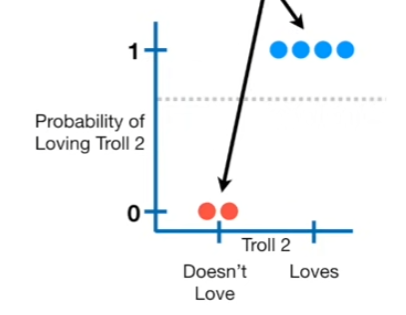

- The **Predicted Probability of Loving Troll 2** is 0.7 (the dotted line)
- The **Red Dots**, with the **Probability of Loving Troll 2 = 0**, represent the two people that do not Love Troll 2
- and the **Blue Dots**, with a **Probability of Loving Troll 2 = 1**, represent the four people that **Love Troll 2**

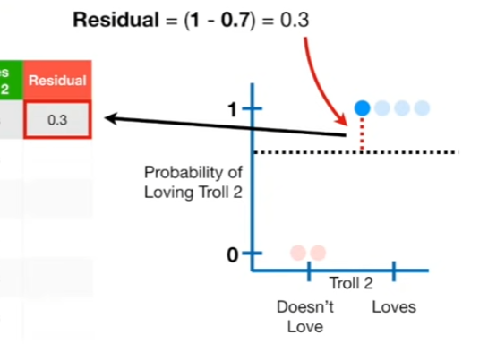

So for this sample, we plug in one for the **Observed** value, and 0.7 for the **Predicted** value, and we get 0.3. Then we calculate the rest of the **Residuals**

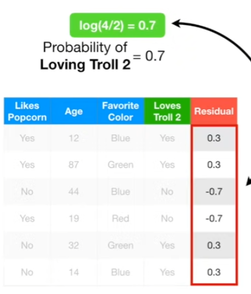

We have calculated the **Residuals** for the leaf's initial **Prediction**

Now we build a **Tree**, using **Likes popcorn, Ages and Favorite Color** to predict the residuals

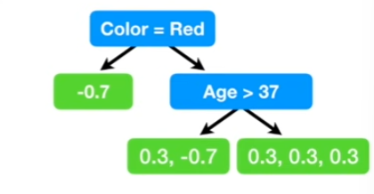

and here is the tree.

> Note: Just like when we used **Gradient Boost for Regression**, we are limiting the number of leaves that we will allow in the tree

In this simple example, we are limiting the number of leaves to 3

In practice people often set the maximum number of leaves to between 8 and 32

Now let's calculate the **Output Values** for the leaves

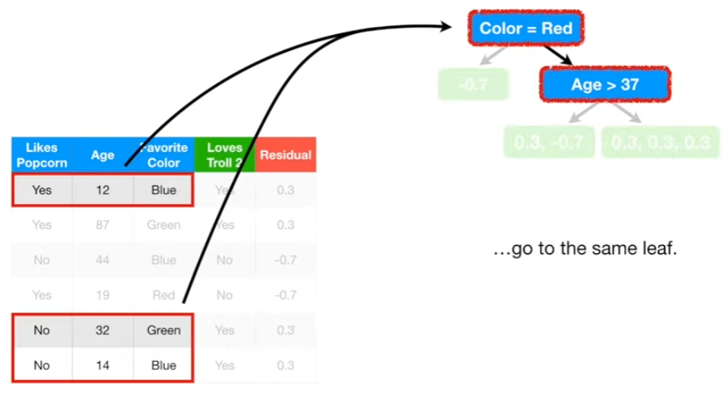

> Note: These three rows of data, goes to the same leaf

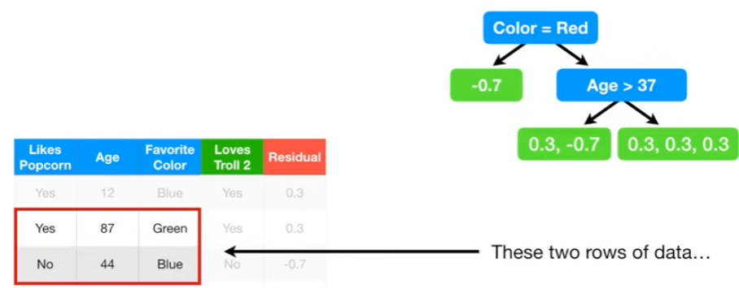
> These two rows of data, goes to the same leaf

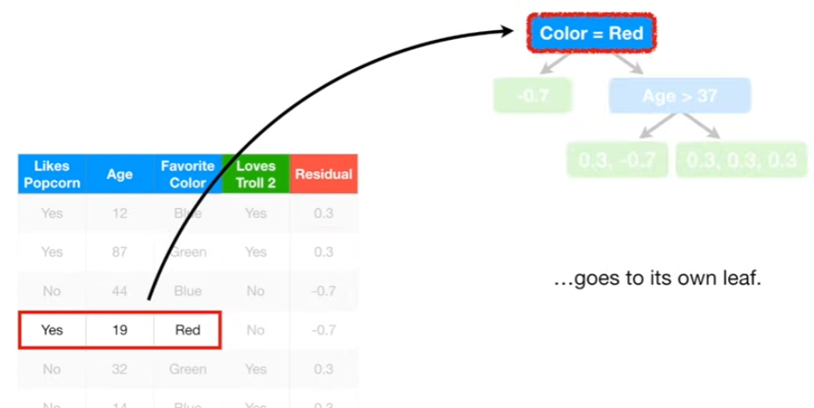
> lastly, this row of data, goes to its own leaf

When we use **Gradient Boost** for **Regression**, a leaf with single **Residual** had an **Output Value** equal to that **Residual**

In contrast, when we use **Gradient Boost** for **Classification**, the situation is a little more complex. This is because the **Predictions** are in terms of the **log(odds)**

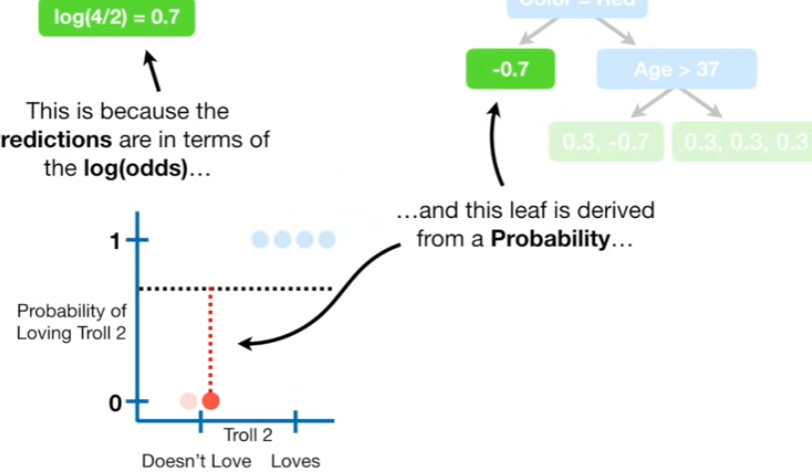

and this leaf is derived from a **Probability**, so we can't just add them together and get a new **Log(odds) Prediction** without some sort of transformation

When we use **Gradient Boost** for **Classification**, the most common transformation is the following formula

$$ 
\frac{\sum_i \text{Residual}_i}{\sum_i \left[ \text{Previous Probability}_i \times (1 - \text{Previous Probability}_i) \right]}
$$

- The numerator is the sum of all of the **Residuals** in the leaf
- The denominator is the sum of the previously predicted probabilities for each **Residual** times 1 minus the same predicted probability.

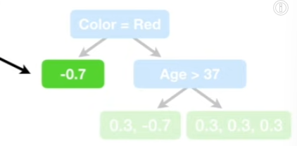

Since there is only one **Residual** in this leaf, we can ignore these summation signs for now.

So we plug in the residuals from the leaf, and since we are building the first tree, the **Previous Probability** refers to the probability from the initial leaf, 0.7

$$ 
\frac{-0.7}{0.7 \times (1 - 0.7)} = -3.3
$$

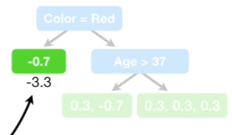

and we end up with -3.3 as the new **Output value** for this leaf. 

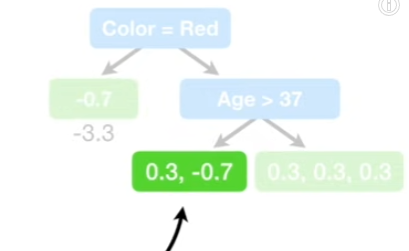

Now we need to calculate the **Output Value** for this leaf.

Since we have two **Residuals** in the leaf, we all them together in numerator

$$ 
\frac{0.3 - 0.7}{(0.7 \times (1 - 0.7)) + (0.7 \times (1 - 0.7))} = -1
$$

> Note: For now, the **Previous Probabilities** are the same for all of the **Residuals**, but this will change when we build the next tree.

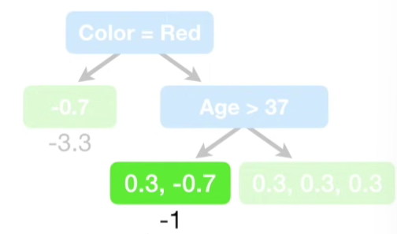

and the **Output Value** for this leaf is -1

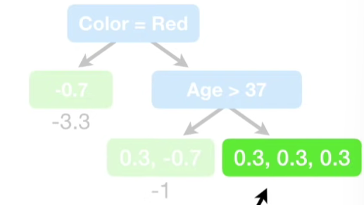

Now let's determine the **Output Value** for this leaf. We plug the **Residuals** into the formula and previous probability, can do the math

$$ 
\frac{0.3 + 0.3 +0.3}{(0.7 \times (1 - 0.7)) + (0.7 \times (1 - 0.7)) + (0.7 \times (1 - 0.7))} = 1.4
$$

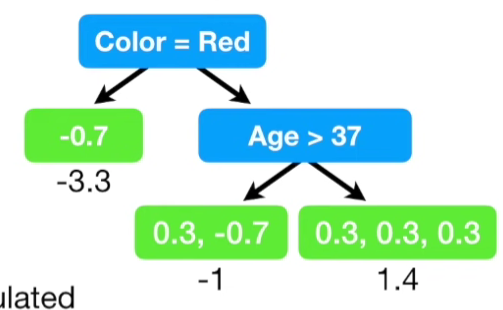

We have calculated the **Output Values** for all three leaves in the tree!

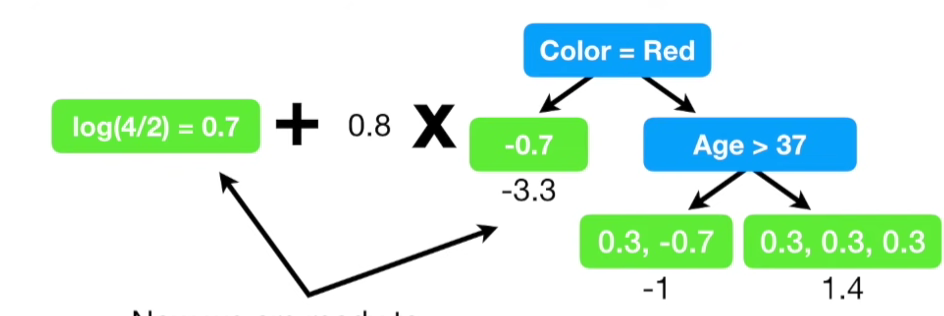

Now we are ready to update our **Predictions** by combining the initial leaf with the new tree

> Note: Just like before , the new tree is scaled by a **Learning Rate**

This example uses a relatively large **Learning Rate** for illustrative purposes. However, 0.1 is more common.

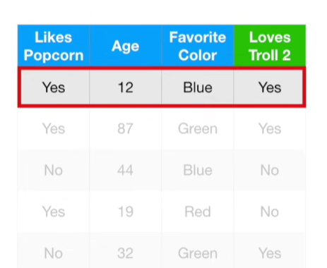

Now let's calculate the **log(odds) Prediction** of this person. The **Log(odds) Prediction** is the prevous **Prediction**, 0.7, plus the **Output Value** from the tree scaled by the **Learning Rate**

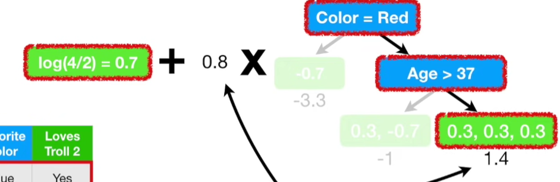

$$\text{log(odds) Prediction} = 0.7 + (0.8 \times 1.4) = 1.8$$

and the new log(odds) Prediction = 1.8. Now we can convert the new **Log(odds) Prediction** into a **Probability**

$$
\begin{align*}
\text{Probability} &= \frac{e^{log(odds)}}{1+e^{log(odds)}} \\
&= \frac{e^{l1.8}}{1+e^{1.8}} \\
&= 0.9
\end{align*}$$ 

and the new predicted probability = 0.9. So we are taking a small step in the right direction since this person **Loves Troll 2** 

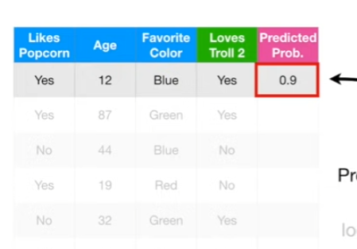

we save the new **Predicted Probability** here

Now we calculate the new **Log(Odds) Prediction** for the second person

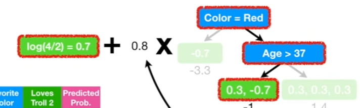

The **log(odds) Prediction** is the previous **Prediction**, 0.7 plus the **Output Value** from the tree scaled by the **Learning Rate**, 0.8 times -1

$$\text{log(odds) Prediction} = 0.7 + (0.8 \times -1) = -0.1 $$

which gives us -0.1 for the new **Prediction**. Now we concert the new **log(odds) Prediction** into a **Probability**

$$Probability = \frac{e^{-0.1}}{1+ e^{-0.1}} = 0.5 $$

and save the new **Predicted Probability** 0.5, here

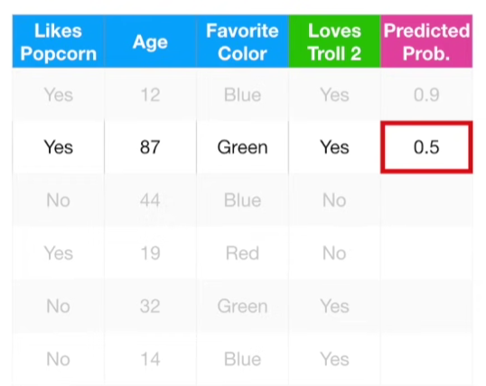

> Note: This new predicted probability is worse than before, and this is one reason why we build a lot of trees, and not just one.

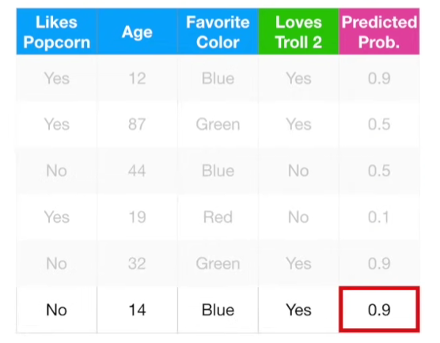

Then we calculate the **Predicted Probabilities** for the remaining people. Then we calculate the new **Residuals**

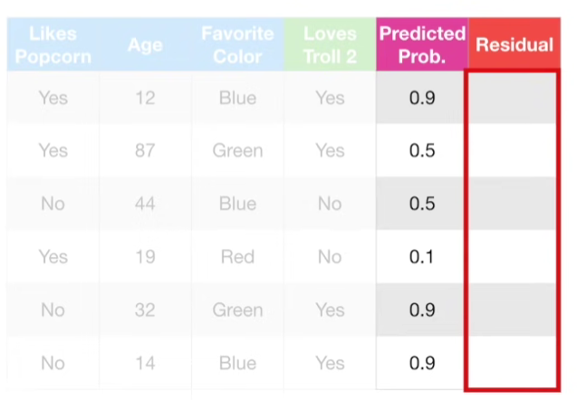

**Residuals** are difference between the **Observed** and **Predicted Probabilities** and just like before, we can plot the **Observed Probabilities** on a graph

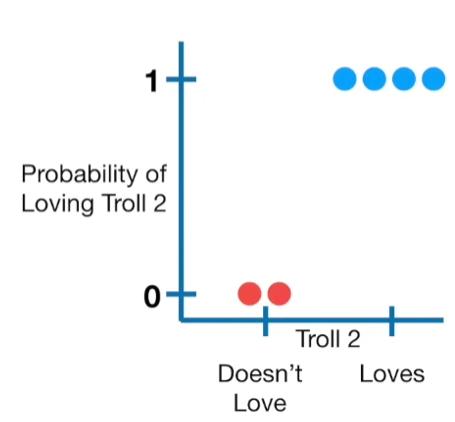

However, now everyone has a different **Predicted Probability**. So, to calculate the **Residual** for the first person, $Residual = (1-0.9) = 0.1$. We do the same for the rest of the observations.

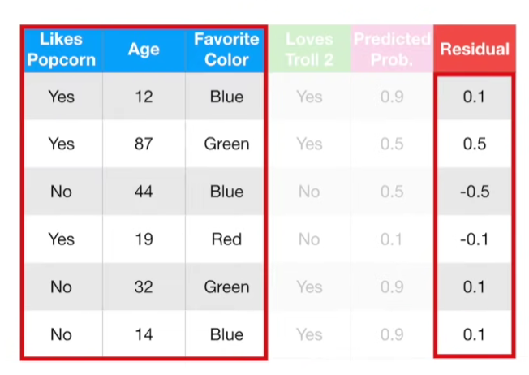

Now, we have the residuals, we can build the new tree and then we need to calculate the **Output Values** for each leaf.

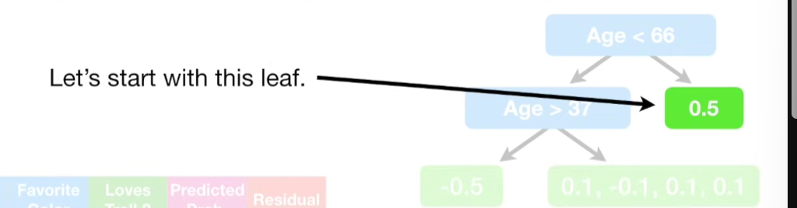

Let's start with this leaf

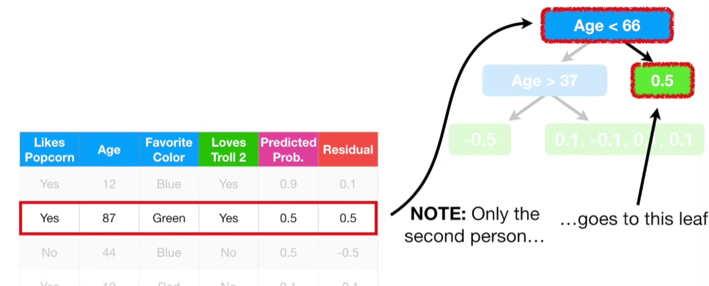

Only the second person goes to this leaf. So we plug in the **Residual** into the formula for the **Output Values**

$$
\begin{align*} 
&\frac{\sum_i \text{Residual}_i}{\sum_i \left[ \text{Previous Probability}_i \times (1 - \text{Previous Probability}_i) \right]} \\
&=  \frac{0.5}{0.5\times (1-0.5)}
&= 2
\end{align*}
$$

And the output value for this leaf is 2.

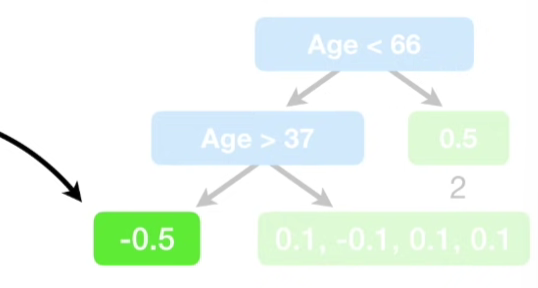

Now let's calculate the Output Value for this leaf.

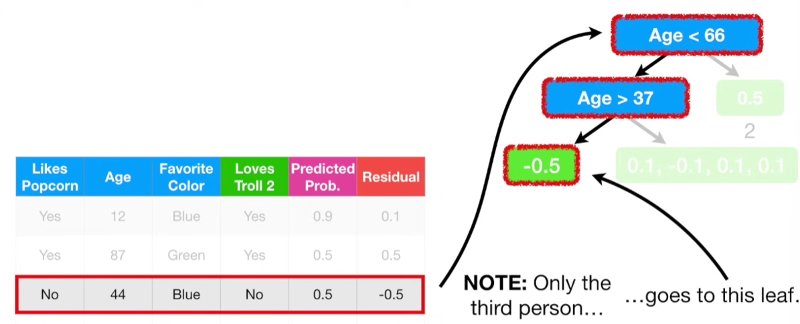

 Only the third person goes to this leaf. So we plug in the **Residual** into the formula for the **Output Values**. Then we plug in the last **Predicted Probability**

 $$ \frac{-0.5}{0.5\times (1-0.5)} = -2 $$

 Lastly, let's calculate the output values for this leaf

 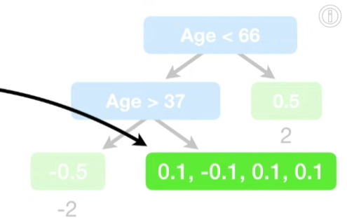

 A bunch of people goes to this leaf. So we plug the **Residuals** into the formula for the **Output Values**

$$ \frac{0.1+ -0.1 + 0.1 + 0.1}{(0.9 \times (1-0.9)) + (0.9 \times (1-0.1)) + (0.9 \times (1-0.9)) + (0.9 \times (1-0.9))} = 0.6 $$

and the output value for this leaf is 0.6

Now that we have calculated all of the **Output Values** for this tree, we can combine it with everything else we have doen so far

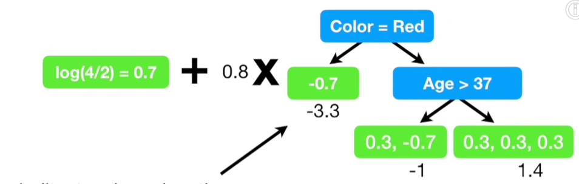

We started with just a leaf, which made one **Prediction** for every individual. Then we built a tree based on the **Residuals**, the difference between the **Observed** values and the single value **Predicted** by leaf.

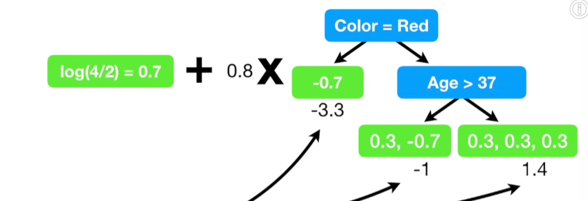

Then we calculted the **Output Values** for each leaf and we scaled it with the **Learning Rate**

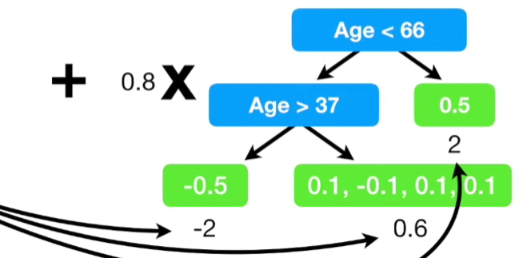

Then we built another tree based on the new **Residuals**, the difference between the **Observed** values and the values **Predicted** by the leaf and the first tree then we calculated the **Output Values** for each leaf and we scaled this new tree with the **Learning Rate** as well

This process repeats until we have made the maximum number of trees specified, or the residuals get super small.

---

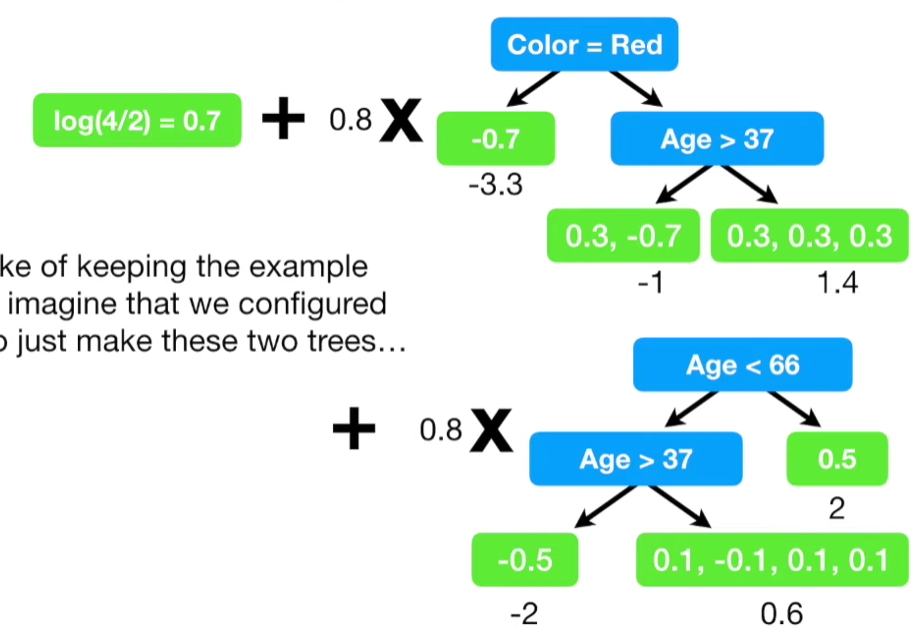

Now, for the sake of keeping the example relatively simple, imagone that we configured **Gradient Boost** to just make these two trees and we needed to **Classify**a new person as someone who **Loves Troll 2** or **does not Love Troll 2**.

The **Prediction** starts with the leaf.then we run the data down the first tree.

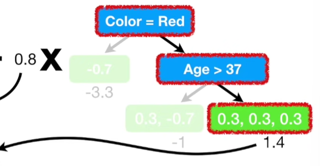

and we add the scaled output 

$$\text{Log(odds) Prediction that someone Loves Troll 2} = 0.7 + (0.8 \times 1.4)$$

then we run the data down the second tree 

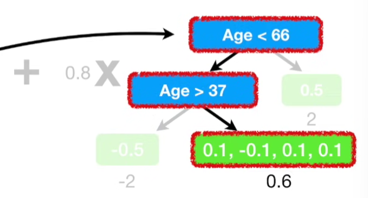

and then we add the scaled output value and do the math 

$$\text{Log(odds) Prediction that someone Loves Troll 2} = 0.7 + (0.8 \times 1.4) + (0.8 \times 0.6) = 2.3$$

and get 2.3 as the **Log(odds) Prediction** that this person **Loves Troll 2**

Now we need to convert this **Log(odds)** into **Probability**.

$$Probability = \frac{e^{2.3}}{1+ e^{2.3}} = 0.9$$

and the predicted probability is 0.9.

Since we are using 0.5 as our threshold for deciding how to **Classify** people, and 0.9 > 0.5, we will classify this person as someone who **Loves Troll 2**

> Note: Before we go, I want to remind you that **Gradient Boost** usually uses trees with between 8 to 32 leaves

> We use small trees in this STatQuest because our **Training Dataset was super small

