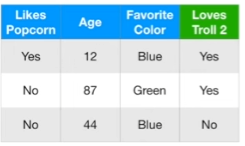
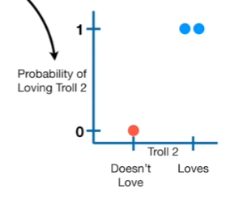
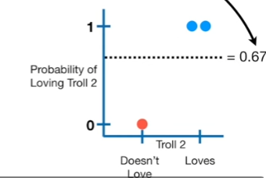
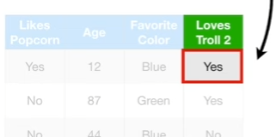
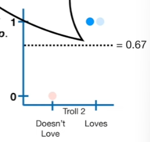
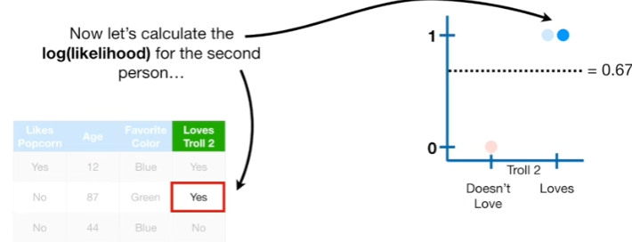
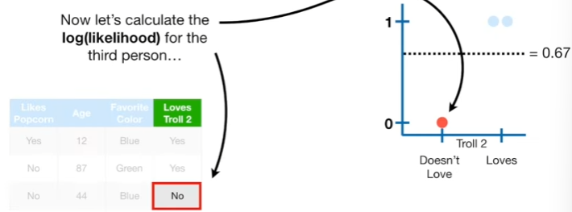

# Gradient Boost (Part 4)

In this StatQuest, we will walk through the original **Gradient Boost** algorithm for **classification**, step-by-step. Just like in Part 2 of this series, we will use an incredibly small **Training Dataset** for the examples.

The small size will help us focus on the algorithm's details, but it will mean using stumps instead of larger trees.

However, by now you know what in practice **Gradient Boost** usually uses trees with between 8 and 32 leaves.

## Input data

### Data ${(x_i,y_i)}^n_{i=1}$ , and a differentiable **Loss Function** $L(y_i, F(x))$

$${(x_i,y_i)}^n_{i=1}$$
- $x_i$ refers to a row of measurements that we will use to **Predict** if someone **Loves Troll 2**
- $y_i$ refers whether or not someone **Loves Troll 2**

The easiest way to understand the most commonly used **Loss Function** for classification is to show how it words on a graph.

- **Red Dot**, with the **Probability of Loving Troll 2** =0, represents the one person that **Does not Love Troll 2
- **Blue Dots**, with a **Probability of Loving Troll** =1, represent the two people that **Love Troll 2**
- In other words, the **Red** and **Blue** dots are observed values and we can draw a dotted line to represent the predicted probability that someone **Loves Troll 2**

In this example, I have set the predicted probability to 0.67

Now, just like we do for **Logistic Regression**, we can calculate the **Log(likelihood)** of the data given the predicted probability

$$ \text{Log(Likelihood of the Observed Data given the Prediction)} \\
= \sum_{i=1}^{N} [ y_i \log(p) + (1 - y_i)\log(1 - p) ] 
$$
- the $p$'s refer to the predicted probability, which is 0.67 in this example
- and the $y_i$'s refer to the **Observed** values for **Loves Troll 2**
- for two people who **Love Troll 2**, $y_i = 1$, which means that $(1 - y_i)\log(1 - p)$ will be 0, leaving just the $log(p)$
- In contrast, for the one person who does not **Love Troll 2**, $y_i=0$, which means this term will be 0.

Now let's use the summation to calculate the **Log(likelihood)** of all three **Observe** values. 

We will start by calculating the **log(likelihood)** for the first person. Because this person Love Troll 2, $y_1 = 1$

$$
[ y_1 \log(p) + (1 - y_1)\log(1 - p) ] = 1 \times \log(1 - p) + (1 - 1) \times \log(1 - p)
$$

then we plug in 0.67 for the predicted probability, $p$

$$
\begin{align*}
[ y_1 \log(p) + (1 - y_1)\log(1 - p) ] &= 1 \times \log(1 - 0.67) + (1 - 1) \times \log(1 - 0.67) \\
&= \log(0.67)
\end{align*}
$$

and the **log(likelihood)** for the first person, given the predicted probability, is the $\log(0.67)$

Now let's  to calculate the **Log(likelihood)** of the second person.

we plug in the value of $y_2 = 1$ and plug in 0.67 for the predicted probability, $p$

$$
\begin{align*}
[ y_2 \log(p) + (1 - y_2)\log(1 - p) ] &= 1 \times \log(1 - 0.67) + (1 - 1) \times \log(1 - 0.67) \\
&= \log(0.67)
\end{align*}
$$

and then we get the $\log(0.67)$ since the predicted probability was the same 

Now let's calculate the **log(likelihood)** for the third person

We plug in the **Observed Value**, 0 for $y_3$ since this person does not love the movie.Also, plug in the $p=0.67$

$$
\begin{align*}
[ y_3 \log(p) + (1 - y_3)\log(1 - p) ] &= 0 \times \log(1 - 0.67) + (1 - 0) \times \log(1 - 0.67) \\
&= \log(1 - 0.67)
\end{align*}
$$

> Note: The better the prediction, the larger the log(likelihood), and this is why, when doing **Logistic Regression**, the goal is to maximize the **log(likelihood)**

>That means that if we want to use the log(likelihood) as **Loss Function**, where smaller values represent better fitting models, then we need to multiply the **log(likelihood)** by **-1** 

$$ - \text{Log(Likelihood of the Observed Data given the Prediction)} \\
= - \sum_{i=1}^{N} [ y_i \log(p) + (1 - y_i)\log(1 - p) ] 
$$

So, we will put this subtle, but very impotant minus sign in front of everything. And since a **Loss Function** sometimes only deals with one sample at a time, we can get rid of the summation, and to make it easier to readm we will replace $y$ with $Observed$

$$-[ \text{Observed} \times \log(p) + (1 - \text{Observed}) \times \log(1 - p) ] $$

Now we need to transform this equation, the **negative log(likelihood)**, so that it is a function of the predicted **log(odds)** instead of the predicted probability, $p$ and we need to simplify it.

Simplify:
$$
\begin{align*}
& - \left[ \text{Observed} \times \log(p) + (1 - \text{Observed}) \times \log(1 - p) \right] \\
&= -\text{Observed} \times \log(p) - (1 - \text{Observed}) \times \log(1 - p) \\
&= -\text{Observed} \times \log(p) - \log(1 - p) + \text{Observed} \times \log(1 - p) \\
&= -\text{Observed} \times \left[\log(p) - \log(1 - p)\right] - \log(1 - p) \\
&= -\text{Observed} \times \log(\text{odds}) - \log(1 - p)
\end{align*}
=$$

>Note: The relationship between probability, $p$, annd the **log(odds)** is derived in the **StatQuest** on odds and log(odds), so check that out if you want more details. $ log(\frac{p}{1-p}) = log(odds)$

