# Gradient Boost (Part 4)

In this StatQuest, we will walk through the original **Gradient Boost** algorithm for **classification**, step-by-step. Just like in Part 2 of this series, we will use an incredibly small **Training Dataset** for the examples.

The small size will help us focus on the algorithm's details, but it will mean using stumps instead of larger trees.

However, by now you know what in practice **Gradient Boost** usually uses trees with between 8 and 32 leaves.

## Input data

### Data ${(x_i,y_i)}^n_{i=1}$ , and a differentiable **Loss Function** $L(y_i, F(x))$

$${(x_i,y_i)}^n_{i=1}$$
- $x_i$ refers to a row of measurements that we will use to **Predict** if someone **Loves Troll 2**
- $y_i$ refers whether or not someone **Loves Troll 2**

The easiest way to understand the most commonly used **Loss Function** for classification is to show how it words on a graph.

- **Red Dot**, with the **Probability of Loving Troll 2** =0, represents the one person that **Does not Love Troll 2
- **Blue Dots**, with a **Probability of Loving Troll** =1, represent the two people that **Love Troll 2**
- In other words, the **Red** and **Blue** dots are observed values and we can draw a dotted line to represent the predicted probability that someone **Loves Troll 2**

In this example, I have set the predicted probability to 0.67

Now, just like we do for **Logistic Regression**, we can calculate the **Log(likelihood)** of the data given the predicted probability

$$ \text{Log(Likelihood of the Observed Data given the Prediction)} \\
= \sum_{i=1}^{N} [ y_i \log(p) + (1 - y_i)\log(1 - p) ] 
$$
- the $p$'s refer to the predicted probability, which is 0.67 in this example
- and the $y_i$'s refer to the **Observed** values for **Loves Troll 2**
- for two people who **Love Troll 2**, $y_i = 1$, which means that $(1 - y_i)\log(1 - p)$ will be 0, leaving just the $log(p)$
- In contrast, for the one person who does not **Love Troll 2**, $y_i=0$, which means this term will be 0.

Now let's use the summation to calculate the **Log(likelihood)** of all three **Observe** values. 

We will start by calculating the **log(likelihood)** for the first person. Because this person Love Troll 2, $y_1 = 1$

$$
[ y_1 \log(p) + (1 - y_1)\log(1 - p) ] = 1 \times \log(1 - p) + (1 - 1) \times \log(1 - p)
$$

then we plug in 0.67 for the predicted probability, $p$

$$
\begin{align*}
[ y_1 \log(p) + (1 - y_1)\log(1 - p) ] &= 1 \times \log(1 - 0.67) + (1 - 1) \times \log(1 - 0.67) \\
&= \log(0.67)
\end{align*}
$$

and the **log(likelihood)** for the first person, given the predicted probability, is the $\log(0.67)$

Now let's  to calculate the **Log(likelihood)** of the second person.

we plug in the value of $y_2 = 1$ and plug in 0.67 for the predicted probability, $p$

$$
\begin{align*}
[ y_2 \log(p) + (1 - y_2)\log(1 - p) ] &= 1 \times \log(1 - 0.67) + (1 - 1) \times \log(1 - 0.67) \\
&= \log(0.67)
\end{align*}
$$

and then we get the $\log(0.67)$ since the predicted probability was the same 

Now let's calculate the **log(likelihood)** for the third person

We plug in the **Observed Value**, 0 for $y_3$ since this person does not love the movie.Also, plug in the $p=0.67$

$$
\begin{align*}
[ y_3 \log(p) + (1 - y_3)\log(1 - p) ] &= 0 \times \log(1 - 0.67) + (1 - 0) \times \log(1 - 0.67) \\
&= \log(1 - 0.67)
\end{align*}
$$

> Note: The better the prediction, the larger the log(likelihood), and this is why, when doing **Logistic Regression**, the goal is to maximize the **log(likelihood)**

>That means that if we want to use the log(likelihood) as **Loss Function**, where smaller values represent better fitting models, then we need to multiply the **log(likelihood)** by **-1** 

$$ - \text{Log(Likelihood of the Observed Data given the Prediction)} \\
= - \sum_{i=1}^{N} [ y_i \log(p) + (1 - y_i)\log(1 - p) ] 
$$

So, we will put this subtle, but very impotant minus sign in front of everything. And since a **Loss Function** sometimes only deals with one sample at a time, we can get rid of the summation, and to make it easier to readm we will replace $y$ with $Observed$

$$-[ \text{Observed} \times \log(p) + (1 - \text{Observed}) \times \log(1 - p) ] $$

Now we need to transform this equation, the **negative log(likelihood)**, so that it is a function of the predicted **log(odds)** instead of the predicted probability, $p$ and we need to simplify it.

Simplify:

$$
\begin{align*}
& - \left[ \text{Observed} \times \log(p) + (1 - \text{Observed}) \times \log(1 - p) \right] \\
&= -\text{Observed} \times \log(p) - (1 - \text{Observed}) \times \log(1 - p) \\
&= -\text{Observed} \times \log(p) - \log(1 - p) + \text{Observed} \times \log(1 - p) \\
&= -\text{Observed} \times \left[\log(p) - \log(1 - p)\right] - \log(1 - p) \\
&= -\text{Observed} \times \log(\text{odds}) - \log(1 - p)
\end{align*}
$$

>Note: The relationship between probability, $p$, and the **log(odds)** is derived in the **StatQuest** on odds and log(odds), so check that out if you want more details. $ log(\frac{p}{1-p}) = log(odds)$

Now we need to convert **log(1-p)** into a function of the **log(odds)**. 

Now, we replace 1 with this fraction do the subtraction, then convert the division into subtraction, and since the log(1) = 0, we can remove it 

$$ 
\begin{align*}
log(1-p) &= log(1- \frac{e^{log(odds)}}{1+ e^{log(odds)}}) \\
&= log(\frac{1+ e^{log(odds)}}{1+ e^{log(odds)}}- \frac{e^{log(odds)}}{1+ e^{log(odds)}}) \\
&= log(\frac{1}{1+ e^{log(odds)}}) \\
&= log(1) - log(1 + e^{log(odds)}) \\
&= - log(1 + e^{log(odds)}) 
\end{align*}$$

> Note: The relationship between probability, $p$, and the **log(odds)** is derived in the **Logistic Regression StatQuest** on estimating parameters with **Maximum Likelihood**

Thus, the **log(1-p)**, which is a function of the predicted probability, p, can be transformed into a function of the predicted **log(odds)**, so lets plug that in 

$$
\begin{align*}
& - \left[ \text{Observed} \times \log(p) + (1 - \text{Observed}) \times \log(1 - p) \right] \\
&= -\text{Observed} \times \log(p) - (1 - \text{Observed}) \times \log(1 - p) \\
&= -\text{Observed} \times \log(p) - \log(1 - p) + \text{Observed} \times \log(1 - p) \\
&= -\text{Observed} \times \left[\log(p) - \log(1 - p)\right] - \log(1 - p) \\
&= -\text{Observed} \times \log(\text{odds}) - \log(1 - p)\\
&= - \text{Observed} \times log(odds) + log( 1+ e^{log(odds)})
\end{align*}
$$

>Note : the sign changed from negative(line 5) to positive(line 6) because we replaced **log( 1 - p )** with $-log(1+e^{log(odds)})$

We converted the negative **log(likelihood)** of the data, which is a function of the predicted probability, $p$ into a function of predicted **log(odds)**. So
$$ - \text{Observed} \times log(odds) + log( 1+ e^{log(odds)}) $$
is the **Loss Function**. Now we just need to show that it is differentiable

So let's take the derivative of the **Loss Function** with respect to predicted **log(odds)**

$$
\begin{align*}
&\frac{d}{d \log(odds)} -\text{Observed} \times \log(odds) + log( 1+ e^{log(odds)}) \\
&= -\text{Observed} + \frac{1}{1+ e^{log(odds)}}\times e^{log(odds)} \\ 
&= -\text{Observed} + \frac{e^{log(odds)}}{1+ e^{log(odds)}} \\ 
&= -\text{Observed} + p
\end{align*}
$$

> Note: Earlier we saw that we can substitute the predicted probability, $p$, with this fraction $\frac{e^{log(odds)}}{1+ e^{log(odds)}}$ but we can also swap the predicted probability, $p$, back in

As we will soon see, sometimes it's easier to use the function of the **logg=(odds)** and sometimes it's easier to use the function of the probability,$p$.

In summary, the input data is the **Training Dataset** 

and this is just a transformation of the negative **log(likehood)**, is the differentiable **Loss Function** and the derivative can be a function of the predicted **log(odds)** or a function of the predicted probability, $p$

## Step 1

### Initialize model with a constant value: 

$$F_0(x) = argmin_\gamma \sum^n_{i=1} L(y_i,\gamma)$$

Just like when we used **Gradient Boost** for  **Regression**, we need to come up with the initial **Prediction** and just like before, we will use this funky looking equation to find the optimal initial **Prediction**

this is just the **Loss Function**
- $y_i$ refers to the **Observed** values
- $\gamma$ refers to a **log(odds)** value
- in theory, we could go ahead and replace the **Log(odds)** with **gamma** but it's actually easier to see what's going on if we leave the **log(odds)** in and remember that it represents **Gamma**
- The summation means that we add up one **Loss function** for each **Observed** value
- The "argmin over gamma" means we need to find a **log(odds)** value that minimizes this sum

The first thing we do is take the derivative of each term with respect to the **Log(odds)**

Now, to make the next steps super easy, let's replace the **log(odds)** with the predicted probability, $p$ 

set the sum of the derivatives equal to zero

and solve.

$$
\begin{align*}
-1 + p -1 + p - 0 + p &= 0 \\
-2 + 3 \times p &= 0 \\
 p &= \frac{2}{3}
\end{align*}
$$

and we end up with the $\frac{2}{3}$ for the initial predicted probability, $p$, because 2 people **Love Troll 2** and there are 3 people in the **Training Dataset**

We can now convert the predicted probability into the predicted **log(odds)**. So we plog in the predicted probability

$$ 
\begin{align*}
\log(odds) &= \log(\frac{p}{1-p}) \\
&= \log(\frac{\frac{2}{3}}{1 - \frac{2}{3}}) \\
&= \log(\frac{\frac{2}{3}}{\frac{1}{3}}) \\
&= \log(2)
\end{align*}
$$

and the predicted **log(odds)** is the $log(\frac{2}{1})$ which is make sense because 2 people **Love Troll 2** and 1 person does not. So given this Loss Function, the **log(odds)** value for $\gamma$ that minimizes this sum is the predicted **log(odds)** of **Loving Troll 2** based on the **Ovserved** Yes/No values

We have created the initial predicted **log(odds)**, $F_0(x) = log(\frac{2}{1})$ and it equals 0.69 

We initialized the model with a constant value, 0.69. In other words, we created a leaf that predicts the log(odds) that someone will **Love Troll 2** = 0.69

## Step 2

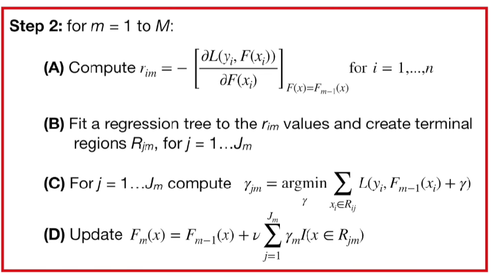

Now we can work on step 2, just like we used **Gradient Boost** for **Regression**, this is when we build the trees.

So we will start by setting $m=1$ and go from here.

### Part A:

for m = 1 to M:

(A) Compute $r_{im} = -[\frac{\partial L(y_i, F(x_i))}{\partial F(x_i)}]_{F(x)=F_{m-1}(x)}$ for $ i= 1,...,n $

we calculate **Pseudo Residuals**

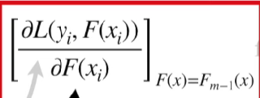

- This is just the derivative of the **Loss Function** with respect to the predicted **log(odds)** and we have already calculated this.

$$
\begin{align*}
&\frac{d}{d \log(odds)} -\text{Observed} \times \log(odds) + log( 1+ e^{log(odds)}) \\
&= -\text{Observed} + \frac{e^{log(odds)}}{1+ e^{log(odds)}}
\end{align*}
$$

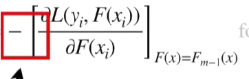

- this big minus sign tell us to multiply the derivative by -1. And that leaves us with this equation for calculating **Pseaudo Residuals** 

$$\text{Observed} - \frac{e^{log(odds)}}{1+ e^{log(odds)}}
$$

> Note: As we have seen before, we can replace this term with the predicted probability, $p$, so we can think of the **Pseudo Residuals** as the **Obsesrved** probability minus the Predicted** probability. 

And the **observed** minus the **Predicted** results in a **Pseudo Residual**.

$$\text{Observed} - p = \text{Pseudo Residual}
$$

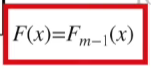

- This part says to plug in the most recent predicted **log(odds)**
- So we plug in the $F_0(x)$, the most recent predicted **log(odds)** then do the math to convert the predicted probability, $p$

$$\text{Observed} - \frac{e^{log(2/1)}}{1+ e^{log(2/1)}}
$$
- then do the math to convert the predicted **log(odds)** to the predicted probability, $p$

$$\text{Observed} - \frac{2}{1+ 2} = \text{Observed} - 0.67
$$

Now we can compute the **Pseudo Residuals** for each sample, $r_{i,m}$, where $i$ is the sample number and $m$ is the tree that we are building.

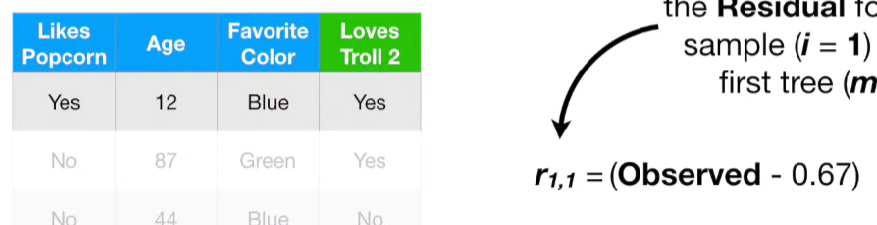

So we will start with $r_{1,1}$ the **Residual** for the first sample (i = 1) and the first tree (m = 1). So we plug in the **Observed** weight for of the first sample 

$$ \text{Observed} - 0.67 = 1 - 0.67 = 0.33
$$

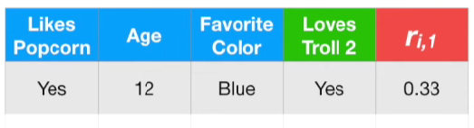

We will keep track of $r_{1,1}$ by adding it to the dataset.

Now we will calculate the two other **Residuals**

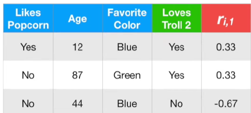

Then we finished the **Part A** of Step 2 by calculating a **Residual** for each sample

### Part B: 

Fit a regression tree to the $$r_{im}$$ calues and create terminal regions **R_{jm}**, for $j= 1...J_m$

Now we are ready for **Part B** where we will build a ref=gression tree. We will build a regression tree using **Likes Popcorn**, **Age**, and **Favorite Color** to predict the **Residuals** 

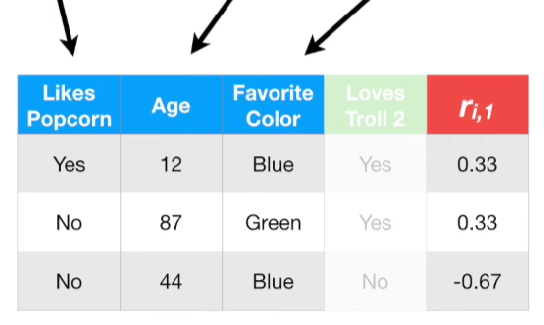

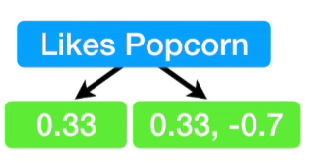

Here is the new tree. We have the regression tree fit to the **Residuals**. Now we need to "create terminal regions $R_{jm}$"

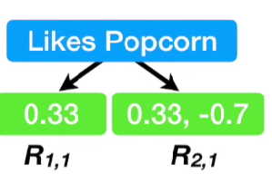

So, in this example, we will name this leaf $R_{1,1}$ and name this leaf $R_{2,1}$ 

We have finished **Part B** of Step 2 by fitting a **Regression Tree** to the **Residuals** and labeling the leaves. 

### Part C:

For $ j = 1...J_m$ compute $\gamma_{jm} = argmin_\gamma \sum_{x_i \in \R_{ij}} L(y_i,F_m-1(x_i)+ \gamma)$

This is when we calculate the **Output Values** for the new tree. So for each leaf in the new tree, $j = 1...J_m$ we compute an **Output value**, "$\gamma_{j,m}$".

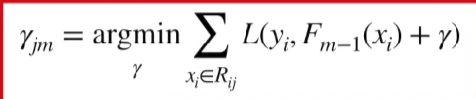
- The **Output Value** for each leaf is the valyue for $\gamma$ that minimizes this summation 

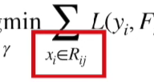
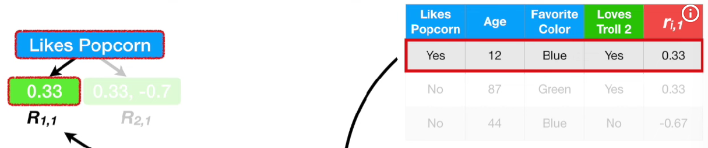
- The $x_i$ in $R_{i,j}$ means that since only the first row of data, $x_1$, goes to leaf $R_{1,1}$ then only $x_1$ is used to calculate the **Output Value** for $R_{1,1}$ 

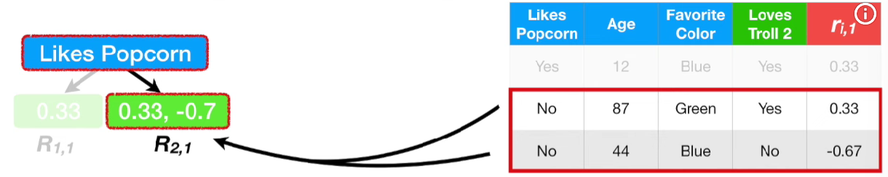
- and since only two samples, $x_2$ and $x_3$, go to leaf $R_{2,1}$ then only $x_2$ and $x_3$ are used to calculate the **Output Value** for $R_{2,1}$ 

Let's start by calculating the **Output Value** for the leaf on the left, $R_{1,1}$ 

That means $j=1$, since this is the first leaf, and $m=1$, since this is the first tree

we can replace the generic form with the actual **Loss Function** that we are using.

Since only $x_1$ goes to **R_{1,1}**, we can ermoce the big sigma and swqp the $i$'s with 1

$$ 
\begin{align*}
\gamma_{1,1} &= argmin_\gamma \sum_{x_i \in \R_{ij}} L(y_i,F_m-1(x_i)+ \gamma ) \\
&= argmin_\gamma  -y_i \times [F_{m-1}(x_i) + log(1 + e^{F_{m-1}(x_i)+ \gamma})] \\
&= argmin_\gamma  -y_1 \times [F_{m-1}(x_1) + log(1 + e^{F_{m-1}(x_1)+ \gamma})]
\end{align*}
$$

> Note: To keep the length of the formula from getting out of hand, we are returning to use $y_i$ to rever to the **Observed** values.

Now let's solve for the optimal value for $\gamma$. In theory, we culd take the derivative of this function with respect to **gamma** and then solve for **gamma**.

So we will take a different approach then when we used **Gradient Boost** for **Regression**

$$
\begin{align*}
L(y_i,F_m-1(x_i)+ \gamma) &= -y_1 \times [F_{m-1}(x_1) + log(1 + e^{F_{m-1}(x_1)+ \gamma})]
\end{align*}
$$

Since taking the derivative of the
**Loss Function** woth respect to **gamma** and then solving for **gamma** is hard, we can approximate the **Loss Function** with a second order **Taylor Polynomial**

$$
L(y_1, F_{m-1}(x_1) + \gamma)
\approx
L(y_1, F_{m-1}(x_1))
+ \frac{d}{dF}(y_1, F_{m-1}(x_1))\, \gamma
+ \frac{1}{2} \frac{d^{2}}{dF^{2}}(y_1, F_{m-1}(x_1))\, \gamma^{2}
$$

Now we can take the derivative of this function with respect to $\gamma$ 

$$
\begin{align*}
\frac{d}{d\gamma}L(y_1, F_{m-1}(x_1) + \gamma)
\approx \frac{d}{dF}(y_1, F_{m-1}(x_1)) + \frac{d^{2}}{dF^{2}}(y_1, F_{m-1}(x_1))\, \gamma &= 0 \\
\frac{d^{2}}{dF^{2}}(y_1, F_{m-1}(x_1))\, \gamma &= -\frac{d}{dF}(y_1, F_{m-1}(x_1)) \\
 \gamma &= \frac{-\frac{d}{dF}(y_1, F_{m-1}(x_1))}{\frac{d^{2}}{dF^{2}}(y_1, F_{m-1}(x_1))}
\end{align*}
$$

$\gamma$ equals -1 times derivative of the **Loss Function** divided by the second derivative of the **Loss Function**. Since we have already solve for first derivative, we can just plug it in

$$
\begin{align*}
\gamma &= \frac{\text{Observed}-p}{\frac{d^{2}}{dF^{2}}(y_1, F_{m-1}(x_1))} \\
&= \frac{\text{Residuals}}{\frac{d^{2}}{dF^{2}}(y_1, F_{m-1}(x_1))}
\end{align*}
$$

The second derivfative of the **Loss Function** equals the derivative of the first derivative of the **Loss Function** so we can plug in the first derivative of the **Loss Function**

$$
\begin{align*}
\frac{d^{2}}{d\,\log(\text{odds})^{2}}
(
    -\text{Observed} \cdot \log(\text{odds})
    + \log\!(1 + e^{\log(\text{odds})}))
&= 
\frac{d}{d\,\log(\text{odds})}
\frac{d}{d\,\log(\text{odds})}(
    -\text{Observed} \cdot \log(\text{odds})
    + \log\!(1 + e^{\log(\text{odds})})) \\
&= \frac{d}{d\,\log(\text{odds})}
(
    -\text{Observed} + (1+e^{log(odds)})^{-1} \times e^{\log(\text{odds})})\\
&= - (1+e^{log(odds)})^{-2} \times e^{\log(\text{odds})} \times e^{\log(\text{odds})} + (1+e^{log(odds)})^{-1} \times e^{log(odds)} \\
&= \frac{- e^{2 \times \log(\text{odds})}}{(1+e^{log(odds)})^{2}} + \frac{e^{\log(\text{odds})}}{(1+e^{log(odds)})} \\
&= \frac{e^{\log(\text{odds})}}{(1+e^{log(odds)})(1+e^{log(odds)})}
\end{align*}
$$

> Note: I also split the denominator into two terms so that the next steps make more sense.

$$
\begin{align*}
 \frac{e^{\log(\text{odds})}}{(1+e^{log(odds)})(1+e^{log(odds)})} &=  \frac{e^{\log(\text{odds})} \times 1}{(1+e^{log(odds)})(1+e^{log(odds)})} \\
 &=  \frac{e^{\log(\text{odds})} }{(1+e^{log(odds)})}\times \frac{1}{(1+e^{log(odds)})} \\
 &= p \times (1- p)
\end{align*}
$$
the first term converts the predicted **Log(odds)** to the predicted probability $p$ and second term is (1-$p$)

So at long last, we see that the second derivative of the **Loss Function** and that brings us back to gamma

$$
\begin{align*}
\gamma &= \frac{\text{Residuals}}{\frac{d^{2}}{dF^{2}}(y_1, F_{m-1}(x_1))} \\
&=\frac{\text{Residuals}}{p \times (1-p)}
\end{align*}
$$

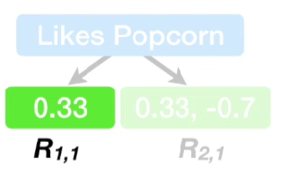

We are trying to find out the output value of this leaf. In other words, we were trying to find the value for **gamma** that, when added to the most recent predicted **log(odds)**, minimized the **Loss Fuction**.

$$\gamma_{1,1} = \frac{Residual}{p \times (1-p)}$$

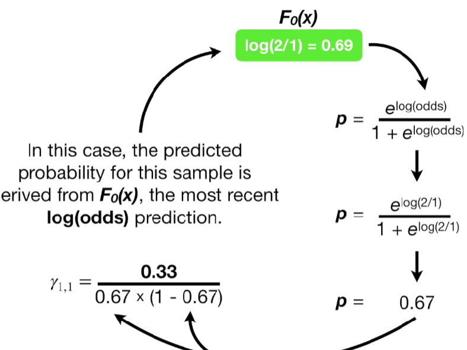

In this case, the predicted probability for this sample is derived from $F_0 (x)$, the most recent **log(odds)** prediction.

$$
\begin{align*}
\gamma &= \frac{0.33}{ 0.67 \times (1-0.67)}
&= 1.5
\end{align*}
$$

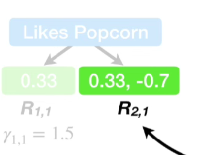

Now let's calculate the **Output Value** for the other leaf, $R_{2,1}$ that means, we are calculating $\gamma_{2,1}$ 

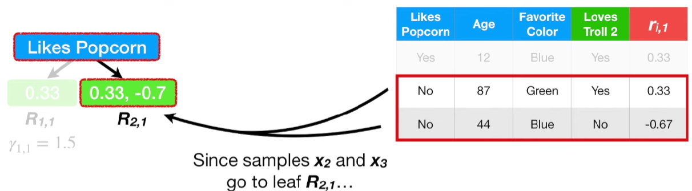

Since samples $x_2$ and $x_3$ go to leaf $R_{2,1}$

$$
\begin{align*}
\gamma_{2,1} &= L(y_2,F_m-1(x_2)+ \gamma ) + L(y_3,F_m-1(x_3)+ \gamma )
\end{align*}
$$

Now, just like before, we can approximate the **Loss Function** with second order Taylor Polynomials 

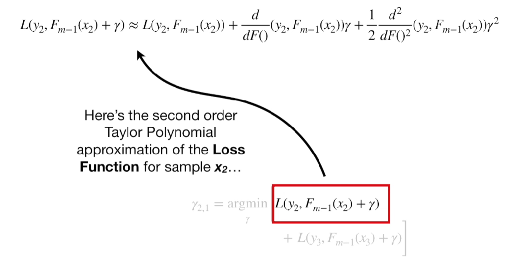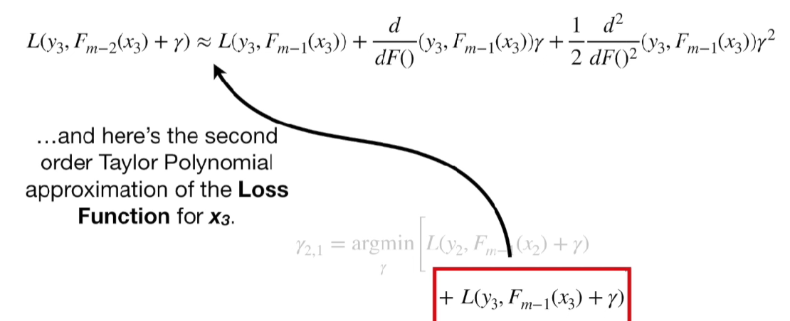

Here is the second order Taylor Polynomial approximation of the **Loss Function** for sample $x_2$ and $x_3$

By adding them together, we get this
$$
\begin{align}
L(y_2, F_{m-2}(x_2) + \gamma) 
+ L(y_3, F_{m-2}(x_3) + \gamma) 
&\approx 
L(y_2, F_{m-1}(x_2)) 
+ L(y_3, F_{m-1}(x_3)) 
\\[6pt] 
&\quad+ 
[
\frac{d}{dF()} (y_2, F_{m-1}(x_2))
+
\frac{d}{dF()} (y_3, F_{m-1}(x_3))
] \gamma
\\[6pt]
&\quad+
\frac{1}{2}
\left[
\frac{d^{2}}{dF()^{2}} (y_2, F_{m-1}(x_2))
+
\frac{d^{2}}{dF()^{2}} (y_3, F_{m-1}(x_3))
\right]
\gamma^{2}
\end{align}
$$

The first step in finding the optimal value for **gamma** is to take the derivative of the sum of the two approximate **Loss Functions** with respect to **gamma**
$$
\begin{align*}
\frac{d}{d\,\gamma}
[
\frac{d}{dF()} (y_2, F_{m-1}(x_2))
+
\frac{d}{dF()} (y_3, F_{m-1}(x_3))
] \gamma
&\approx
\frac{d}{dF()} (y_2, F_{m-1}(x_2))
+
\frac{d}{dF()} (y_3, F_{m-1}(x_3))
\end{align*}
$$

The derivative is everything between the square brackets. 

And the third term,
$$
\begin{align*}
\frac{d}{d\,\gamma}
\frac{1}{2}
\left[
\frac{d^{2}}{dF()^{2}} (y_2, F_{m-1}(x_2))
+
\frac{d^{2}}{dF()^{2}} (y_3, F_{m-1}(x_3))
\right]
\gamma^{2}
&\approx
\left[
\frac{d^{2}}{dF()^{2}} (y_2, F_{m-1}(x_2))
+
\frac{d^{2}}{dF()^{2}} (y_3, F_{m-1}(x_3))
\right]
\gamma
\end{align*}
$$

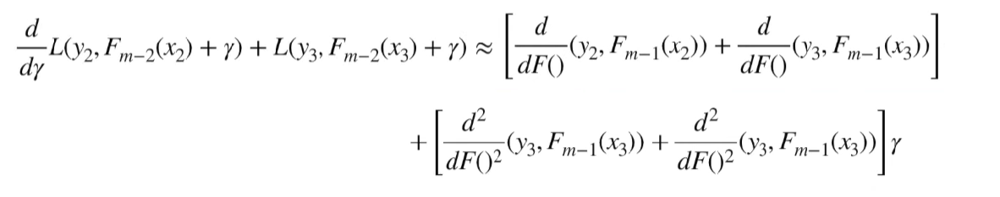

So this is the derivative of the sum of the approximate **Loss Functions** with respect to **gamma**

Set it equals to 0 and now we need to solve for gamma

$$
\begin{align}
\frac{d}{d\gamma} \Big(
    L(y_2, F_{m-2}(x_2) + \gamma)
    + L(y_3, F_{m-2}(x_3) + \gamma)
\Big)
&\approx
\left[
\frac{d}{dF()}(y_2, F_{m-1}(x_2))
+
\frac{d}{dF()}(y_3, F_{m-1}(x_3))
\right]
\\[6pt]
&\quad+
\left[
\frac{d^{2}}{dF()^{2}}(y_2, F_{m-1}(x_2))
+
\frac{d^{2}}{dF()^{2}}(y_3, F_{m-1}(x_3))
\right]\gamma
= 0
\end{align}
$$

$$
\begin{align}
[
\frac{d^{2}}{dF()^{2}}(y_2, F_{m-1}(x_2))
+
\frac{d^{2}}{dF()^{2}}(y_3, F_{m-1}(x_3))
]\gamma
&= - 
[
\frac{d}{dF()}(y_2, F_{m-1}(x_2))
+
\frac{d}{dF()}(y_3, F_{m-1}(x_3))
] \\
\gamma &= 
\frac{
[
\frac{d}{dF()}(y_2, F_{m-1}(x_2))
+
\frac{d}{dF()}(y_3, F_{m-1}(x_3))
]
}
{
[
\frac{d^{2}}{dF()^{2}}(y_2, F_{m-1}(x_2))
+
\frac{d^{2}}{dF()^{2}}(y_3, F_{m-1}(x_3))
]\
}
\end{align}
$$

Now we need to spmplify it.

In numerator, we have two separate derivagives of the **Loss function**: one for $x_2$ and one for $x_3$ and since we already know that the deriavtive of the **Loss Function** is this $ -\text{observed} + \frac{e^{log(odds)}}{1+e^{log(odds)}}$ we can plug it in for $x_2$ and $x_3$. 

Similarly, we have the sum of two second derivatives in the denominator: one for $x_2$ and one for $x_3$ and since we already know that the second derivative of the **Loss Function** = $p \times (1-p)$, we can plug them in

$$
\begin{align}
\gamma &= 
\frac{
-[
\frac{d}{dF()}(y_2, F_{m-1}(x_2))
+
\frac{d}{dF()}(y_3, F_{m-1}(x_3))
]
}
{
[
\frac{d^{2}}{dF()^{2}}(y_2, F_{m-1}(x_2))
+
\frac{d^{2}}{dF()^{2}}(y_3, F_{m-1}(x_3))
]
} \\
&=
\frac{
- [
-y_2 +  \frac{e^{log(odds)}}{1+e^{log(odds)}}
+
-y_3 +  \frac{e^{log(odds)}}{1+e^{log(odds)}}
]
}
{
[ p_2 \times (1-p_2) + p_3 \times (1-p_3)]
} \\
&=
\frac{
- [
-y_2 +  p_2 + -y_3 + p_3
]
}
{
[ p_2 \times (1-p_2) + p_3 \times (1-p_3)]
} \\
&=
\frac{\text{Residual}_2 + \text{Residual}_3}
{[ p_2 \times (1-p_2) + p_3 \times (1-p_3)]}
\end{align}
$$

At long last, we see that **gamma** is equal to the sum of the **Residuals** divided by the sum of $p \times (1-p)$ for each sample and the leaf

Now we need to plug in the most recent predicted probabilities $p_2$ and $p_3$, for $x_2$ and $x_3$.

Just like before, since we are building the first tree, the predicted probability for these samples is derived from $F_0(x)$, the most recent **log(odds)** prediction.

$$
\begin{align}
\gamma_{2,1} 
&= \frac{\text{Residual}_2 + \text{Residual}_3}
{[ p_2 \times (1-p_2) + p_3 \times (1-p_3)]} \\
&= 
\frac{0.33 + -0.67}
{[ 0.67 \times (1-0.67) + 0.67 \times (1-0.67)]}
\end{align}
$$

> Note: Since we are just starting out, the predicted probabilities are the same for all of the samples. However, after we uild the first tree, they can be different.

$$ \gamma_{2,1} = -0.77$$

and the output value for leaf $R_{2,1}$ is -0.77

We made it through step 2 **part C**. We calculated the output value for each tree in the tree.

### Part D:

Update $F_m(x) = F_{m-1}(x) + \nu \sum_{j=1}^{J_m} \gamma_{jm} \, I(x \in R_{jm})$

We make a new prediction for each sample.Since this the our first pass through **Step 2** and m=1, this the new prediction will be called $F_1(x)$.

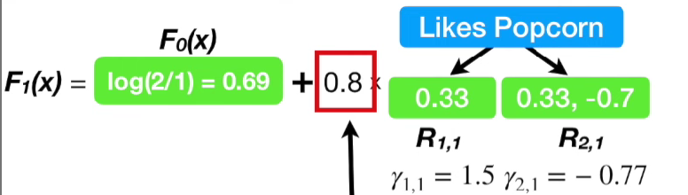

The new prediction, $f_1(x)$, is based on the last prediction we made, $F_0(x)$ plus the learning rate $\nu$ times the output values from the first tree we made. 

> Note: the summation is there just in case that a single sample end up in multiple leaves.

> Note: we have set the **Learning Rate**,**nu**, to 0.8, which is relatively large.

We have created the new prediction $F_1(x)$. Now we will use the $F_1(x)$ to make new **Predictions** for each sample

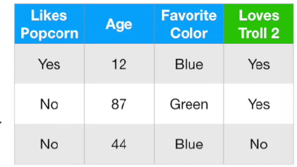

We will start with the first sample.

The new prediction for $x_1$ starts with the last predictipon,$F_0(x)$, which is 0.69 plus 0.8 times the **Output Value** from the new tree which is 1.5 because $x_1$ **Like Popcorn**

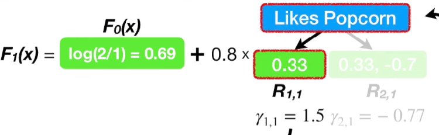

$ F_1(x_1) = 0.69 + 0.8 \times 1.5 =1.89 $ 

The new **log(odds) Prediction** for the first sample is 1.89, which is a better prediction that before because the odds are more in favor that this person will **Love Troll 2**

Now we will calculate the new predicted **log(odds)** for the second sample,$x_2$.

$ F_1(x_2) = 0.69 + 0.8 \times -0.77 = 0.77$ 

which is worse than before, 0.33, but that's also why we build more than one tree

Now we calculate the new predicted **log(odds)** for the third sample,$x_3$

$ F_1(x_3) = 0.69 + 0.8 \times -0.77 = 0.77$ 

which is better than before, -0.7.

We made it through one iteration of step 2. Now we set $m=2$ and do everything over again

In the interest of time, let's assume $M = 2$, so that we are done with **Step 2** 

>Note: In prective, M = 100 or more.

## Step 3

If $M=2$, then $F_x(2)$ is the output from the **GRadient Boost** algorithm.

Now, if we received some new data we would use $F_2(x)$ to predict whether this person **Love Troll 2**

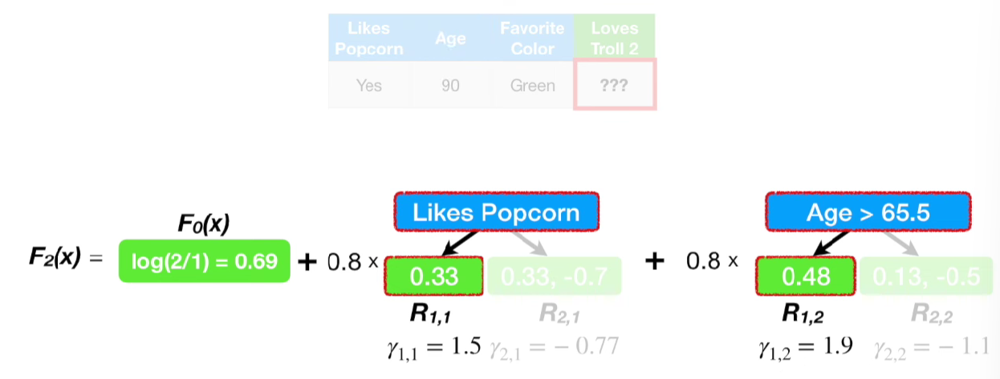

$$
\text{The predicted log(odds) that this person will Love Troll 2} = \log(2/1) + (0.8 \times 1.5) + (0.8 \times 1.9) = 3.4
$$

$$
\text{The predicted probability that this person will Love Troll 2} = \frac{e^{3.4}}{1+ e^{3.4}} = 0.97
$$

If we use a threshold of 0.5 for deciding if someone **Loves Troll 2**, then since 0.97 > 0.5, this person **Love Troll 2**