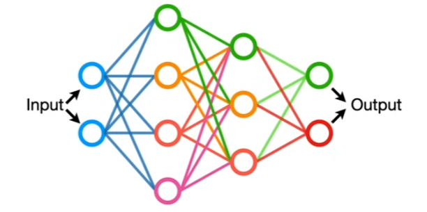

# Neural Networkds Part 1: Inside the black box

Neural Networks, one of the most popular algorithms in **Machine Learning**, cover a broad range of concepts and techniques.

The qual of this series is to take a peak into the **Black box** by breaking down each concept and technique into its components and walking through how they fit together, step-by-step.

## What Neural Networks do and how they do it

let's imagine we tested a druf that was designed to treat an illness and we gave the drug to 3 different groups of peopler  with 3 different **Dosages**