# Neural Networkds Part 1: Inside the black box

Neural Networks, one of the most popular algorithms in **Machine Learning**, cover a broad range of concepts and techniques.

The qual of this series is to take a peak into the **Black box** by breaking down each concept and technique into its components and walking through how they fit together, step-by-step.

## What Neural Networks do and how they do it

let's imagine we tested a druf that was designed to treat an illness and we gave the drug to 3 different groups of people  with 3 different **Dosages**, Low Dosages, Medium Dosages and High Dosages

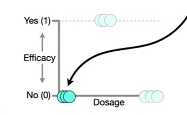

The low **Dosages** were not Effective**, so we set them to 0 on this graph. In contrast, the medium **Dosages** were **Effective**, so we set them to 1. And the high **Dosages** were not **Effective**, so those are set to 0.

Now that we have this data, we would like to use it to predict whether or not a future **Dosage** will be Effective

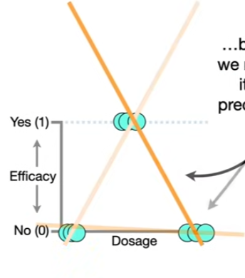

However, we cannot fit a straight line to the data to male predictions because no matter how we rotate the **Straight line**, it can only accurately predict 2 of the 3 dosages.

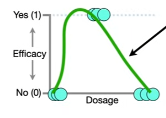

The good news is that a **Neural Network** can fit a squiggle to the data. The green squiggle is close to 0 for **low Dosages**, close to 1 for **medium Dosages** and close to 0 for **high Dosages**.

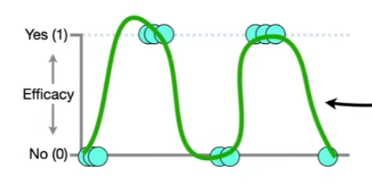

And even if we have a really complicated dataset like this, a **Neural Network** can fit a **squiggle** to it. 

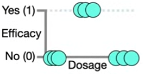

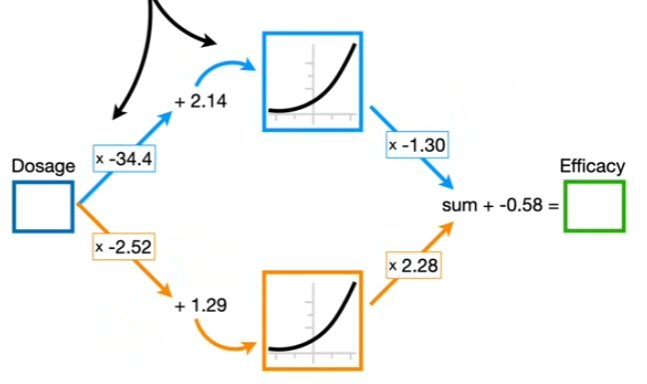

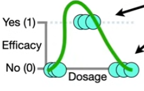

In this **StatQuest**, we are going to use this super simple dataset and show how this **Neural Network creates this green Squiggle

## Description of Neural Networks

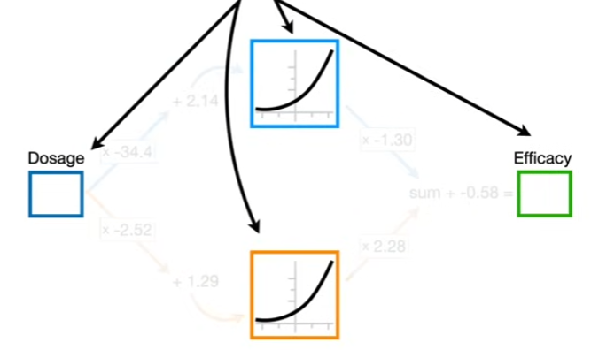

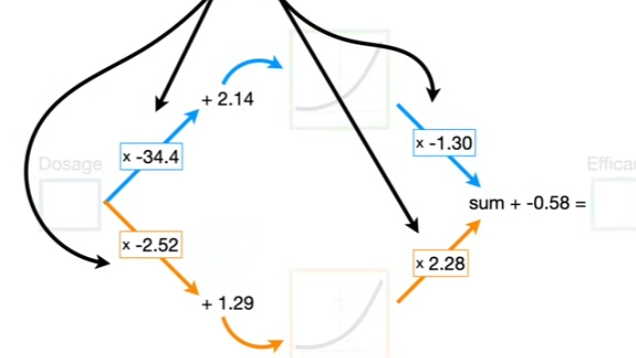

A **Neural Network** consists of **Nodes** and **connections** between the nodes.

> Note: The number along each connection represent parameter values that were estimated when this **Neural Network** was fit to the data

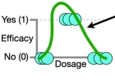

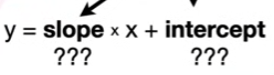

For now, just know that these parameter estimates are analogous to the **slope** and **intercept** values that we solve for when we fir a **straight line** to data.

Likewise, a **Neural Network** starts out with unknown parameter values that are estimated when we fit the **Neural Network** to a dataset using a method called **Backpropagation**. We will talk about this in part 2, but for now just assume that we have already fit this **Neural Network** to this specific dataset and that means we have already estimated these parameters.

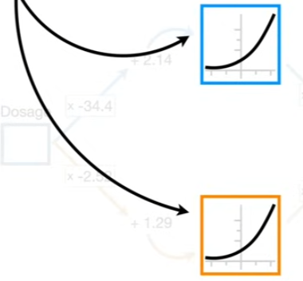

Also, you may have noticed that some of the **Nodes** have **curved lines** inside of them.

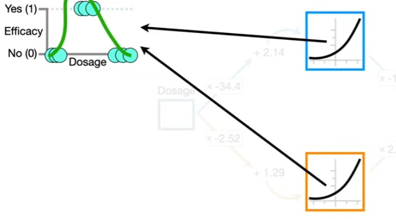

These **bent** or **curved lines** are teh building blocks for fitting a **Squiggle** to data.

The goal of this **StatQuest** is to show you how these identical **curves** can be reshaped by the parameter values and then added together to get a **Green squiggle** that fits the data.

> Note: There are many common **bent** or **curved** lines that we can choose for a **Neural Network**

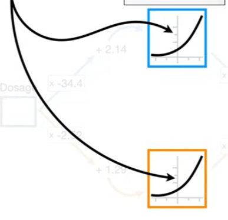

This specific **curved line** is called **softplus**

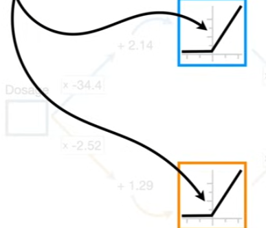

Alternatively, we could use this **bent line**, called, **ReLU**, which is should for **Rectified Linear Unit**.

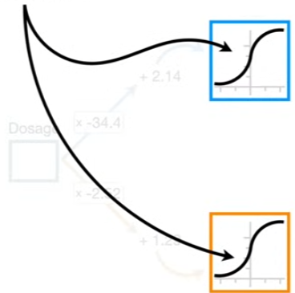

Or we could use a **sigmoid** shape or any other **bent** or **curved line**

>Terminology: 
>The **curved** or **bent lines** are called **Activation Functions**.  

When you build a **Neural Network**, you have to decide which **Activation Function** or **Functions** you want to use 

Where most people teach **Neural Networks**, they use the **Sigmoid Activation Function** or the **softplus Activation Function**

So we will use the **Softplus Activation Function** in this **StatQuest**

> Note: This specific Neural Network is about as simple as they get

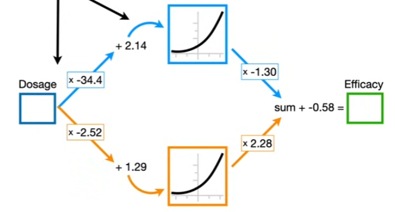

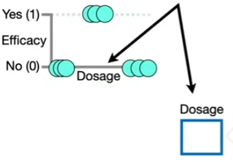

It only has **1 Input Node** where we plug in the **Dosage**

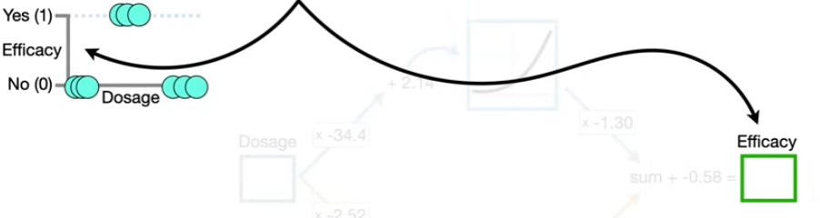

only **1 Output Node** to tell us the predicted **Effectiveness**

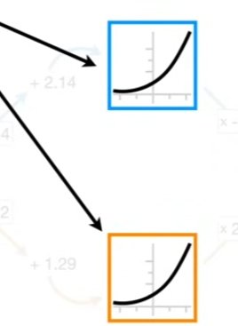

and only **2 Nodes** between the **Input** and **Output Nodes**.

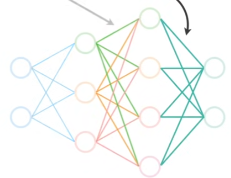

However, in practive, **Neural Networks** are usually much fancier and have more than **1 Input Node**, more than **1 Output Node**, different layers of **Nodes** between the **Input and Output Nodes** and a spider web of connections between each layer of **Nodes**.

> Terminology: The layers of **Nodes** between the **Input** and **Output Nodes** are called **Hidden Layers**

When you build a **Neural Network** one of the first things you do is decide how many **Hidden Layers** you want, and how many **Nodes** go into each **Hidden Layer**

Although there are rules of thumb for making decisions about the **Hidden Layers**, you essentially make a guess and see how well the **Neural Network** performs, adding more layers and nodes if needed.

Now, even though this **Neural Networks** looks fancy, it is still made from the same parts used in the simple Neural Networks which only has 1 **Hidden Layer** with **2 Nodes**

## Creating a squiggle from curved lines

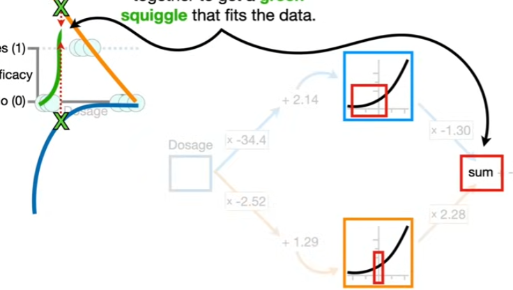

So let's learn how this **Neural Network** creates new shapes from the **curved** or **bent lines** in the **Hidden Layer** and then adds them together to get a green squiggle that fits the data

> Note: To keep the math simple, let's assume **Dosages** go from 0(low) to 1(high)

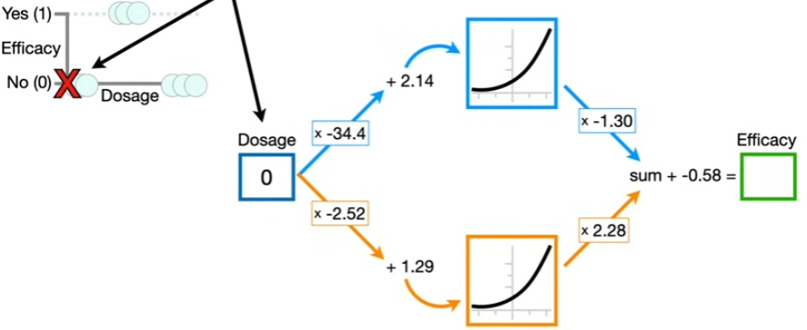

The first thing we are going to do is plug the lowest **Dosage**, 0, into the **Neural Network**.

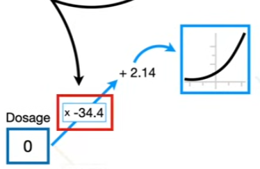

Now, to get from the **Input Node** to the top **Node** in the **Hidden Layer** this connection multiplies the **Dosage** by **-34.4** and then adds **2.14** and the result is an x-axis coordinate for the **Activation Function**.

$$(\text{Dosage} \times -34.4) + 2.14 = \text{x-axis coordinate}$$

For example, the lowest **Dosage**, 0 is multiplied by **-34.4** and then we add **2.14** to get **2.14** as the x-axis corrdinate for the **Activation Function**

$$(0 \times -34.4) + 2.14 = 2.14$$

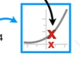

To get the corresponding y-axis value, we plug **2.14** into the **Activation Function**, which, in this case, is the **softplus** function.

$$f(x) = \log( 1 + e^x)$$

>Note: if we had chosen the **sigmoid** curve for the **Activation Function** then we would plug 2.14 into the equation for the **sigmoid** curve

> $$f(x) = \frac{e^x}{e^x + 1}$$

> and if had chosen the **ReLU bent line** for the **Activation Function** then we would plug **2.14** into the **ReLU** equation.

> $$f(x) = max(0,x)$$

Now since we are using **softplus** for the **Activation Function**, we plug 2.14 into the **softplus** equation

$$f(2.14) = \log( 1 + e^{2.14}) = 2.25$$

and the $\log( 1 + e^{2.14})$ is **2.25**

>Note: In statistics, machine learning and most programming leanguages, **log()** implies the **natural log** (ln), or the log base $e$

Anyway, the y-axis coordinate for the **Activation Function** is 2.25

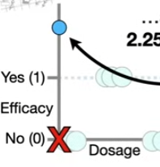

So we will need to extend this y-axis up a little bit and put a blue dot at 2.25 for when **Dosage** = 0.

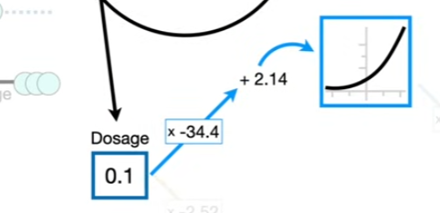

Now if we increase the **Dosage** a little bit and plug 0.1 into the input, the x-axis coordinate for the **Activation Function** is **-1.3** and the correspinding y-axis value is **0.24**

$$(0.1 \times -34.4) + 2.14 = -1.3$$

$$f(-1.3) = \log( 1 + e^{-1.3}) = 0.24$$

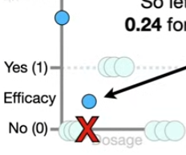

So let's put a blue dot at 0.24 for when **Dosage** = 0.1.

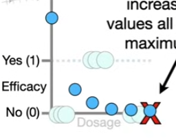
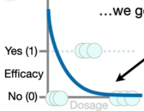

And if we continue increase the **Dosage** values all the way to 1(the maximum **Dosage**), we get this blue curve.

> Note: Before we move on, i want to point out that the full range of **Dosage** values, from 0 to 1, corresponds to this relatively narrow range of values from the **Activation Function**.

> 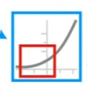

In other words, when we plug **Dosgae** values, from 0 to 1, into the **Neural Network** and then multiply them by -34.4 and add 2.14, then we only get x-axis coordinates that are within the **Red box** and thus, only the corresponding y-axis values in the **red box** are used to make this new **blue curve**.

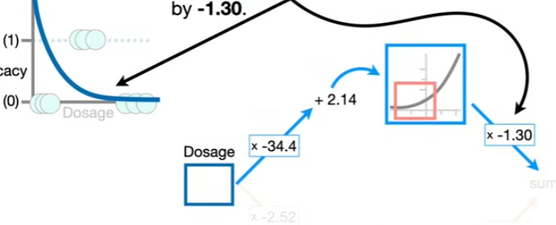

Now we scale the y-axis values for the **blue curve** by -1.3. 

For example, when **Dosage = 0**, the current y-axis coordinate for the blue curve is **2.25** so we multiply **2.25** by **-1.3** and get **-2.93** 

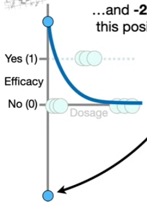

and **-2,93** corresponds to this position of the y-axis

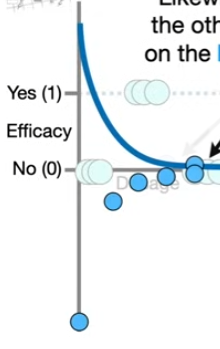

Likewise, we multiply all of the other y-axis coordinates on the **Blue curve** by **-1.30** and we end up with a new **blue curve**

--- 

Now let's focus on the connection from the **Input Node** to the bottom **Node** in the **Hidden Layer**

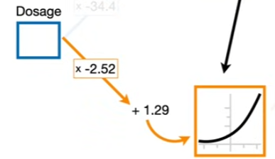

However, this time, we multiply the **Dosage** by **-2.52**, instead of -34.4, and we add **1.29** instead of 2.14 to get the x-axis coordinate

> Remember: These values come from fitting the **Neural Network** to the data with **Backpropagation**, and we will talk about that in **Part 2** in this series

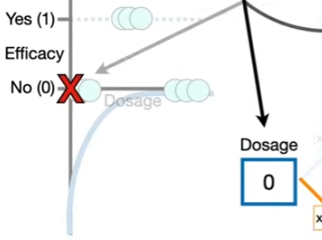

Now, if we plug the lowest **Dosage**, 0, into the **Neural Network** then the x-axis coordinate for the **Activation Function** is **1.29**

$$(0 \times -2.52) + 1.29 = 1.29$$

Now we plug **1.29** into the **Activation Function** to get the corresponding y-axis and get **1.53**

$$f(1.29) = \log( 1 + e^{1.29}) = 1.53$$

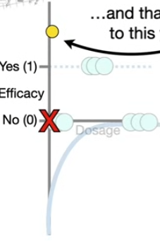
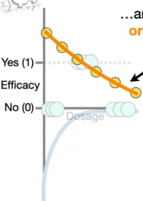

And that corresponds to this **yellow dot**. Now we just plug in the **Dosage** values from 0 to 1 to get the corresponding y-axis values and we get thsi **orange curve**

> Note: Just like before, I want to point out that full range of **Dosage** values , from 0 to 1 corresponds to this narrow range of values from the **Activation Function**

> 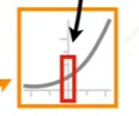

In other words, when we plug **Dosage** values from **0** to **1**, into the **Neural Network**, we only get x-axis coordinates that are within the **Red box** and thus, only the corresponding y-axis values in the **red box** are used to make this new **orange curve**

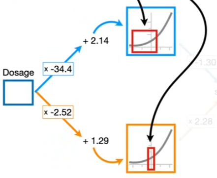
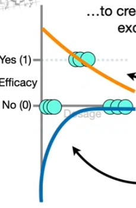

So we see that fitting a **Neural Network** to data gives us different parameter estimates on the **connections** and that results in each **Node** in the **Hidden Layer** using different portions of the **Activation Functions** to create these new and exiting shapes. 

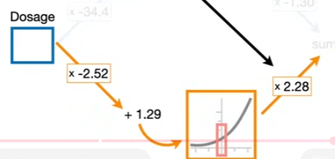

Now, just like before, we scale the y-axis coordinates on the **orange curve**. Only this time, we scale by a positive number,**2.28**.

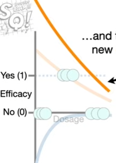

ant that gives us this new **orange curve**. 

Now the **Neural Network** tells us to add the y-axis coordinates from **blue curve** to the **orange curve**

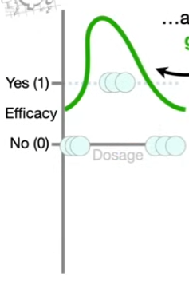

And that gives us this **green squiggle** line. then finally, we substract **0.58** from the y-axis values on the **green squiggle** and we have a **green squiggle** that fits the data.

## Using the Neural Network to make a prediction

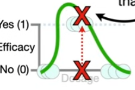

Now if someone comes along and says that they are using **Dosage = 0.5**. We can look at the corresponding y-axis coordinate on the **green squiggle** and see that the **Dosage** will be effective.

Or we can solve the y-axis coordinate by plugging **Dosage = 0.5** into the **Neural Network** and do the math and we see that the y-axis coordinate on the green squiggle is **1.03** and since 1.03 is closer to 1 than 0, we will conclude **Dosage = 0.5** is effective

## Some more Neural Network terminology

Now, you may be wondering why this is called a **Neural Network** instead of a **Big Fancy Squiggle Fitting Machine**.

The reason is that way back in the 1940s and 50s when **Neural Networks** were invented they thought the **Nodes** were vaguely like **Neurons** and the **connections** between the **Nodes** were sort of like **synapses**. 

However, i think they should be called **Big Fancy Squiggle Fitting Machine**, because that's what they do.

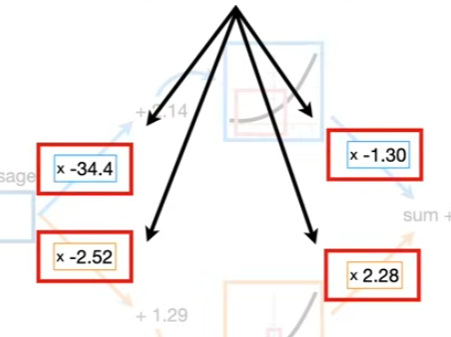

> Note: Whether or not you call it a **Squiggle Fitting Machine**, the parameters that we multiply are called **weights**

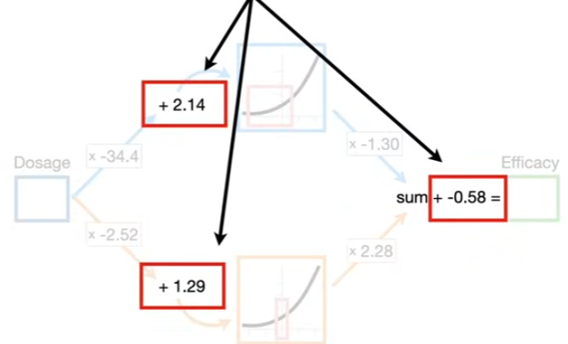

> And the parameters that we add are called **biases**

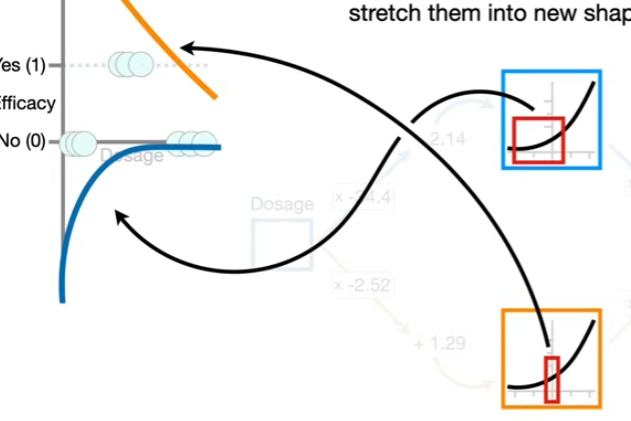

> Note: This **Neural Network** starts with two identical **Activation Functions** but the **weights** and **Biases** on cinnections slice them, flip then and stretch them into new shapes

which are then added together to get a **squiggle** that is entirely new and the **Squiggle** is then shifted to fit the data.

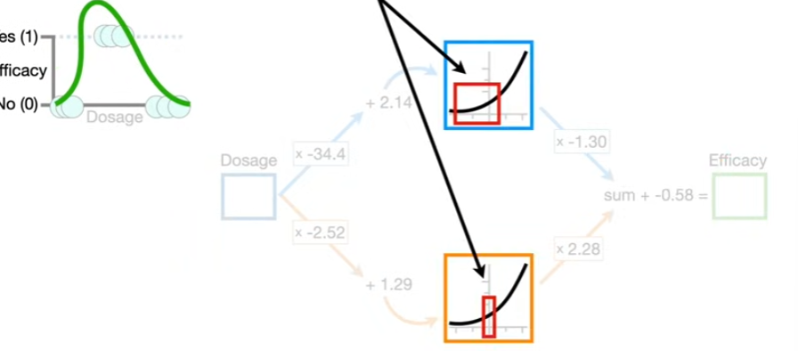

Now, if we want create this **green squiggle** with just two **Nodes** in a single **Hidden Layer** 

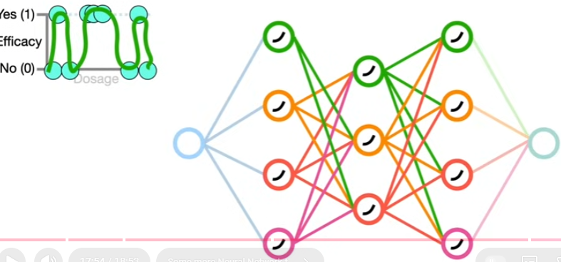

just imagine what types of green squiffles we could fit with more **Hidden Layers** and more **Nodes** in each **Hidden layer**

In theory, Neural Networks can fit a green squiggle to just about to any dataset, no matter how complicated.