# Neural Networks (Part 2): Backpropagation Main Ideas

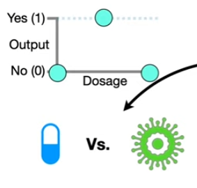

In statquest on **Neural Networks** part 1, Inside the **Black Box**, we started with a simple dataset that showed whether or not different drug dosages were effective against a virus. 

The low and high dosages are not effective, but the medium dosage was effective. Then we talked about how a **Neural Network** like this one fits a **green squiggle** to this dataset.

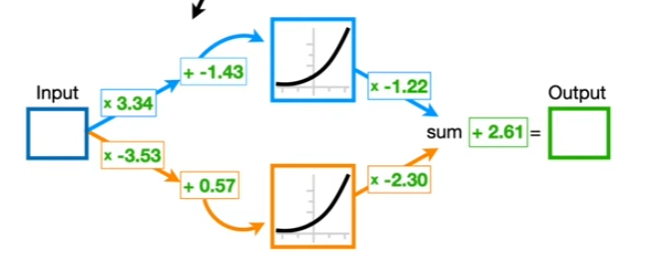

Remember, the **Neural Network** starts with identical **Activation Functions** but using different **Weights** and **Biases** on the connections, it flips and stretches the **Activation Functions** into new shapes which are then added together to get a **squiggle** that are shifted to fit the data.

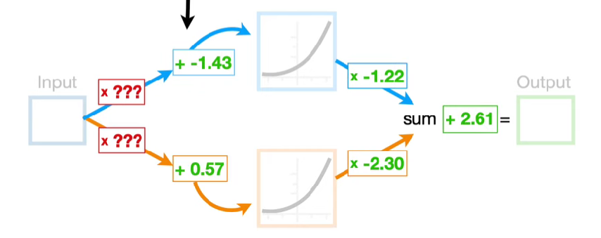

However, we did not talk about how to estimate the **Weight** and **Biases**. So let's talk about how **Backpropagation** optimizes the **Weight** and **Biases** in this and other **Neural Networks**

>Note: **Back propagation** is relatively simple, but there are a ton of details. So i have split it up to bite sized pieves

## Main idea of Backpropagation

1. Using the **Chain Rule** to calculate derivatives

$$\frac{\text{d SSR}}{\text{d bias}}= \frac{\text{d SSR}}{\text{d Predicted}}$$

2. Plugging the derivatives into **Gradient Descent** to optimize parameters.

In the next part, we will talk about how the **Chain Rule** and **Gradient Descent** apply to multiple parameters simultaneously, and intoduce some fancy notation.

Then we will go completely bonkers with the chain rule and show how to opti,ize all 7 parameters simultaneously in this **Neural Network**

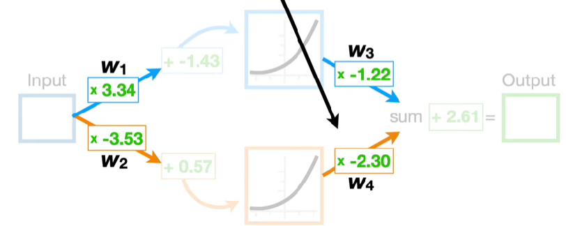
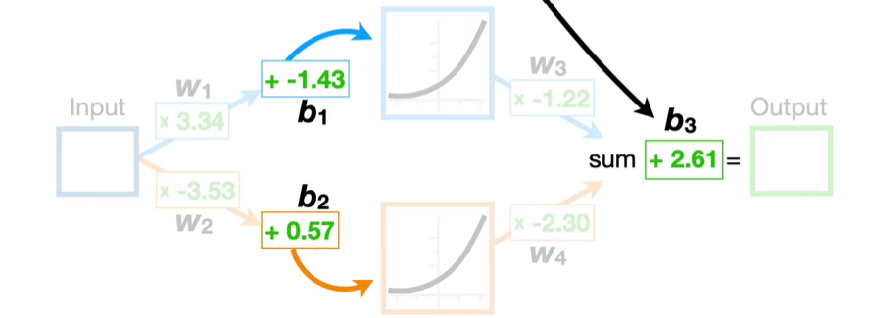

First, let's give each one a name so we can be celar about which specific **Weights** we are talking about and also name each **Bias**

> Note: Conceptually, Backpropagation starts with the last parameter and work its way backwords to estimate all of the other parameters.

However, we can discuss all of the **Main Ideas** behund **Backpropagation** by just estimating the last **Bias,$b_3$**

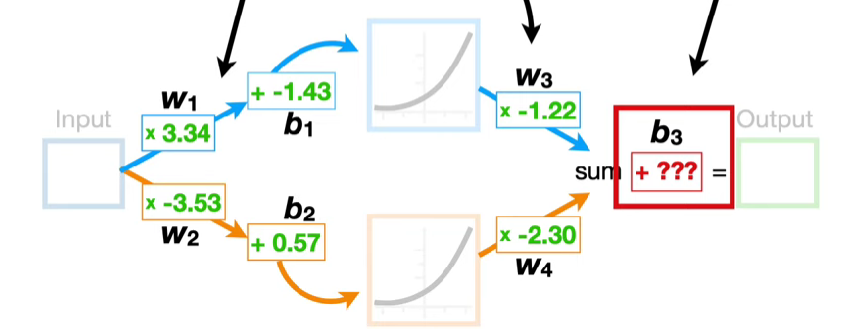

So in order to start from the back, let's assume that we already have **optimal values** for all of the parameters except for the last **Bias** term, $b_3$.

> Note: Throughout this and the next **StatQuests**, I will make parameter that have already been optimized **green** and unoptimized parameters will be **red**

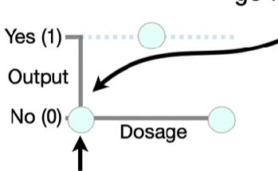

> Note: To keep the math simple, let's assume **Dosages** go from 0(low) to 1(high)

## Fitting the Neural Network to the data

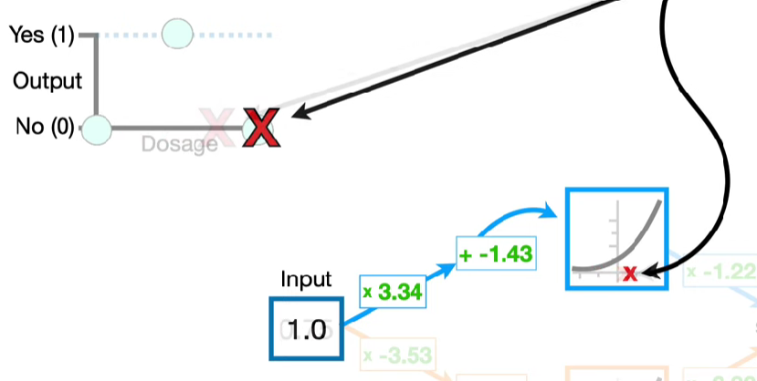

Now, if we run **Dosages** from 0 to 1 through the connection to the top **Node** in the **Hidden Layer** then we get x-axis coordinates for the **Activation Function** that are all inside this **red box** and when we plug the x-axis coordinates into the **Activation Function** which, in this example is the **Softplus Activation Function**

$$f(x) = log(1+e^x)$$

we get the corresponding y-axis coordinates and this blue curve.

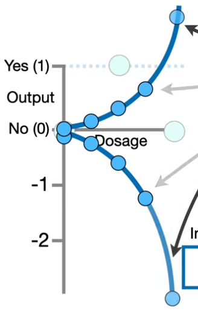

Then we multiply the y-axis coordinates on the blue curve by -1.22 and we get the final blue curve. 

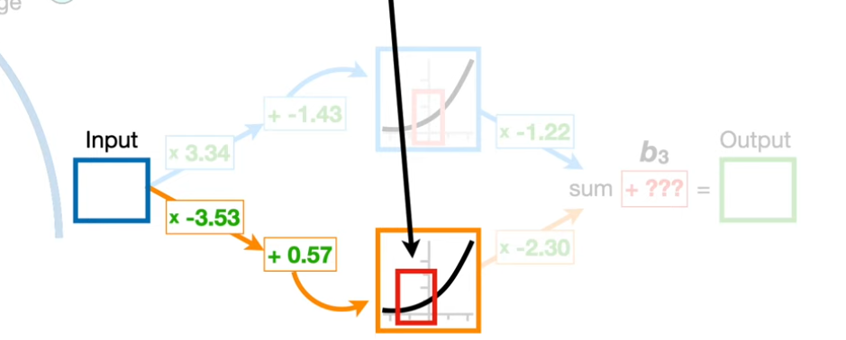

Now, if we run dosages from zero to one through the connection to the bottom node in the hidden layer, then we get x-axis coordinates inside this red box. 

Now we plug those x-axis coordinates into the **activation function** to get the corresponding y-axis coordinates for this orange curve. 

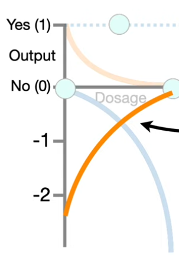

Now we multiply the y-axis coordinates on the orange curve by - 2.3 and we end up with this final orange curve.

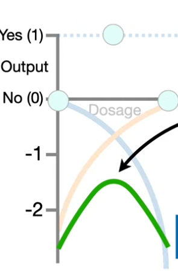

Now we add the **blue** and **orange** curves together to get this **green squiggle**. 

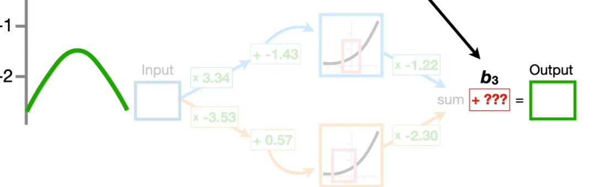

Now we are ready to add the final bias, **b3**, to the green squiggle. Because we don't yet know the optimal value for b3, we have to give it an initial value, and because **Bias** terms are frequently initialized to 0, we will set $b_3 = 0$.

Now, adding zero to all of the y-axis coordinates on the green squiggle leaves it right where it is. 

## Sum of Squared Residuals

However, that means the green squiggle is pretty far from the data that we observed. We can quantify how good the **green squiggle** fits the data by calculating the **sum of the squared residuals.** 

A **residual** is the difference between the **observed** and **predicted** values. 

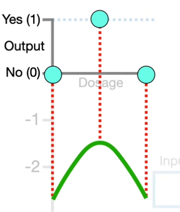

For example, 

$$\text{SSR} = (0 - -2.6)^2 + (1 - 1.61)^2 + (0 - -2.61)^2 = 20.4$$

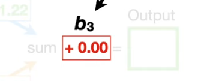

So when b3 equals 0, the sum of the squared residuals equals 20.4. 

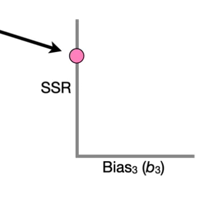

And that corresponds to this location on this graph that has the **sum of the squared residuals** on the y -axis and the **bias**, $b_3$, on the x-axis.

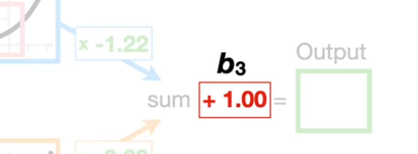
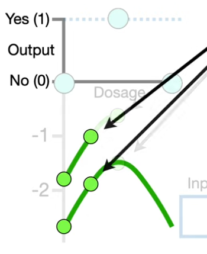

Now, if we increase $b_3$ to 1, then we would add one to the y-axis coordinates on the green squiggle and shift the green squiggle up one. And we end up with shorter **residuals**.

When we do the math,
 
$$\text{SSR} = (0 - -1.6)^2 + (1 - 0.61)^2 + (0 - -1.61)^2 = 7.8$$

the sum of the squared residuals equals 7.8, 

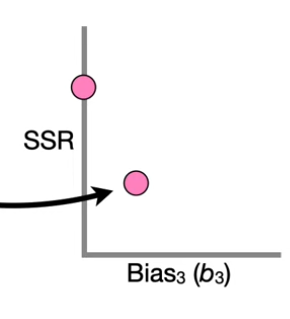

and that corresponds to this point on our graph. 

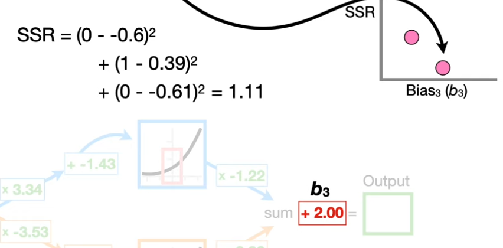

if we increase $b_3$ to 2, then the sum of the squared residuals equals 1.11. And if we increase $b_3$ to 3, then the sum of the squared residuals equals 0.46.

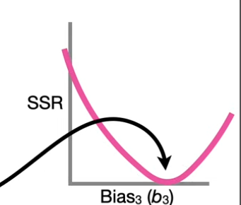

And if we had time to plug in tons of values for $b_3$, we would get this pink curve, and we could find the lowest point, which corresponds to the value for $b_3$ that results in the lowest sum of the squared residuals.

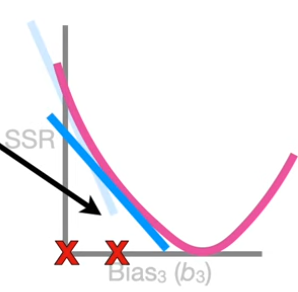

However, instead of plugging in tons of values to find the lowest point in the pink curve, we use **Gradient Descent** to find it relatively quickly. 

## Using Chain Rule to calculate the drivative 

And that means we need to find the **derivative of the sum of the squared residuals** with respect to $b_3$. 

Now, remember the sum of the squared residuals equals the first residual squared, plus all of the other squared residuals.

$$ \text{SSR} = (\text{Observed}_1 - \text{Predicted}_1)^2 + (\text{Observed}_2 - \text{Predicted}_2)^2+ ...$$

Now, because this equation takes up a lot of space, we can make it smaller by using summation notation. 

$\text{SSR} = \sum^{n=3}_{i=1} (\text{Observed}_i - \text{Predicted}_i)^2 $ 

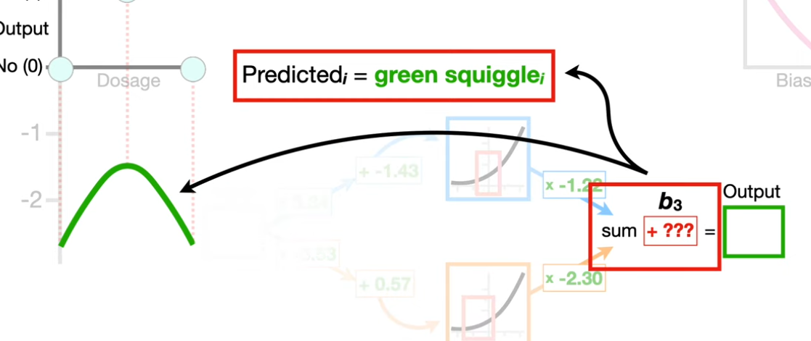

Now let's talk a little bit more about the predicted values. Each predicted value comes from the **green squiggle**, and the green squiggle comes from the last part of the neural network.

In other words, the **green squiggle** is the sum of the **blue** and **orange** curves, plus $b_3$.

Now remember, we want to use gradient descent to optimize $b_3$, and that means we need to take the derivative of the **sum of the squared residuals** with respect to b3. 

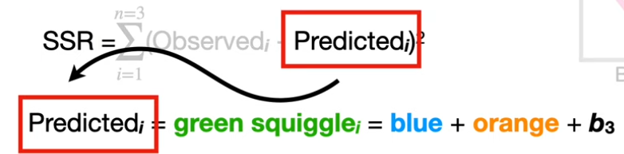

And because the **sum of the squared residuals** are linked to b3 by the **predicted values**, we can use the **chain rule** to solve for the derivative of the *sum of the squared residuals* with respect to $b_3$. 

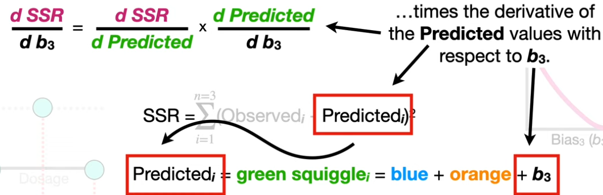

The chain rule says that the derivative of the sum of the squared residuals with respect to $b_3$ is the derivative of the sum of the squared residuals with respect to the predicted values, times the derivative of the predicted values with respect to $b_3$. 

Now we can solve for the derivative of the sum of the squared residuals with respect to the predicted values by first substituting in the equation, and then use the chain rule to move the square to the front, and then we multiply that by the derivative of the stuff inside the parentheses with respect to the predicted values, negative one. Now we simplify by multiplying two by negative 1, and we have the derivative of the sum of the squared residuals with respect to the predicted values. 

$$
\begin{align*}
\frac{d\ \text{SSR}}{d\ \text{Predicted}} &= \frac{d}{d\ \text{Predicted}} \sum^{n=3}_{i=1} (\text{Observed}_i - \text{Predicted}_i)^2 \\
&= \sum^{n=3}_{i=1} 2\times(\text{Observed}_i - \text{Predicted}_i) \times -1 \\
&= \sum^{n=3}_{i=1} -2\times(\text{Observed}_i - \text{Predicted}_i)\\
\end{align*}
$$ 

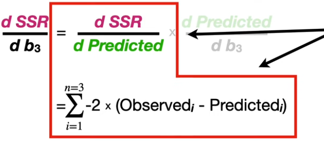

So let's move that up here, and now we are done with the first part.

$$
\begin{align*}
\frac{d\ \text{Predicted}}{d\ b_3} &= \frac{d}{d\ b_3} \text{green squiggle} \\
&= \frac{d}{d\ b_3} (\text{blue} + \text{orange} + b_3 )\\
&= 0 + 0 + 1 \\
&=1
\end{align*}
$$ 

 Now let's solve for the second part: the derivative of the predicted values with respect to $b_3$. We start by plugging in the equation for the predicted values.**Remember, the blue and orange curves were created before we got to $b_3$.** 
 
 So the derivative of the **blue curve** with respect to $b_3$ is 0, because the blue curve is independent of $b_3$. And the derivative of the **orange curve** with respect to b3 is also 0. Lastly, the derivative of b3, with respect to $b_3$, is 1. Now we just add everything up, and the derivative of the predicted values with respect to $b_3$, is 1. 
 
 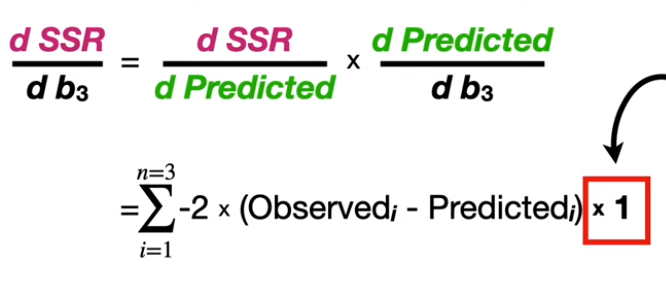
 
 So we multiply the derivative of the sum of the squared residuals with respect to the predicted values by 1.
 
>Note: this times 1 part in the equation doesn't do anything, but I'm leaving it in to remind us that the derivative of the sum of the squared residuals with respect to $b3$ consists of two parts: 
> - the derivative of the sum of the squared residuals with respect to the predicted values
> - the derivative of the predicted values with respect to $b_3$.

And at long last we have the derivative of the sum of the squared residuals with respect to $b_3$. And that means we can plug this derivative into **gradient descent** to find the optimal value for $b_3$. 

## Using Gradient Descent

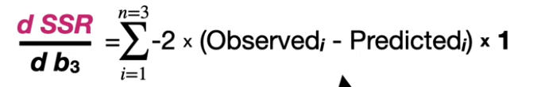

So let's move this equation up and show how we can use this equation with gradient descent. 

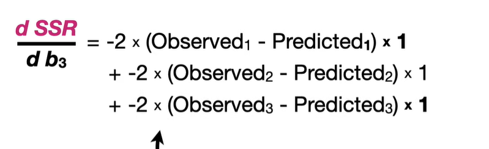

First, we expand the summation. Then, we plug in the observed values and the values predicted by the **green squiggle**. 

Remember, we get the **predicted values** on the **green squiggle** by running the **dosages** through the **neural network**. 

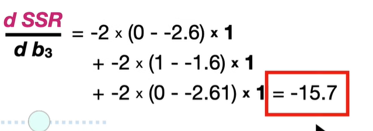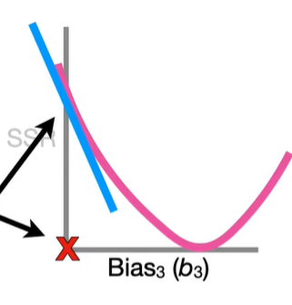

Now, we just do the math and get negative 15.7. And that corresponds to the slope for when **$b_3$ = 0**. 

$$\text{Step size} = \text{Slope} \times \text{Learning Rate}$$

Now we plug the slope into the gradient descent equation for step size, and, in this example, we'll set the learning rate to 0.1. 

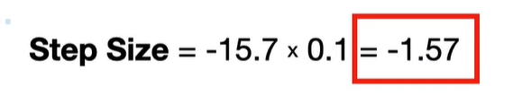

And that means the step size is -1.57.

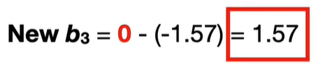

$$\text{New b3} = \text{Old b3} - \text{Step size} $$

Now we use the step size to calculate the new value for $b_3$ by plugging in the **current value for $b_3$, 0**, and the **step size**, **-1.57**. And the **new value for $b_3$** is 1.57. 

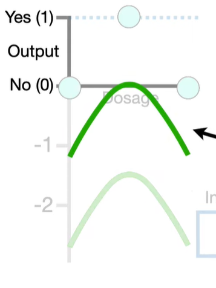

Changing $b_3$ to 1.57 shifts the green squiggle up, and that shrinks the residuals. 

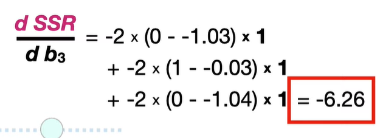

Now, plugging in the **new predicted values** and doing the math gives us **-6.26**, which corresponds to the slope when $b_3$ equals **1.57**. 

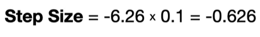
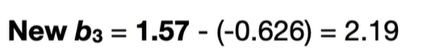

Then, we calculate the **step size** and the **new value for $b_3$**, which is **2.19**. 

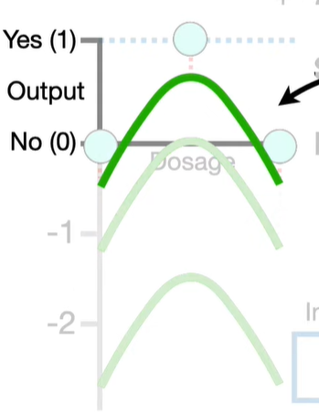

Changing b3 to 2.19 shifts the green squiggle up further, and that shrinks the residuals even more.

Now we just keep taking steps until the step size is close to zero. And because the step size is close to 0 when $b_3$ = 2.61, we decide that 2.61 is the optimal value for b3.

So, the main ideas for backpropagation are that, when a parameter is unknown, like $b_3$, we use the **chain rule** to **calculate the derivative of the sum of the squared residuals** with respect to the unknown parameter, which in this case was $b_3$. Then we initialize the unknown parameter with a number, and in this case we set $b_3$ = 0, and used **gradient descent** to optimize the unknown parameter.  
