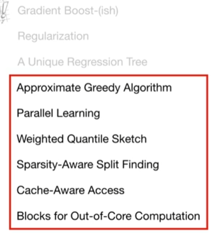
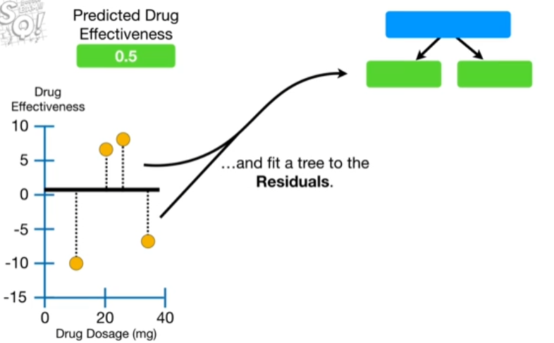
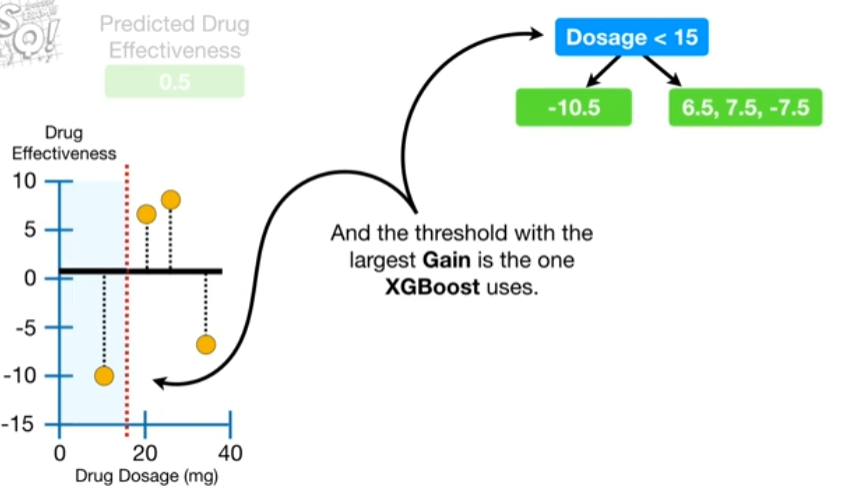
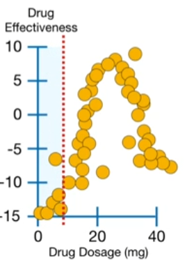
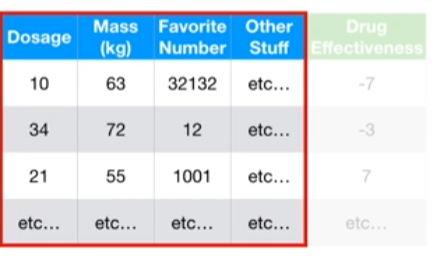
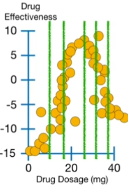
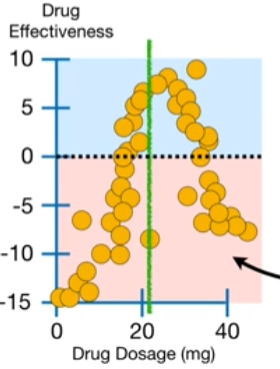
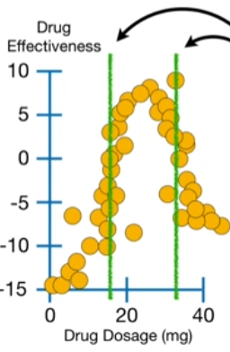
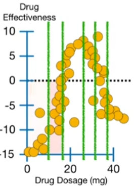

# XGBoost Part 4: Optimizations 

These parts are what make **XGBoost** relatively efficient with relatively large training datasets.

The last 6 parts describe optimizations for large datasets

## Overview

In XGBoost part 1, XGBoost Trees for Regression, we had a super simple **Training Dataset** and used different **Drug Dosages** to predict drug effectiveness.

The first thing we did was make an initial prediction, which could be anything like the mean **Drug Effectiveness**, but by default is 0.5

Then we calculated the **Residuals** and fit a tree to the **Residuals**. We did this by calculating the **Similarity Scores** and the **Gain** for each possible threshold. And the threshold with the largest **Gain** is the one **XGBoost** uses

> Note: The decision to use the threshold that gives the largest **Gain** is made without worrying about the leaves will be split later and that means **XGBoost** uses a **Greedy Algorithm** to build trees.

In other words, since **XGBoost** uses a **Greedy Algorithm**, it makes a decision without looking ahead to see if it is the absolute best choice in the long term.

In contrast, if **XGBoost** did not use a **Greedy Algorithm**, it would postpone making a final decision about this threshold until after trying different thresholds in the leaves to see how things played out in the long run.

And this same process would be repeated for every single possible threshold for the root. In other words, bu using a **Greedy Algorithm**, **XGBoost** can build a tree relatively quickly.

That said, when we have alot of measurements then the **Greedy Algorithm** becomes slow because it still has to look at every possible threshold. 

## Approximate Greedy Algorithm

And if we had a more interesting training dataset that used alot of variables to predict **Drug Effectiveness** then checking every single threshold in every single variable would take forever. This is where the **Approximate Greedy Algorithm** comes in

Going back to our example with a lot of observations, instead of  testing every single threshold, we could divide the data into **Quantiles** and only use the quantiles as candidate thresholds to split the observations

For example, instead of using the smallest two **Dosages** to define the first threshold, the **Approximate Greedy Algorithm** uses the first quantile to define the first threshold. And the second quantile is the second threshold that we will consider.

> Note: If we only used one quantile and it split the observations in hald, then that quantile would be the threshold since there are no other options.

This would make finding the "best" threshold very fast since we would not have to calculate **Gain** or **Similarity** to make the decision.

But since both sides of the threshold represent a lot of people who have positive **Drug Effectiveness** values and negative **Drug Effectiveness** values then this threshold would not do a good job prediction **Drug Effectiveness**

In contrast, if we had two quantiles, then our predictions would improve because we would do a better job separating observations with positive values for **Drug Effectiveness** from observations with negative values for **Drug Effectiveness** . So, for this data, two quantiles are better than one.

If we ahve 5 quantiles, then our predictions would be more accurate, since each threshold represents a smaller cluster of observations.

However, the more quantiles we have, the more thresholds we will have to test, and that means it will take longer to build the tree.

For **XGBoost** the **Approximate Greedy Algorithm** means that instead of testing all possible thresholds, we only test the quantiles. By default, the **Approximate Greedy Algorithm** uses about 33 quantiles.

> Why "about 33 quantiles" instead of "exactly 33 quanntiles"

To answer that question, we need to talk about **Parallel learning** and the **Weighted Quantile Sketch**

## Weighted Quantile Sketch

