# XGBoost Part 4: Optimizations 

These parts are what make **XGBoost** relatively efficient with relatively large training datasets.

The last 6 parts describe optimizations for large datasets

## Overview

In XGBoost part 1, XGBoost Trees for Regression, we had a super simple **Training Dataset** and used different **Drug Dosages** to predict drug effectiveness.

The first thing we did was make an initial prediction, which could be anything like the mean **Drug Effectiveness**, but by default is 0.5

Then we calculated the **Residuals** and fit a tree to the **Residuals**. We did this by calculating the **Similarity Scores** and the **Gain** for each possible threshold. And the threshold with the largest **Gain** is the one **XGBoost** uses

> Note: The decision to use the threshold that gives the largest **Gain** is made without worrying about the leaves will be split later and that means **XGBoost** uses a **Greedy Algorithm** to build trees.

In other words, since **XGBoost** uses a **Greedy Algorithm**, it makes a decision without looking ahead to see if it is the absolute best choice in the long term.

In contrast, if **XGBoost** did not use a **Greedy Algorithm**, it would postpone making a final decision about this threshold until after trying different thresholds in the leaves to see how things played out in the long run.

And this same process would be repeated for every single possible threshold for the root. In other words, bu using a **Greedy Algorithm**, **XGBoost** can build a tree relatively quickly.

That said, when we have alot of measurements then the **Greedy Algorithm** becomes slow because it still has to look at every possible threshold. 

## Approximate Greedy Algorithm

And if we had a more interesting training dataset that used alot of variables to predict **Drug Effectiveness** then checking every single threshold in every single variable would take forever. This is where the **Approximate Greedy Algorithm** comes in

Going back to our example with a lot of observations, instead of  testing every single threshold, we could divide the data into **Quantiles** and only use the quantiles as candidate thresholds to split the observations

For example, instead of using the smallest two **Dosages** to define the first threshold, the **Approximate Greedy Algorithm** uses the first quantile to define the first threshold. And the second quantile is the second threshold that we will consider.

> Note: If we only used one quantile and it split the observations in hald, then that quantile would be the threshold since there are no other options.

This would make finding the "best" threshold very fast since we would not have to calculate **Gain** or **Similarity** to make the decision.

But since both sides of the threshold represent a lot of people who have positive **Drug Effectiveness** values and negative **Drug Effectiveness** values then this threshold would not do a good job prediction **Drug Effectiveness**

In contrast, if we had two quantiles, then our predictions would improve because we would do a better job separating observations with positive values for **Drug Effectiveness** from observations with negative values for **Drug Effectiveness** . So, for this data, two quantiles are better than one.

If we ahve 5 quantiles, then our predictions would be more accurate, since each threshold represents a smaller cluster of observations.

However, the more quantiles we have, the more thresholds we will have to test, and that means it will take longer to build the tree.

For **XGBoost** the **Approximate Greedy Algorithm** means that instead of testing all possible thresholds, we only test the quantiles. By default, the **Approximate Greedy Algorithm** uses about 33 quantiles.

> Why "about 33 quantiles" instead of "exactly 33 quanntiles"

To answer that question, we need to talk about **Parallel learning** and the **Weighted Quantile Sketch**

## Weighted Quantile Sketch

When we have a lot of data, so much data that we cannot fit all into a computer's memory at one time, then things that seem simple, like sorting a list of numbers and finding quantiles, become really slow.

To get around this problem, a class algorithms, called **Sketches**, can quickly create approximate solutions.

### How XGBoost uses Sketches

For this example, imagine we are just using a ton of **Dosages** to predict **Drug Effectiveness** 

And imagine splitting it into small pieces and putting the pieces on different computers on a network.

The **Quantile Sketch Algorithm** combines the values fron each computer to make an approximate histogram. 

Then the approximate histogram is used to calculate the approximate quantiles. And the **Approximate Greedy Algorithm** uses approximate quantiles 

Since **XGBoost** uses **weighted quantile sketch**, so that means these quantiles are not normal everydaty quantiles.  

Usually quantiles are set up so that the same number of observations are in each one. In contrast, with weighted quantiles, each observation has a corresponding **Weight**

And the sum of the **Weights** are the same in each quantile. For example, if the sum of the **Weights** in the first quantile was 10, then the second quantile will also be 10, etc.

The weights are derived fron the **Cover** metric that we discueesd in part 2 and 3 in this series.

Specifically, the weight for each observation os the 2nd derivative of the **Loss Function**, what we are referring to as the **Hessian**. That means for **Regression**, the **Weights** are all equal to 1. And that means the weighted quantiles are just like normal quantiles and contain an equal number of observations. 

In contrast, for **Classification, the weights are 

$$\text{Weight} = \text{Previous Probability}_i \times (1-\text{Previous Probability}_i)$$

So let's see how the equation for wrights effect the quantiles in **Classification** with a simple dataset.

These **Red** and **Green** Xs correspond to the previously predicted probabilities that these dosages are effective, and they start out at the initial prediction,0.5.

After we run the data down the first tree, most of the predictions improved and as we add more trees, most of the predictions get better and better.

When using **XGBoost** for **Classification**, the weights for the **Weighted Quantile Sketch** are calculated from the previously predicted probabilities.

So let's calculate the weights for each observation.

> Note: we are just showing one example of calculating weights. In practive, weights are calculated after building each tree.

These predicted probabilities are very close to 0, indicating a high amount of confidence in classifying these **Dosages** as ineffective.

Since the previously predicted probability for these two points is 0.1, the weight is 

$$
\begin{align*}
\text{Weight} &= \text{Previous Probability}_i \times (1-\text{Previous Probability}_i) //
&= 0.1 \times (1-0.1) //
&= 0.09
\end{align*}
$$

These predicted probabilities are very close to 1, indicating that we have high confidence in classifying these **Dosages** as effective.

Since the previously predicted probability for these two points is 0.9, the weight is 

$$
\begin{align*}
\text{Weight} &= \text{Previous Probability}_i \times (1-\text{Previous Probability}_i) \\
&= 0.9 \times (1-0.9) \\
&= 0.09
\end{align*}
$$

These predicted probabilities are very close to 0.5, indicating that we not very confidence in how to classify these observations.

Since the previously predicted probability for these two points is 0.6 and 0.4, the weight both are **0.24**

Now we see that when the previously predicted probability is close to 0.5, meaning we dont have much confidence in the classification, the weights are relatively large.

In contrast, when the previously predicted probability is very close to 0 or 1, meaning we have a lot of confidence in the classification, the weights are relatively small.

Now, if we split this data into equal quantiles we would put the quantiles here. But remember, we are treating each quantile as a unit, and lumping the lst two observations together as unit means that they will end up in the same leaf together in the tree.

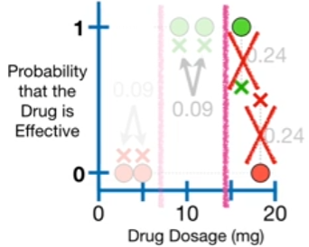

And since the positive residual will cancel out the negative residual, it will be very difficult to improve the predicted probabilities. So, instead of using equal quantiles, **XGBoost** tries to make quantiles that have a similar sum of weights 

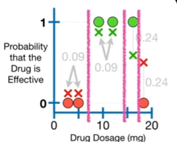

In order to divide the observations into quantiles where **the sums of weights are similar**, we devide them into these quantiles.

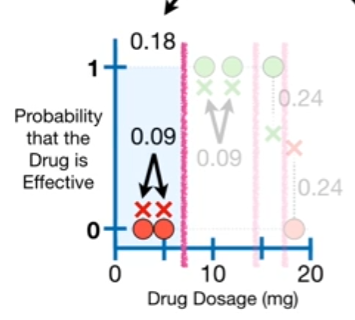

The sum of the weight of first qualtile is **0.18**. The sum of the weight of second qualtile is **0.18**. The third quantile only has one obsersvation, and its weight is **0.24**. And the last quantile also only has a single observation, and its weight is **0.24**.

By dividing the observations into quantiles where the sum of the **Weights are similar**, we split the two observations with low confidence predictions into separate bins.

In other words, the advantage of using the **Weighted Quantile Sketch** is that we get smaller quantiles when we need them. 

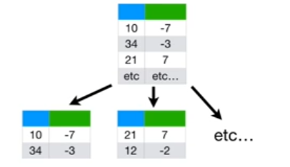

So when we have a hige training dataset, **XGBoost** uses an **Approximate Greedy Algorithm** and that means using the **Parallel Learning** to split up the dataset so that multiple computers can work on it at the same time.

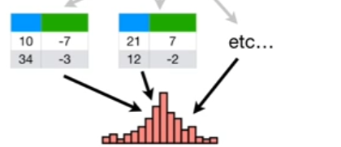

and a **Weighted Quantile Sketch** merges the data into an approximate histogram and the histogram is divided into **weighted quantiles** that put observations with low confidence predictions into quantiles with fewer observations.

> Note: **XGBoost** only uses the **Approximate Greedy Algorithm**, **Parallel Learning** and the **Weighted Quantile Sketch** when the **Training Dataset** is huge

When the training datasets are small, **XGBoost** just uses a normal, everyday **Greeedy Algorithm**.

## Sparsity-Aware Split Finding

Let's return to the example where we were using **Dosage** to predict **Drug Effectiveness**

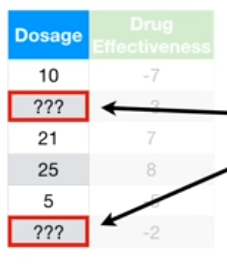

only this time, we have a few missing values.

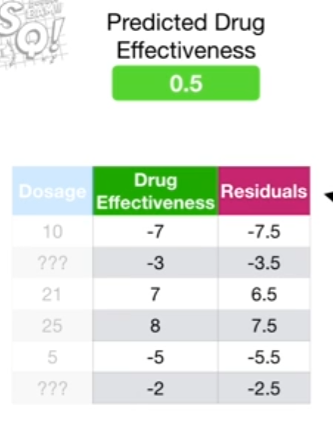

Even though we have missing values, we can calculate the **residuals**, the difference between the **observed Drug Effectiveness** and the **Predicted Drug Effectiveness**, using the initial prediction, 0.5.

And just like we normally do when we build **XGBoost Trees**, we can put all of the **Residuals** into a single leaf

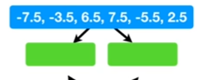

Now we need to determine if splitting the **Residuals** into two leaves will do a better job clustering them. So, just like we always do for continuous data, we need to sort the **Dosages** from low to high

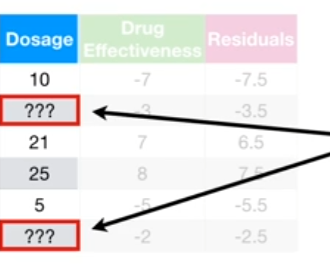

Unfortunately, it's unclear how to sort the **Dosages** with missing values. So what we will do is we split the data into two tables. One table will contain all of the obsercations with **Dosage** values and another table will contain all of the observations without **Dosags* values.

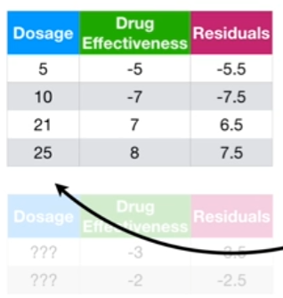

Now, focusing on the table that has **Dosage** values for every observation, we sort rwos by **Dosage**, from low to high and we test the average of the first two dosages, 7.5, as a candidate threshold.

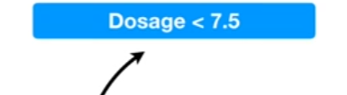

> Note: if this was a large dataset, we would be using the first quantile here.

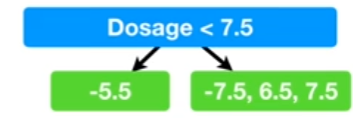

In this case, we test the threshold by putting the **Residual** for the one observation that has a **Dosage < 7.5** in the leaf on the left and putting the remaining **Residuals**, which all have **Dosages > 7.5**, into the leaf on the right.

Now that we have all of the **Residuals** with known **Dosages** in the tree, we calculate the two separate **Gain** values.

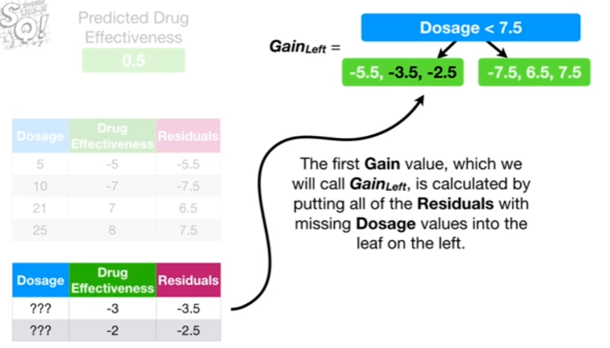

The first **Gain** value, which we will call **$Gain_\text{left}$**, is calculated by putting all of the **Residuals** with missing **Dosage** values into the leaf on the left.

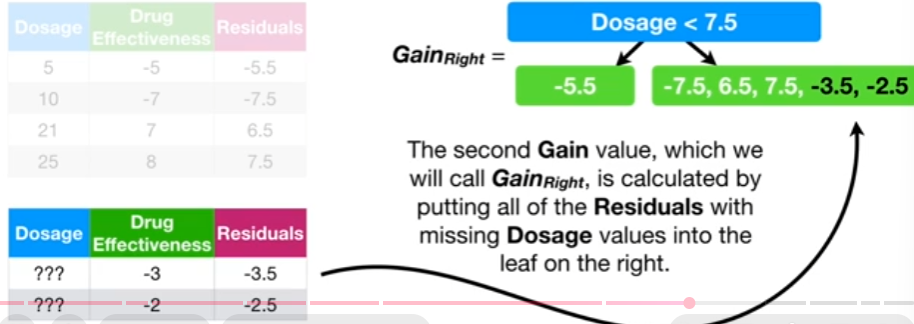

The second **Gain** value, which we will call **$Gain_\text{right}$**, is calculated by putting all of the **Residuals** with missing **Dosage** values into the leaf on the right.

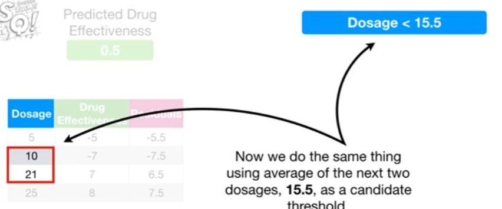

Now we do the same thing using average of the next two dosages, **15.5**, as a candidate threshold.

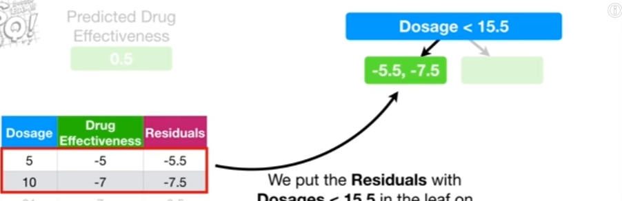

We put the **Residuals** with **Dosages < 15.5** in the leaf on the left and the **Residuals** with **Dosages >= 15.5** in the leaf on the right. 

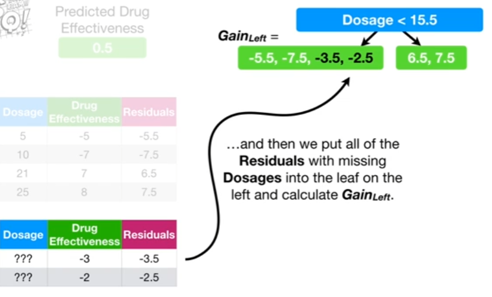

and then we put all of the **Residuals** with missing **Dosages** into the leaf on the left and calculate **$Gain_\text{left}$**.

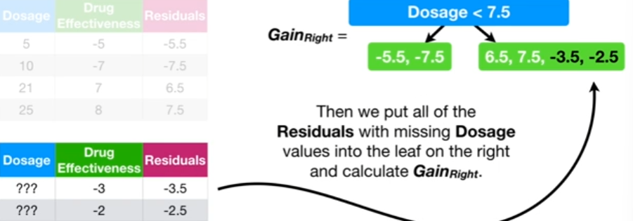

Then we put all of the residuals with missing **Dosage** values into the leaf on the right and calculate **$Gain_\text{right}$**.

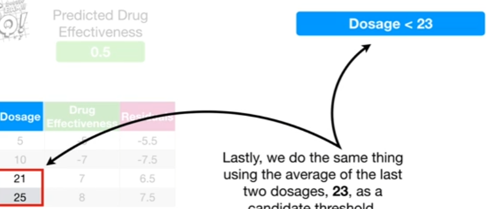

Lastly, we do the same thing using the average of the last two dosages,23, as a candidate threshold.

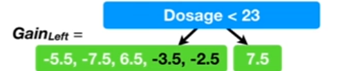

We calculate **$Gain_\text{left}$** 

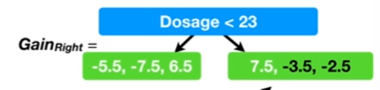

and we calculate **$Gain_\text{right}$**

In the end, we choose the threshold that gaves us the largest value for **Gain** overall.

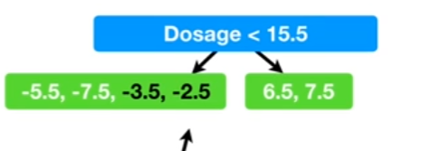

In this case, that meant picking **$Gain_\text{left}$** when the threshold was **Dosage < 15.5**

> Note: This path, going to the left leaf when **Dosage < 15.5**, will be the default path for all future observations that are missing **Dosage** values

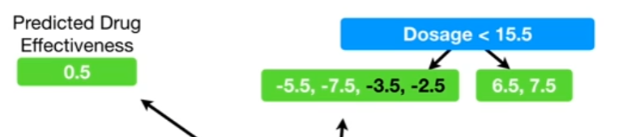

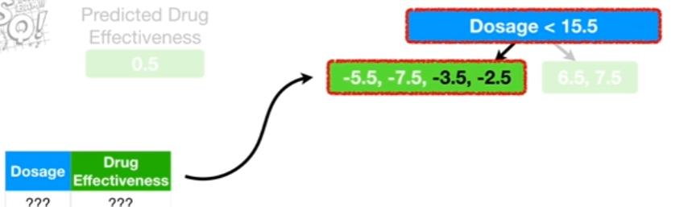

For example, if this was the **XGBoost model** and we got a new obsesrvation without a value for **Dosage**, but without a value for **Dosage**, but we still needed to predict **Drug Effectiveness** then we would assume that this **Observation** goes to the leaf on the left. 

Thus, **Sparsity-Aware Split Finding** tells us how to build trees with missing data and how to deal with new observations when there is missing data.

## Cache-Aware Access

Now we need to talk about **Cache-Aware Access**. This is where **XGBoost** starts to get super nitty gritty.

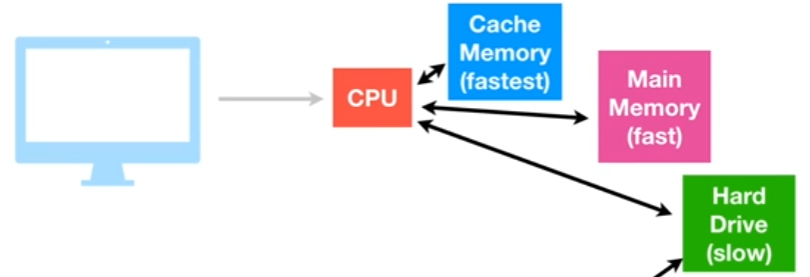

The basic idea is inside each computer is we have a **CPU(central processing unit)** and that **CPU** has a small amout of **Cache Memory**. 

The **CPU** can use this memory in the computer. The **CPU** is also attached to a large amount of **Main Memory**. While the **Main Memory** is larger than the **Cache**, it takes longer to use.

Lastly, the **CPU** is also attached to the **Hard Drive**. The **Hard Drive** can store the most stuff, but is the slowest of all memory options.

If you want your program to run really fast, the goal is to maximize what you can do with the **Cache Memory**.

So **XGBoost** puts the **Gradients** and **Hessians** in the **Cache** so that it can rapidly calculate **Similarity Scores** and **Output Values**

## Blocks for Out-of-Core Computation

Lastly, we need to talk about **Blocks for Out-of-Core Computation**.

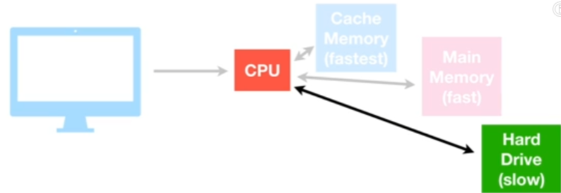

Going back to the super simple computer schematic. When the dataset is too large for the **Cache** and **Main Memory**, then, at least some of it must be stored on the **Hard Drive**.

Because reading and writing data to the **Hard Drive** is super slow, **XGBoost** tries to minimize these actions by compressing the data.

Even though the **CPU** must spend some time decompressing the data that comes from  the **Hard Drive**, it can do this faster than the **Hard Drive** can read the data.

In other words, by spending a little bit of **CPU** time uncompressing the data, we can avoid spending a lot of time accessing the **Hard Drive**. 

Also, when there is more than one **Hard Drive** available for storage, **XGBoost** uses a database technique called **Sharding** to speed up disk access.

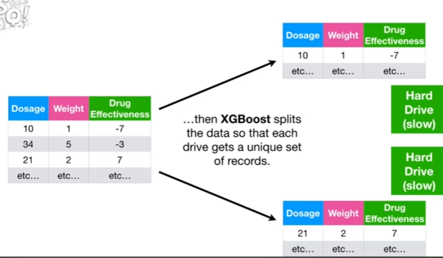

For example, if this is the dataset and it is very large then **XGBoost** spilts the data so that each drive gets a unique set of records. 

Then, when the **CPU** needs data, both **Drives** can be reading data at the same time.

Thus, **Cache-Aware Access** and **Blocks for Out-of-Core Computation** are optimizations that take the computer hardware into account

---

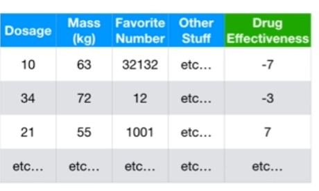

Lastly, I need to mention that **XGBoost** can also speed things up by allowing you to build each tree with onnly a random subset of the data.

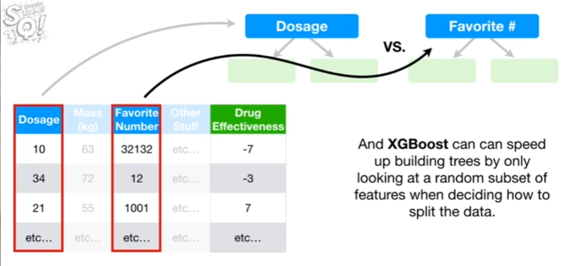

And **XGBoost** can speed up building trees by only looking at a random subset of features when deciding how to plot the data.
