# XGBoost Part 4: Optimizations 

These parts are what make **XGBoost** relatively efficient with relatively large training datasets.

The last 6 parts describe optimizations for large datasets

## Overview

In XGBoost part 1, XGBoost Trees for Regression, we had a super simple **Training Dataset** and used different **Drug Dosages** to predict drug effectiveness.

The first thing we did was make an initial prediction, which could be anything like the mean **Drug Effectiveness**, but by default is 0.5

Then we calculated the **Residuals** and fit a tree to the **Residuals**. We did this by calculating the **Similarity Scores** and the **Gain** for each possible threshold. And the threshold with the largest **Gain** is the one **XGBoost** uses

> Note: The decision to use the threshold that gives the largest **Gain** is made without worrying about the leaves will be split later and that means **XGBoost** uses a **Greedy Algorithm** to build trees.

In other words, since **XGBoost** uses a **Greedy Algorithm**, it makes a decision without looking ahead to see if it is the absolute best choice in the long term.

In contrast, if **XGBoost** did not use a **Greedy Algorithm**, it would postpone making a final decision about this threshold until after trying different thresholds in the leaves to see how things played out in the long run.

And this same process would be repeated for every single possible threshold for the root. In other words, bu using a **Greedy Algorithm**, **XGBoost** can build a tree relatively quickly.

That said, when we have alot of measurements then the **Greedy Algorithm** becomes slow because it still has to look at every possible threshold. 

## Approximate Greedy Algorithm

And if we had a more interesting training dataset that used alot of variables to predict **Drug Effectiveness** then checking every single threshold in every single variable would take forever. This is where the **Approximate Greedy Algorithm** comes in

Going back to our example with a lot of observations, instead of  testing every single threshold, we could divide the data into **Quantiles** and only use the quantiles as candidate thresholds to split the observations

For example, instead of using the smallest two **Dosages** to define the first threshold, the **Approximate Greedy Algorithm** uses the first quantile to define the first threshold. And the second quantile is the second threshold that we will consider.

> Note: If we only used one quantile and it split the observations in hald, then that quantile would be the threshold since there are no other options.

This would make finding the "best" threshold very fast since we would not have to calculate **Gain** or **Similarity** to make the decision.

But since both sides of the threshold represent a lot of people who have positive **Drug Effectiveness** values and negative **Drug Effectiveness** values then this threshold would not do a good job prediction **Drug Effectiveness**

In contrast, if we had two quantiles, then our predictions would improve because we would do a better job separating observations with positive values for **Drug Effectiveness** from observations with negative values for **Drug Effectiveness** . So, for this data, two quantiles are better than one.

If we ahve 5 quantiles, then our predictions would be more accurate, since each threshold represents a smaller cluster of observations.

However, the more quantiles we have, the more thresholds we will have to test, and that means it will take longer to build the tree.

For **XGBoost** the **Approximate Greedy Algorithm** means that instead of testing all possible thresholds, we only test the quantiles. By default, the **Approximate Greedy Algorithm** uses about 33 quantiles.

> Why "about 33 quantiles" instead of "exactly 33 quanntiles"

To answer that question, we need to talk about **Parallel learning** and the **Weighted Quantile Sketch**

## Weighted Quantile Sketch

When we have a lot of data, so much data that we cannot fit all into a computer's memory at one time, then things that seem simple, like sorting a list of numbers and finding quantiles, become really slow.

To get around this problem, a class algorithms, called **Sketches**, can quickly create approximate solutions.

### How XGBoost uses Sketches

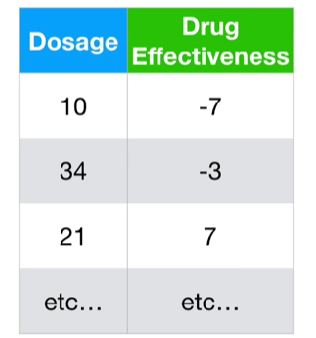

For this example, imagine we are just using a ton of **Dosages** to predict **Drug Effectiveness** 

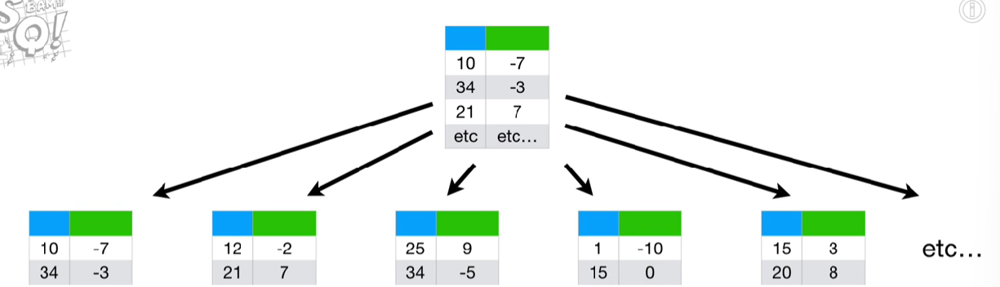

And imagine splitting it into small pieces and putting the pieces on different computers on a network.

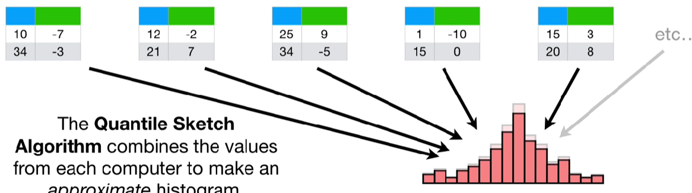

The **Quantile Sketch Algorithm** combines the values fron each computer to make an approximate histogram. 

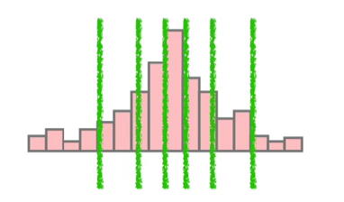

Then the approximate histogram is used to calculate the approximate quantiles. And the **Approximate Greedy Algorithm** uses approximate quantiles 

Since **XGBoost** uses **weighted quantile sketch**, so that means these quantiles are not normal everydaty quantiles.  

Usually quantiles are set up so that the same number of observations are in each one. In contrast, with weighted quantiles, each observation has a corresponding **Weight**

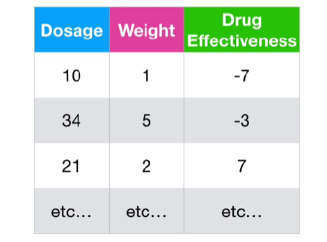

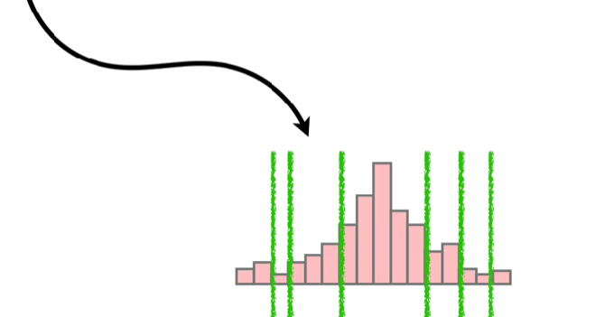

And the sum of the **Weights** are the same in each quantile. For example, if the sum of the **Weights** in the first quantile was 10, then the second quantile will also be 10, etc.

The weights are derived fron the **Cover** metric that we discueesd in part 2 and 3 in this series.

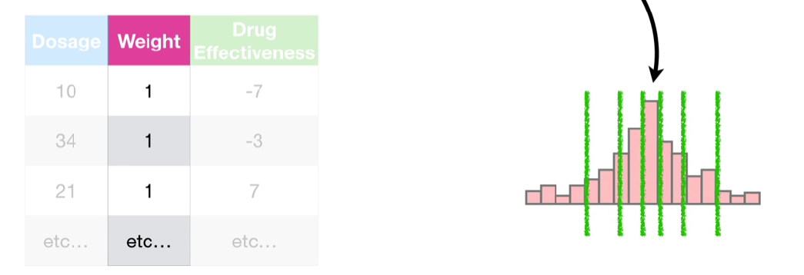

Specifically, the weight for each observation os the 2nd derivative of the **Loss Function**, what we are referring to as the **Hessian**. That means for **Regression**, the **Weights** are all equal to 1. And that means the weighted quantiles are just like normal quantiles and contain an equal number of observations. 

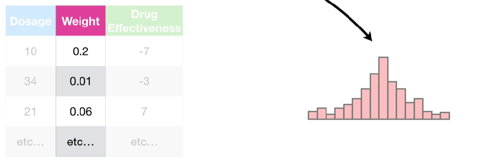

In contrast, for **Classification, the weights are 

$$\text{Weight} = \text{Previous Probability}_i \times (1-\text{Previous Probability}_i)$$

So let's see how the equation for wrights effect the quantiles in **Classification** with a simple dataset.

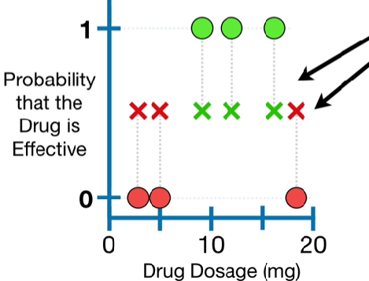

These **Red** and **Green** Xs correspond to the previously predicted probabilities that these dosages are effective, and they start out at the initial prediction,0.5.

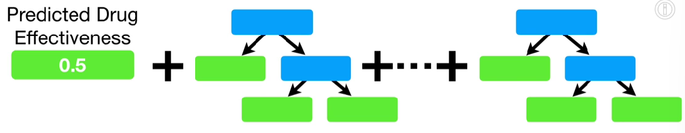

After we run the data down the first tree, most of the predictions improved and as we add more trees, most of the predictions get better and better.

When using **XGBoost** for **Classification**, the weights for the **Weighted Quantile Sketch** are calculated from the previously predicted probabilities.

So let's calculate the weights for each observation.

> Note: we are just showing one example of calculating weights. In practive, weights are calculated after building each tree.

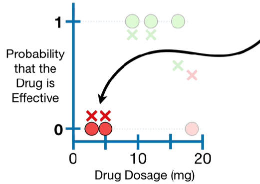

These predicted probabilities are very close to 0, indicating a high amount of confidence in classifying these **Dosages** as ineffective.

Since the previously predicted probability for these two points is 0.1, the weight is 

$$
\begin{align*}
\text{Weight} &= \text{Previous Probability}_i \times (1-\text{Previous Probability}_i) //
&= 0.1 \times (1-0.1) //
&= 0.09
\end{align*}
$$

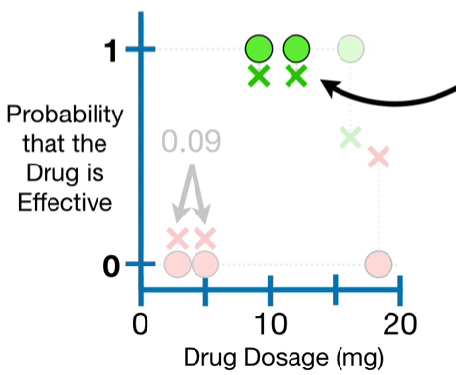

These predicted probabilities are very close to 1, indicating that we have high confidence in classifying these **Dosages** as effective.

Since the previously predicted probability for these two points is 0.9, the weight is 

$$
\begin{align*}
\text{Weight} &= \text{Previous Probability}_i \times (1-\text{Previous Probability}_i) //
&= 0.9 \times (1-0.9) //
&= 0.09
\end{align*}
$$

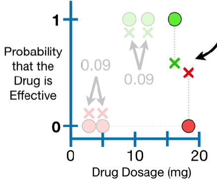

These predicted probabilities are very close to 0.5, indicating that we not very confidence in how to classify these observations.

Since the previously predicted probability for these two points is 0.6 and 0.4, the weight both are 0.24

Now we see that when the previously predicted probability is close to 0.5, meaning we dont have much confidence in the classification, the weights are relatively large.

In contrast, when the previously predicted probability is very close to 0 or 1, meaning we have a lot of confidence in the classification, the weights are relatively small.

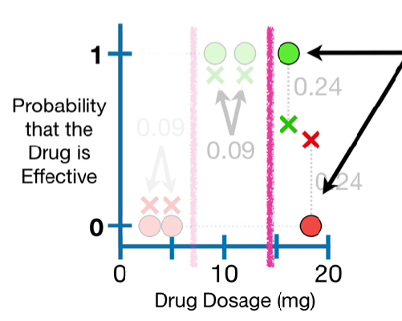

Now, if we split this data into equal quantiles we would put the quantiles here. But remember, we are treating each quantile as a unit, and lumping the lst two observations together as unit means that they will end up in the same leaf together in the tree.