# XGBoost Trees for Regression

XGBoost is extreme and that means, it's a big **Machine Learning** algorithm with lots of parts.
 
 1. Gradent Boost
 2. Regularization
 3. A unique regression tree
 4. Approximate Greedy Algorithm
 5. Weighted Quantile Sketch
 6. Sparsity-Aware Split Finding
 7. Parallel Learning 
 8. Cache-Aware Access
 9. Blocks for Out-of-Core Computation

 Assuming that you are already familiar woth **Gradient Boost** and **Regularization**, so we start by learning about **XGBoost**'s unique regression tree

For the first part, we will build our intuition about how **XGBoost** does **Regression**. In part 2, we will build our intuition about how **XGBoost** does **Classification**. In part 3, we will dive into the mathematical details and show you how **Regression** and **Classification** are related and why creating unique trees makes so much sense.

> Note: XGBoost was designed to be used with large, complicated datasets.

However, to keep the examples from getting out of hand, we will use this super simple **Training Data**

The very first step in fitting **XGBoost** to the **Training data** is to make an initial prediction

This prediction can be anything, but by default it is 0.5, regardless of whether you are using **XGBoost** for **Regression** or **Classification**

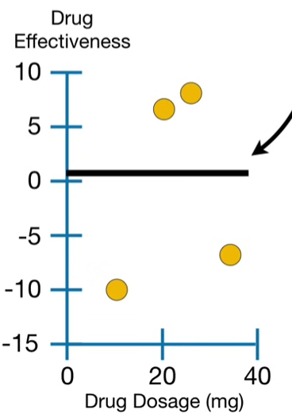

The prediction corresponds to this thick, black horizontal line and the **Residuals**, the difference between the **Observed** and **Predicted** values, show us how good the initial prediction is.

Now, just like unextreme Gradient Boost, **XGBoost** fits a **Regression Tree** to the residuals

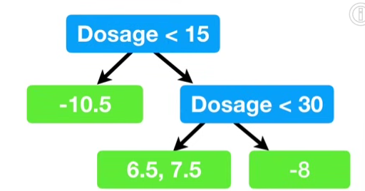

However, unlike unextreme **Gradient Boost**, which typically uses regular, off-the-shelf, **Regression Trees**. **XGBoost** uses a unique **Regression Tree** that I cann an **XGBoost Tree**.

## How to build an **XGBoost Tree** for Regression 

> Note: There are many ways to build **XGBoost** Trees. We focus on the most common way to build them for **Regression**

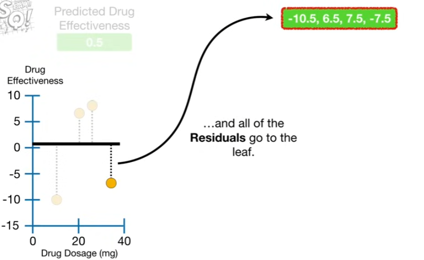

Each tree starts out as a single leaf and all of the residuals go to the leaf. 

### Calculating Similarity Scores

Now we calculate a **Quality Score** or **Similarity Score** for the **Residuals**

$$ \text{Similarity Score} = \frac{\text{Sum of Residuals, Squared}}{\text{Number of Residuals} + \lambda}
$$

> Note: $\lambda$ (lambda) is a **Regularization** parameter, and we will talk more about that later

For now, let lambda = 0, now we plug the 4 residuals into the numerator and since there are 4 residuals in the denominator.

$$\text{Similarity Score} =\frac{(-10.5 + 6.5 + 7.5 + -7.5)^2 }{4+0}$$

>Note: Because we do not square the **Residuals** before we add them together in the numeratir, 7.5 and -7.5 cancel each other out 

The **Similarity score** for the **Residuals** in the root = 4

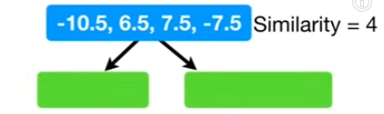

Now the question is whether or not we can do a better job clustering similar **Residuals** if we split them into two groups

To answer this, we first focus on the two observations with the lowest Dosages. Their average **Dosage** is 15, and that corresponds to this dotted red line.

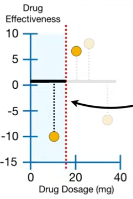

So we split the observations into two groups, cased on thether or not the **Dosage < 15**.

The observation on the far left is the only one with **Dosage < 15**, so it goes to the left on the left, and the rest fo to the right.

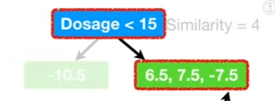

Now we calculate the **similarity score** for the leaf on the left by plugging the one **Residual** into the numerator. and since only one **Residual** went to the leaf on the left, the **Number of Residuals** = 1 

$$\text{Similarity Score} =\frac{(-10.5)^2 }{1+0}$$

and the similarity score for the leaf on the left = 110.25.

And calculate the **similarity score** for the **Residuals** that go to the leaf on the right. and since there are 3 **Residuals** in the leaf on the right, we plug 3 into the denominator.

$$\text{Similarity Score} =\frac{(6.5 + 7.5 + -7.5)^2 }{3+0}$$

> Note: Like we saw earlier, because we do not square the **Residuals** before we add them together, 77.5 and - 7.5 cancel each other out. 

Thus the **Similarity Score** for the **Residuals** in the leaf on the right = 14.08

Now we have calculated the **Similarity Scores** for each node. We see that when the **Residuals** in a node are very different, they cancel each other out and the **Similarity Score** is relatively small.

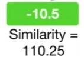

In contrast, when the **Residuals** are similar, or there is just one of them, they do not cancel out and the **Similarity Score** is relatively large

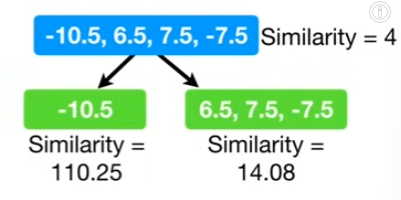

### Calculating Gain to evaluate different thresholds

Now we need to quamtify how much better the leaves cluster similar **Residuals** than the root. 

We do this by calculating the **Gain** of splitting the **Residuals** into two groups. 

$$\text{Gain} = \text{Left}_\text{similarity} + \text{Right}_\text{similarity} - \text{Root}_\text{similarity}$$

Plugging in the numbers, 

$\text{Gain} = 110.25 + 14.08 - 4 = 120.33$

Now that we have calculated the **Gain** for the threshold **Dosage < 15**, we can compare it to the gain calculated for other thresholds.

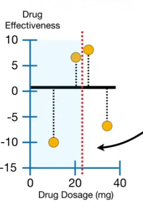

So we shift the threshold over so that it is the average of the next two observations and build a simple tree that sivides the new threshold, **Dosage< 22.5**. So now we calculate the **Similarity Scores** for the leaves and calculate the **Gain**.

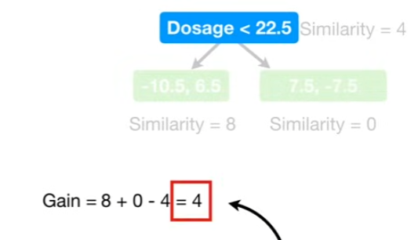

The **Gain** for **Dosage** < 22.5 is 4

Since the **Gain** for **Dosage<22.5(Gain = 4)** is less than **Gain** for **Dosage < 15 (Gain = 120.33)**, **Dosage<15** is better at splitting the **Residuals** into clusters of similar values.

Then we repeat the same for **Dosage < 30**. The **Gain** for **Dosage <30** = 56.33. 

Again, since the **Gain** for **Dosage<30(Gain = 56.33)** is less than **Gain** for **Dosage < 15 (Gain = 120.33)**, **Dosage<15** is better at splitting the **Residuals** into clusters of similar values.

And since we can't shift the threshold over any further to the right, we are done comparing sifferent thresholds. We will use the threshold that gave us the largest **Gain**, Dosage < 15, for the first branch in the tree

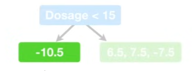

Now, since there is only one **Residual** in the leaf on the left, we can't split it any further. However, we can plot the 3 **Residuals** in the leaf on the right.

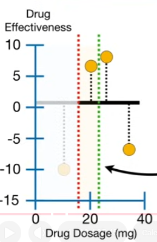

So we start with these two observations, and their average **Dosage** is 22.5, which corresponds to this dotted green line.

Now just like before, we calculate the **Similarity Scores** for the leaves.

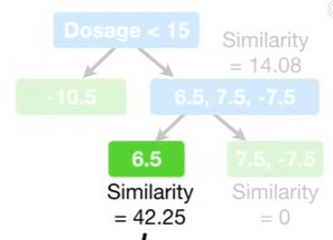

then we calculate the **Gain**

$\text{Gain} = 42.25 +0 -  14.08 = 28.17$

and we get **Gain** = 28.17 for when the threshold is **Dosage** < 22.5 

Now we shift the threshold over of the last two observations ( Dosage < 30), calculate the similarity score for the leaf and the gain.

And we get **Gain** = 140.17 which is much larger than 28.17, when the threshold was **Dosage**<22.5

So we will use **Dosage <30** as the threshold for this branch.

>Note: To kep this example from getting out of hand, i have limited the tree depth to two levels. However, the default is allow up to 6 levels.

### Pruning an XGBoost Tree

Now we need to talk about how to **Prune** this tree

We **Prune** an **XGBoost** Tree based on its **Gain** values. We start by picking a number, for example 130.

> Terminology: XGBoost calls this number (130) $\gamma$ (gamma)

- Calculate Gain (associated with the lowest branch in the tree) minus gamma.
- If the defference betweent the **Gain** and **gamma** is negative, we will remove the brach. If the defference betweent the **Gain** and **gamma** is positive, we will not remove the branch

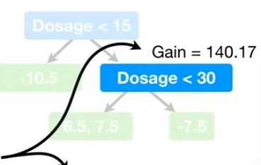

In this case, we plug in the **Gain** and the value for gamma,130, we get a **positive** number, so we will not remove this branch and we are done pruning.

> Note: The Gain for the root, 120.3, is less than 130, the value for $\gamma$(gamma), so the difference will be negative.

However, because we did not remove the first branch, we will not remove the root.

In contrast, if we set $\gamma$ = 150, then we would remove this branch because $140.17 - 150 = negative$ so we will remove this branch

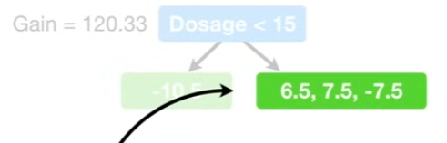

Now we subtract gamma from the gain for the **Root**

$120.33 - 150 = negative$ , we will remove the root and all we would be left with is the original prediction, wich is pretty extreme pruning.

So, while this wasn't the most nuanced example of how an **XGBoost Tree** is pruned. I hope you get the idea.

### Building XGBoost Tree with regularization

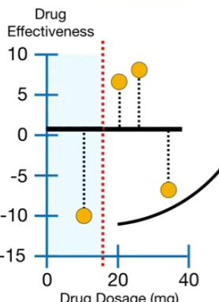

Now let's go back to the original **Residuals** and build a tree, jusst like before only this time, when we calculate **Similarity Scores**, we will set $\lambda$ (lambda) = 1

Remember $\lambda$ is a **Regularization Parameter**, which means that it is intended to reduce the prediction's sensitivity to individual observations.

Now the **Similarity Score** for the root is 3.2

$$\text{Similarity Score} =\frac{(6.5 + 7.5 + -7.5)^2 }{3+1} = 3.2$$

which is 8/10 of what we got when $\lambda$ = 0.

When we calculate the **Similarity Score** for the leaf on the left, we get 55.12, which is half of what we got when $\lambda = 0$

And we calculate the **Similarity Score** for the leaf on the right, we get 10.56, which is 3/4 of what we got when $\lambda = 0$

So one thing we see is that when $\lambda$ > 0, the **Similarity Scores** are smaller and the amount of decrease is **inversely proportional** to the number of **Residuals** in the node.

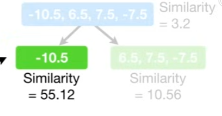

In other words, the leaf on the left had only 1 **Residual**, and it had the largest decrease in **Similarity Score**, 50%.

In contest, the root had all 4 **Residuals** and the smallest decrease, 20%.

Then we calculate the $Gain = 55.12 + 10.56 - 3.2 = 62.48$, which is a lot less than 120.33, the value we got when lambda = 0 

Similarly, when $\lambda = 1$, the **Gain** for the next branch is smaller than before.

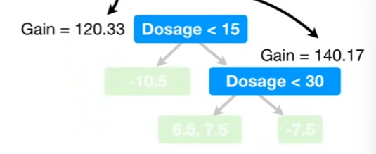

Just for comparison, these were the **Gain** values, when $\lambda = 0$. When we first talked about pruning trees, we set $\gamma$ (gamma) = 130 and because for the lowest branch in the first tree, **Gain** - $\gamma$ = positive, we did not prune at all.

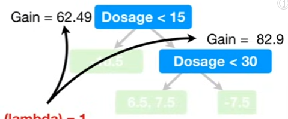

Now, with $\lambda$ = 1, the values for **Gain** are both < 130. So we would prune the whole tree away

So, when $\lambda$ > 0, it is easier to prune leaves because the values for gain are smaller.

> Note: Before we move on, I want to illustrate one last feature of $\lambda$

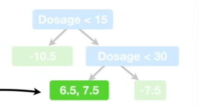

For this example, imagine we split this node into two leaves. Now let's calculate the **Similarity Scores** with $\lambda$= 1

For the branch, we get 65.3. For the left leaf, we get 21.12, and for the right leaf, we get 28.12

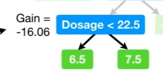

That means the **Gain** is -16.06. Now, when we decide if we should prune this branch, we plug in the **Gain** and we pug in a value for $\gamma$ 

> Note: If we set $\gamma$ = 0 , then we will get a negative number and we will prune this branch even though $\gamma$ = 0

In other words, setting $\gamma$ = 0 does not turn of pruning. On the other hand, by setting $\lambda = 1$ did what it was supposed to do, it prevented over fitting the Training Data.

### Calculating the output value for the leaves

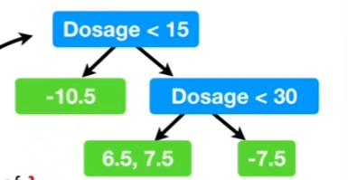

For now, regardless of $\lambda$ and $ \gamma$, let's assume this si the tree we are working with and determine the **Output Values** for the leaves.

$$
\text{Output Value} = \frac{\text{Sum of Residuals}}{\text{Number of Residuals} + \lambda}
$$

> Note: the **Output Value** equation is like the **Similarity Score** except we do not square the sum of the residuals

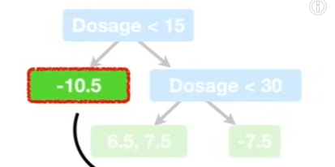

So, for this leaf, we plug in the residual, -10.5, the number of residual in the leaf, 1 and the value for the **Regularization Parameter**, $\lambda$.

If $\lambda = 0$, then there is no **Regularization** and the **Output Value = -10.5**

$$
\text{Output Value} = \frac{-10.5}{1+0}
$$

On the other hand, if $\lambda = 1$ , the output vale = -5.25

$$
\text{Output Value} = \frac{-10.5}{1+1} = -5.25
$$

In other words, when $\lambda$ > 0, then it will reduce the amount that this individual observation adds to the overall prediction. (reduce sensitivity)

For now, we will keep things simple and let $\lambda$ = 0, because this is the default value and put - 10.5 under the leaf so we will remember it.

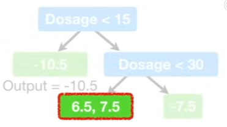

Now, we will calculate the output value for this leaf. When $\lambda$ = 0 , the output value = 7. In other words, when $\lambda = 0 the output value for a leaf is simply the average of the **Residuals** in that leaf.

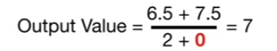

Lastly, when $\lambda$ = 0, the output value for this leaf is -7.5

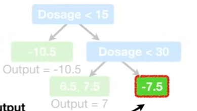

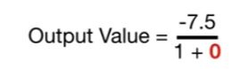

Now, the first tree is complete

### Making Predictions with XGBoost

Since we have built our first tree, we can make new **Predictions** and just like unextreme **Gradient Boost**,XGBoost makes new predictions by starting with the initial **Prediction** and adding the output of the **Tree**, scaled by a **Learning Rate**.

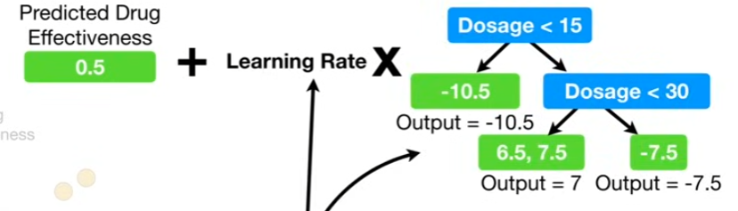

> Terminology: XGBoost calls the **Learning Rate**, $\eta$ (eta), and default value is 0.3, so what's what we will use

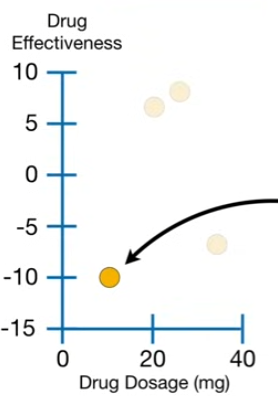

Thus the new **Predicted** value for this observation, with **Dosage** = 10 is the original prediction, 0.5 plus the learning rate $\eta$, 0.3, times the output value, -10.5 and that gives us -2.65. 

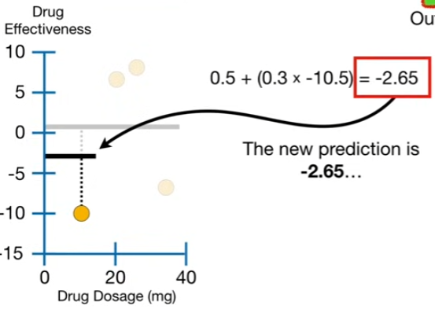

and we see the new residual is smaller than before, so we have taken a small step in the right direction. 

Likewise, the new predictions for the remaining observations have smaller **Residuals** than before, suggesting each small step was in the right direction.

Now we build another tree based on the new **Residuals** and make new predictions that give us even smaller residuals and then build another tree based on the newest **Residuals** and wekeep building trees until the **Residuals** are super small, or we have reached the maximum number.
