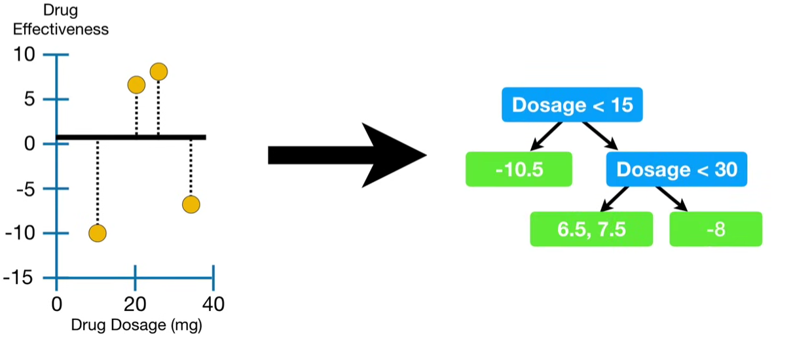
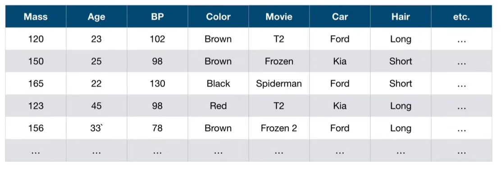
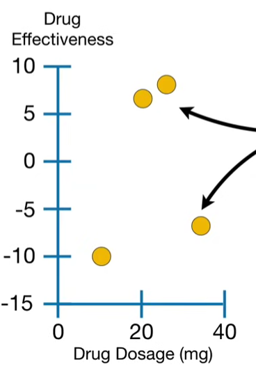

# XGBoost Trees for Regression

XGBoost is extreme and that means, it's a big **Machine Learning** algorithm with lots of parts.
 
 1. Gradent Boost
 2. Regularization
 3. A unique regression tree
 4. Approximate Greedy Algorithm
 5. Weighted Quantile Sketch
 6. Sparsity-Aware Split Finding
 7. Parallel Learning 
 8. Cache-Aware Access
 9. Blocks for Out-of-Core Computation

 Assuming that you are already familiar woth **Gradient Boost** and **Regularization**, so we start by learning about **XGBoost**'s unique regression tree

For the first part, we will build our intuition about how **XGBoost** does **Regression**. In part 2, we will build our intuition about how **XGBoost** does **Classification**. In part 3, we will dive into the mathematical details and show you how **Regression** and **Classification** are related and why creating unique trees makes so much sense.

> Note: XGBoost was designed to be used with large, complicated datasets.

However, to keep the examples from getting out of hand, we will use this super simple **Training Data**

The very first step in fitting **XGBoost** to the **Training data** is to make an initial prediction