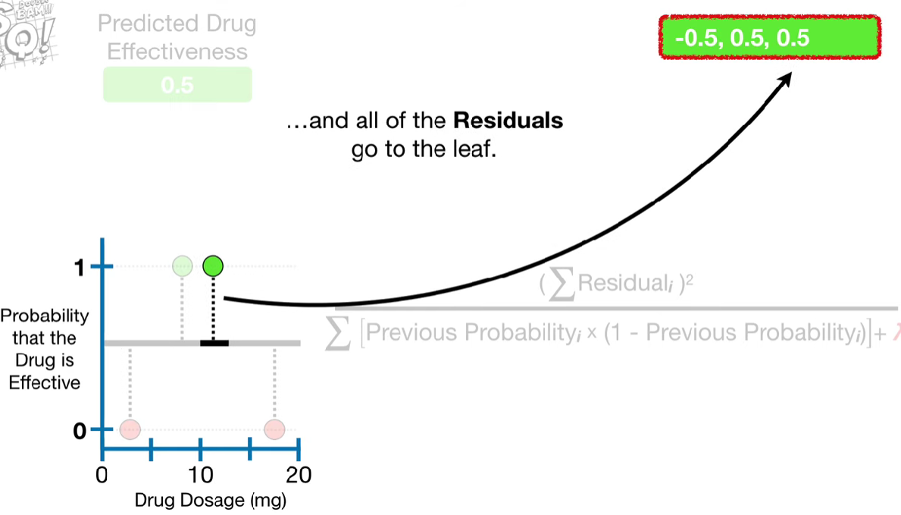
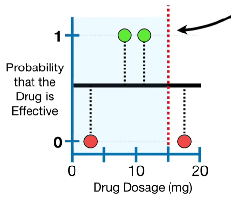
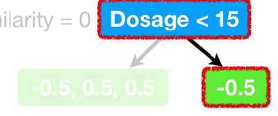
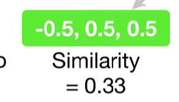
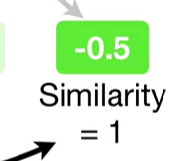

# XGBoost Part 2: Classification

We will give an overview of how XGBoost Trees are built for Classification

We will use this super simple **Training Data** consisting of 4 different Drug Dosages.

The Green Dots indicate that the drug was **Effective** and the Red Dots indicate that the drug was **Not Effective**.

The very first step in fitting XGBoost to the Training Data is to make an initial prediction. This prediction can be anything, for example, the **probability** of observing an effective dosage in the Training Data, but by default it is 0.5, regardless of whether you are using XGBoost for **Regression** or **Classification**

In other words, regardless of the **Dosage**, the default prediction is that there is a 50% change the drug is **Effective**

We can illustrate the initial prediction by adding a **y-axis** to our graph to represent that the Drug is Effective and drawing a **thick black line** at **0.5** to represent a 50% change that the drug us effective.

Since these two **Green Dots** represent effective dosages, we will move them to the top of the graph, where the probability that the drug is effective is 1. The twp **Red Dots** at the bottom represent ineffective dosages, so we will leave them at the bottom of the graph, where the probability that the drug is effective is 0

The **Residuals**, the differences between the **Observed** and **Predicted** values, show us how good the initial prediction is.

## Similarity Scores

Now just like we did for **Regression**, we fit an **XGBoost Tree** to the **Residuals** however, since we are using **XGBoost** for **Classification**, we have a new formula for the **Similarity Scores**

$$
\frac{( \sum_i \text{Residual}_i )^2}
     {\sum_i \big[ \text{Previous Probability}_i \left( 1 - \text{Previous Probability}_i \right) \big] + \lambda}
$$

> Note: The numerator is just **the Sum of the Residuals, Squared**. 

In other words, the numerator for **Classification** is the same as the numerator for **Regression**. And just like for **Regression**, the denominator contains $\lambda$, the **Regulariztation Parameter**. However, the rest of the denominator is different. They are just the sum of the previously predicted probability times 1 minus the previously predicted probability.

> Note: Although this formula is different from what **XGBoost** uses for **Regression**, it is very closely related.

### Building a Tree

Now, let's build a tree. Just like for **Regression** each tree starts out as a single leaf and all of the residuals go to the leaf

Now we need to calculate a **Similarity Score** for the leaf and that means we plug all 4 **Residuals** into the numerator.

$$
\frac{( -0.5 + 0.5 + 0.5 + -0.5)^2}
     {\sum_i \big[ \text{Previous Probability}_i \left( 1 - \text{Previous Probability}_i \right) \big] + \lambda}
$$

>Note: Because we do not square the **Residuals** before we add them together, they will cancel each other out

And we will end up with 0 in the numerator and that makes the **Similarity Score** = 0. For now let's just put **Similarity = 0 up here so we can keep track of it.

Now we need to decide if we can do a better job clustering similar **Residuals** if we split them into two groups.

We start with this threshold, **Dosage < 15**

> Note: We chose the threshold because 15 is the average value between last two observations.

Thus, the tree **Residuals** with **Dosages < 15** go to the left leaf and the one **Residual** with **Dosage > 15** goes to the leaf on the right.

To calculate the **Similarity Score** for the three **Residuals** that ended up in the leaf on the left, we plug the three **Residuals** into the numerator and since we are building the first tree, the **Previous Probability** refers to the prediction from the initial leaf. So we plug in **0.5** for each **Residual** that ended up in the left leaf. Now, just to keep things simple, we will let $\lambda = 0$. However, you know from **Part 1** that $\lambda$ reduces the **Similarity Score**, which ultimately makes leaves easier to prune.

$$
\begin{align*}
\frac{( \sum_i \text{Residual}_i )^2}
     {\sum_i \big[ \text{Previous Probability}_i \left( 1 - \text{Previous Probability}_i \right) \big] + \lambda}
&= 
\frac{( -0.5 + 0.5 + 0.5 + -0.5)^2}
     {(0.5 \times (1 - 0.5)) + (0.5 \times (1 - 0.5)) + (0.5 \times (1 - 0.5)) + 0}
\\
&= 0.33
\end{align*} 
$$

The **Similarity Score** for the leaf on the right is 1 when lambda = 0

$$
\frac{( -0.5)^2}
     {(0.5 \times (1 - 0.5)) + \lambda} = 1
$$

### Calculate the Gain

