# XGBoost Part 2: Classification

We will give an overview of how XGBoost Trees are built for Classification

We will use this super simple **Training Data** consisting of 4 different Drug Dosages.

The Green Dots indicate that the drug was **Effective** and the Red Dots indicate that the drug was **Not Effective**.

The very first step in fitting XGBoost to the Training Data is to make an initial prediction. This prediction can be anything, for example, the **probability** of observing an effective dosage in the Training Data, but by default it is 0.5, regardless of whether you are using XGBoost for **Regression** or **Classification**

In other words, regardless of the **Dosage**, the default prediction is that there is a 50% change the drug is **Effective**

We can illustrate the initial prediction by adding a **y-axis** to our graph to represent that the Drug is Effective and drawing a **thick black line** at **0.5** to represent a 50% change that the drug us effective.

Since these two **Green Dots** represent effective dosages, we will move them to the top of the graph, where the probability that the drug is effective is 1. The twp **Red Dots** at the bottom represent ineffective dosages, so we will leave them at the bottom of the graph, where the probability that the drug is effective is 0

The **Residuals**, the differences between the **Observed** and **Predicted** values, show us how good the initial prediction is.

## Similarity Scores

Now just like we did for **Regression**, we fit an **XGBoost Tree** to the **Residuals** however, since we are using **XGBoost** for **Classification**, we have a new formula for the **Similarity Scores**

$$
\frac{( \sum_i \text{Residual}_i )^2}
     {\sum_i \big[ \text{Previous Probability}_i \left( 1 - \text{Previous Probability}_i \right) \big] + \lambda}
$$

> Note: The numerator is just **the Sum of the Residuals, Squared**. 

In other words, the numerator for **Classification** is the same as the numerator for **Regression**. And just like for **Regression**, the denominator contains $\lambda$, the **Regulariztation Parameter**. However, the rest of the denominator is different. They are just the sum of the previously predicted probability times 1 minus the previously predicted probability.

> Note: Although this formula is different from what **XGBoost** uses for **Regression**, it is very closely related.

## Building a Tree

Now, let's build a tree. Just like for **Regression** each tree starts out as a single leaf and all of the residuals go to the leaf

Now we need to calculate a **Similarity Score** for the leaf and that means we plug all 4 **Residuals** into the numerator.

$$
\frac{( -0.5 + 0.5 + 0.5 + -0.5)^2}
     {\sum_i \big[ \text{Previous Probability}_i \left( 1 - \text{Previous Probability}_i \right) \big] + \lambda}
$$

>Note: Because we do not square the **Residuals** before we add them together, they will cancel each other out

And we will end up with 0 in the numerator and that makes the **Similarity Score** = 0. For now let's just put **Similarity = 0 up here so we can keep track of it.

Now we need to decide if we can do a better job clustering similar **Residuals** if we split them into two groups.

We start with this threshold, **Dosage < 15**

> Note: We chose the threshold because 15 is the average value between last two observations.

Thus, the tree **Residuals** with **Dosages < 15** go to the left leaf and the one **Residual** with **Dosage > 15** goes to the leaf on the right.

To calculate the **Similarity Score** for the three **Residuals** that ended up in the leaf on the left, we plug the three **Residuals** into the numerator and since we are building the first tree, the **Previous Probability** refers to the prediction from the initial leaf. So we plug in **0.5** for each **Residual** that ended up in the left leaf. Now, just to keep things simple, we will let $\lambda = 0$. However, you know from **Part 1** that $\lambda$ reduces the **Similarity Score**, which ultimately makes leaves easier to prune.

$$
\begin{align*}
\frac{( \sum_i \text{Residual}_i )^2}
     {\sum_i \big[ \text{Previous Probability}_i \left( 1 - \text{Previous Probability}_i \right) \big] + \lambda}
&= 
\frac{( -0.5 + 0.5 + 0.5 + -0.5)^2}
     {(0.5 \times (1 - 0.5)) + (0.5 \times (1 - 0.5)) + (0.5 \times (1 - 0.5)) + 0}
\\
&= 0.33
\end{align*} 
$$

The **Similarity Score** for the leaf on the right is 1 when lambda = 0

$$
\frac{( -0.5)^2}
     {(0.5 \times (1 - 0.5)) + \lambda} = 1
$$

## Calculate the Gain

Now we can calculate the **Gain**, just like we did when we used **XGBoost** for **Regression**.

$$\text{Gain} = \text{Left}_\text{Similarity} + \text{Right}_\text{Similarity} - \text{Root}_\text{Similarity}$$

We plug in the **Similarity Scores** 

$\text{Gain} = 0.33 + 1 - 0 = 1.33 $

So when we split the **Observations** based on the threshold **Dosage < 15 **, **Gain = 1.33**

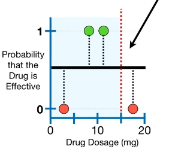

There are no other threshold gives us a larger **Gain** value. 

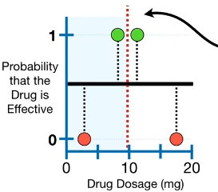

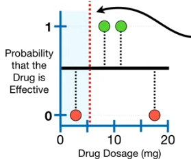

and that means **Dosage <15** will be the first branch in our tree.

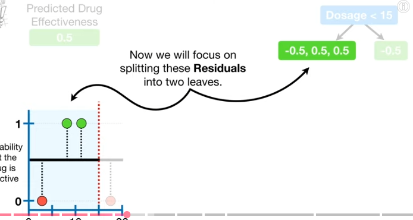

Now we will focus on splitting these **Residuals** into two leaves. 

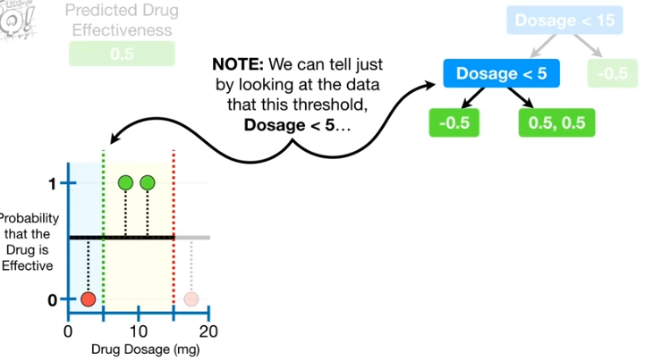 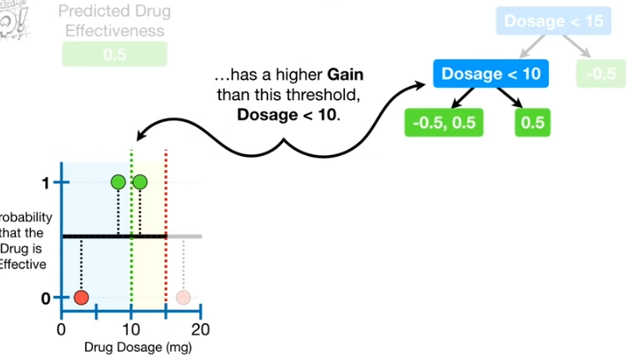

> Note: We can tell just by looking at the data that this threshold, **Dosage < 5** has a higher **Gain** than this threshold, **Dosage < 10**
 - this is because when the threshold is **Dosage < 10**, these two **Residuals** will cancel each other out.
 - 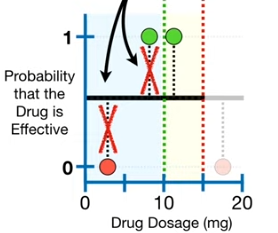
 - And the **Similarity Score** for this leaf will be 0. 
 - 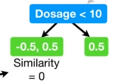
 - So when we calculate the **Gain**, we get $\text{Gain} = 0 + 1 - 0.33 = 0.66$

Now let's compare that to the **Gain** we get when the threshold is **Dosage < 5**

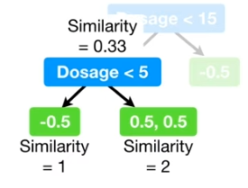

These are the similarity scores, and when we plug them into the equation for the **Gain**
- $\text{Gain} = 1 + 2 - 0.33 = 2.66$
- we get 2.66

And since 2.66 > 0.66, we will use **Dosage < 5** as the threshold for this branch. 

Now, since I am limiting trees to 2 levels, we will not split this elaf any further, and we are done building this tree.

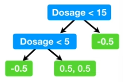

> Note: We stopped growing this tree because we limited the number of levels to 2, however, **XGBoost** also has a threshold for the minimum number of **Residuals** in each leaf 

--- 
> Terminology: 

- The minimum number of **Residuals** in each leaf is determined by calculating something called **Cover**.
- **Cover** is defined as the denominator of the **Similarity Score** minus $\lambda$ (lambda).
- In other words, when we are using **XGBoost** for **Classification**, **Cover** is equal to $$ \sum [\text{Previous Probability}_i \times (1 - \text{Previous Probability}_i)]$$
---

In contrast, when **XGBoost** is used for **Regression** and we are using this formula for the **Similarity Score** 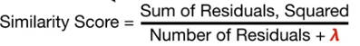 then **Cover** is equal to Number of Residuals in a leaf
- By default, the minimum value for **Cover** is 1. Thus, by default, when we use **XGBoost** for **regression**, we can have as few as 1 **Residual** per leaf. 
- In other words, when we use **XGBoost** for **Regression** and use the default minimum value for **Cover**, **Cover** has no effect on how we grow the tree.

In contrast, things are way more complicated when we use **XGBoost** for **Classification** because **Cover** depends on the previously predicted probability of each **Residual** in a leaf
- 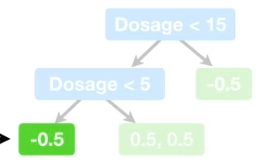
- For example, the **Cover** for this leaf is the previously predicted probability for this observation, which was $\text{Cover} = 0.5 \times (1-0.5) = 0.25 $ 
- 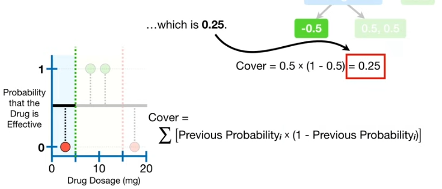
- And since the default value for the minimum **Cover** is 1, **XGBoost** would not allow this leaf. 
- 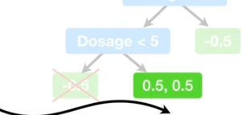
- Likewise, the **Cover** for this leaf is $\text{Cover} = 0.5 \times (1-0.5) +  0.5 \times (1-0.5) = 0.50 $
- So by default, **XGBoost** would not allow this leaf either.

Since these leaves are not allowed,let's remove them and go back to this leaf

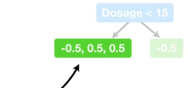

Because the previously predicted probability is the same for all of these **Residuals**, 0.5. **Cover** is just 3 times the **Cover** for one of the **Residuals**. 
$$\text{Cover} = 3 \times [0.5 \times (1-0.5)] = 0.75$$

So **XGBoost** will not allow this leave either. Ultimately, if we used the default minimun value for **Cover**, 1, then we would be left with the **Root**, and **XGBoost** requires tree to be larger than just the **Root**.

In order to prevent this from being the worst example ever, let's set the minimum value for **Cover** = 0. That means setting the **min_child_weight** parameter equal to 0.

## How to Prune the Tree

We prune by calculating the difference between the **Gain** associated with the lowest branch and a number we pick for $\gamma$ (gamma). 

$$ \text{Gain} - \gamma$$

For example, if we plugged in the **Gain**, 2.66 and set $\gamma$ = 2, 2.66 - 2 = 0.66. Then we would not prune because the difference is a **positive** number

In contrast, if we set $\gamma$ = 3, Then we would prune because the differnce is a **negative** number.

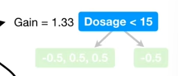

And we would also prune this branch, because 1.33 - 3 = **negative**. and all we would be left with is the original prediction.

--- 

Going back to the original tree, remember from **Part 1**, that $\lambda$, the **Regularization Parameter**, reduces the **Similarity scores** and that lower **Similarity Scores** result in lower values for **Gain**

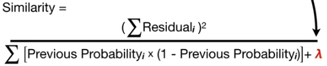

For example, if we set $\lambda$ = 1, then we will get these lower values for **Gain**

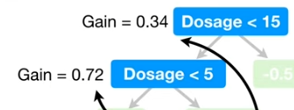

and that means a lower value for $\gamma$ will result in a negative difference and cause us to prune branches. 

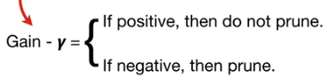

In other words, values for $\lambda$ greater than 0 reduce the sensitivity of the tree to individual observations by pruning and combining them with other observations.

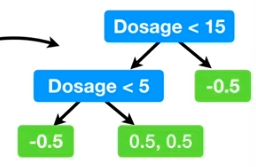

For now, regardless of  $\lambda$ and \gamma$, let's assume that this is the tree we are working with and determine the **Output Values** for the leaves. 

### Classification

For **Classification**, the **Output Value** for a leaf is 

$$
\frac{( \sum_i \text{Residual}_i )}
     {\sum_i \big[ \text{Previous Probability}_i \left( 1 - \text{Previous Probability}_i \right) \big] + \lambda}
$$

> Note: With the exception of $\lambda$, the **Regularization Parameter**, this is the same formula we used for unextreme **Gradient Boost**

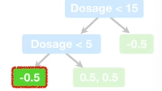

So for this leaf, we plug in the **Residual**, -0.5 and the previously predicted probability  

$$
\frac{-0.5}
     {0.5 \times (1-0.5) + \lambda} 
$$

if $\lambda$ = 0, then there is no **Regularization** and the **Output Value** = -2 

On the other hand, if $\lambda$ = 1, then the **Output Value = -0.4** which is closer to zero than -2, when $\lambda$ = 0 

In other words, when $lambda$ > 0, then it reduces the amount that this single observation adds to the new prediction.

Thus, $\lambda$, the **Regularization Parameter**, reduces the prediction's sensitivity to isolate observations.

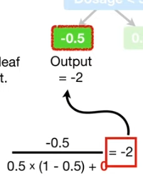

For now, we will let $\lambda$ = 0 because this is the default value and put -2 under the leaf so we will remember it. 

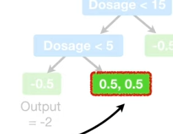

Similarly, when $\lambda = 0$, the output value for this leaf is 2

$$
\frac{ 0.5 + 0.5}
     {0.5 \times (1-0.5) + 0.5 \times (1-0.5) + 0} =2
$$

> Note: if $\lambda$ = 1 then we get 0.67, which is closer to 0 but the effect of $\lambda$ is smaller, this time because there are two observations in this leaf

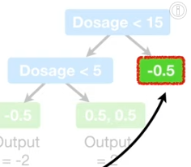

Lastly, when $\lambda$ = 0, the **Output Value** for this leaf is -2. We have completed the first tree, now we can make new **Predictions**

---

Just like other boosting methods, **XGBoost** for **Classification** makes new predictions by startiung with initial predictions

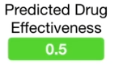

However, just like with unextreme **Gradient Boost** for **Classification**, we need to convert this probability to a **log(odds)** value.

$$\frac{p}{1-p} = odds$$

So, since this is the formula that converts probabilities to odds. We can get a formula that converts probabilities to the **log(odds)** by taking the log of both sides. $log(\frac{p}{1-p}) = log(odds)$

In this case, we plug in $p = 0.5$ and do the math, and we see that when $p = 0.5$, the $log(odds) = 0$

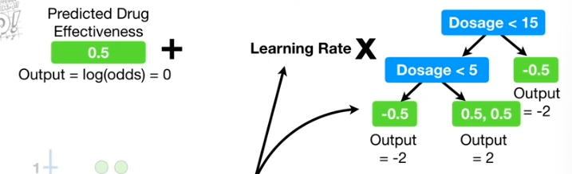

Now, just like unextreme **Gradient Boost** for **Classification**, we add the **log(odds)** of the initial prediction to the output of the **Tree**, scaled by a **Learning Rate**

**XGBoost** calls the **Learning Rate** $\eta$ and the default value is 0.3, so that's what we will use. 

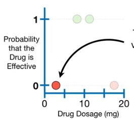

Thus, the new **Predicted** value for this observation, with **Dosage = 2** is the **log(odds)** of original prediction, 0, plus the **Learning Rate**, 0.3 times the **Output Value**,-2 and that gives us a **log(odds)** value = -0.6.

## Logistic Regression 

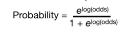

To convert a **log(odds)** value into a probability, we plug it into the **Logistic Function** and the new predicted probability is 0.35

$$ \text{Probability} = \frac{e^{-0.6}}{1 + e^{-0.6}} = 0.35$$

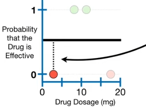

remember the original prediction was 0.5 and this was the original **Residual**. Now the new predicted probability is 0.35 and the new **Residual** is smaller than before, so we have taken a small step in the right direction.

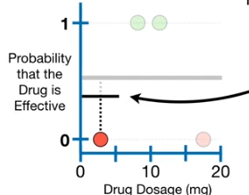

> Note: You may be wondering why we even bothered adding the **log(odds)** of the initial prediction since it is 0

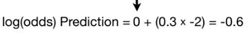 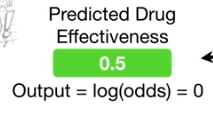

This is always the case if you use the default value 0.5, for the initial prediction. However, you can change the initial prediction to any probability and any value other than **0.5** will give you something more interesting to add.

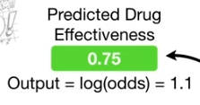

For example, if 75% of observations in the **Training Data** said that the drug was effective, we might set the initial prediction to 0.75 and now the initial **log(odds) = 1.1** so we will plug 1.1 into the equation instead of 0 

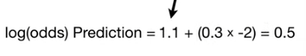

But since the default initial prediction is 0.5, we will use 0 for the initial **log(odds)** in the remaining examples.

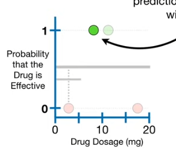

Using the same methods, we make a new prediction for this observation, with **Dosage = 8**. we will get 0.65 as the predicted probability. And the new **Residuals** is smaller than before. 

Likewise, the new predictions for the remaining observations have smaller **Residuals** than before.

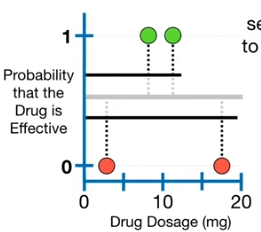

Now we have the new residuals, we can build the second tree that is fit to the new **Residuals**

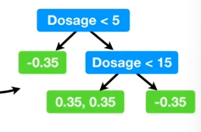

>Note: When we build the second tree, calculating the **Similarity Scores** is a little more interesting because the **Previous Probabilities** are no longer the same for all the observations.

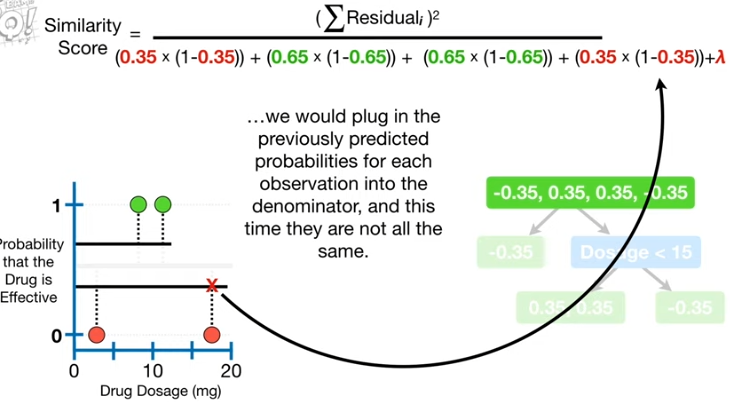

similar the the **Output Value**. After we get the new tree, we add it to all the previous predictions and make new predictions that give us even smaller **Residuals**. 

Then we build another tree based on the new **Residuals** and we keep building trees until the **Residuals** are super small, or we have reached the maximum number of trees.