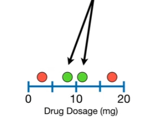
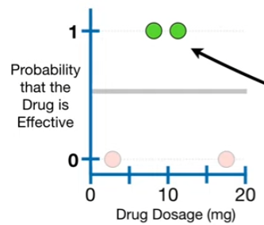

# XGBoost Part 2: Classification

We will give an overview of how XGBoost Trees are built for Classification

We will use this super simple **Training Data** consisting of 4 different Drug Dosages.

The Green Dots indicate that the drug was **Effective** and the Red Dots indicate that the drug was **Not Effective**.

The very first step in fitting XGBoost to the Training Data is to make an initial prediction. This prediction can be anything, for example, the **probability** of observing an effective dosage in the Training Data, but by default it is 0.5, regardless of whether you are using XGBoost for **Regression** or **Classification**

In other words, regardless of the **Dosage**, the default prediction is that there is a 50% change the drug is **Effective**

We can illustrate the initial prediction by adding a **y-axis** to our graph to represent that the Drug is Effective and drawing a **thick black line** at **0.5** to represent a 50% change that the drug us effective.

Since these two **Green Dots** represent effective dosages, we will move them to the top of the graph, where the probability that the drug is effective is 1. The twp **Red Dots** at the bottom represent ineffective dosages, so we will leave them at the bottom of the graph, where the probability that the drug is effective is 0

The **Residuals**, the differences between the **Observed** and **Predicted** values, show us how good the initial prediction is.

## Similarity Scores

Now just like we did for **Regression**, we fit an **XGBoost Tree** to the **Residuals** however, since we are using **XGBoost** for **Classification**, we have a new formula for the **Similarity Scores**

$$
\frac{( \sum_i \text{Residual}_i )^2}
     {\sum_i \big[ \text{Previous Probability}_i \left( 1 - \text{Previous Probability}_i \right) \big] + \lambda}
$$